# Water Bodies Detection — Aquaculture Pond Segmentation

[](https://www.python.org/downloads/)
[](https://pytorch.org/)
<!-- [](LICENSE) -->

End-to-end deep learning pipeline for **automatic detection and extraction of aquaculture ponds** from Planet multispectral satellite imagery. The system produces GIS-ready polygon shapefiles with **one polygon per bund-separated pond unit** — covering both dry and wet ponds under a single `aqua_pond` class.

---

## Table of Contents

1. [Project Overview](#1-project-overview)
2. [Problem Statement](#2-problem-statement)
3. [Project Objectives](#3-project-objectives)
4. [System Architecture](#4-system-architecture)
5. [Dual-Head Design (Multi-Head Output)](#5-dual-head-design-multi-head-output)
6. [Dataset Preparation](#6-dataset-preparation)
7. [Data Augmentation](#7-data-augmentation)
8. [Model Architecture](#8-model-architecture)
9. [Why This Architecture Was Selected](#9-why-this-architecture-was-selected)
10. [Loss Functions](#10-loss-functions)
11. [Optimizer](#11-optimizer)
12. [Training Strategy](#12-training-strategy)
13. [Evaluation Metrics](#13-evaluation-metrics)
14. [Inference Pipeline](#14-inference-pipeline)
15. [Postprocessing](#15-postprocessing)
16. [GIS Processing](#16-gis-processing)
17. [Challenges Faced](#17-challenges-faced)
18. [Lessons Learned](#18-lessons-learned)
19. [Model Limitations](#19-model-limitations)
20. [Future Improvements](#20-future-improvements)
21. [Project Folder Structure](#21-project-folder-structure)
22. [Installation](#22-installation)
23. [Training](#23-training)
24. [Prediction](#24-prediction)
25. [Example Results](#25-example-results)
26. [Performance Summary](#26-performance-summary)
27. [Engineering Decisions](#27-engineering-decisions)
<!-- 28. [MLOps & Production Considerations](#28-mlops--production-considerations) -->

---

## 1. Project Overview

### What is water body detection?

**Water body detection** is the process of identifying and delineating aquaculture pond areas in geospatial imagery. In this project, the task is framed as **semantic segmentation**: every pixel in a satellite image tile is classified as either *pond interior* (aqua) or *background*, with an additional **bund boundary** channel that marks the earthen dividers between adjacent ponds.

Unlike simple "water vs land" classification, this pipeline targets **aquaculture infrastructure** — rectangular and irregular pond units separated by narrow bunds (embankments), digitized in training shapefiles.

### Why is it important?

| Stakeholder | Value |
|---|---|
| **GIS / Planning teams** | Automated pond inventories replace weeks of manual digitization |
| **Environmental monitoring** | Consistent, repeatable area estimates across seasons |
| **Land-use mapping** | Accurate aquaculture extent for policy and compliance |
| **MLOps / Engineering** | Reproducible pipeline from raw GeoTIFF to shapefile |

Manual pond mapping at regional scale is slow, expensive, and inconsistent. Deep learning on high-resolution multispectral imagery enables **scalable, standardized extraction** with GIS-native outputs.

> **Reference literature:** UNet++ consistently outperforms plain U-Net on water-body edge extraction in remote sensing ([Remote Sensing, 2024](http://tb.chinasmp.com/EN/10.13474/j.cnki.11-2246.2024.0805)). Dual-output / boundary-aware designs further improve contour quality in dense pond clusters.

---

## 2. Problem Statement

### Manual digitization challenges

| Problem | Impact |
|---|---|
| **Time consumption** | A single district mosaic can require hundreds of operator-hours |
| **Human error** | Missed ponds, merged adjacent units, inconsistent bund handling |
| **Subjectivity** | Different operators draw different boundaries for the same pond |
| **Scale** | Planet mosaics at 3–5 m GSD cover millions of pixels per scene |

### Large satellite imagery challenges

| Challenge | Description |
|---|---|
| **Memory limits** | Full mosaics do not fit in GPU memory — tiling is mandatory |
| **Spectral complexity** | Water, shadow, wet soil, and vegetation can look similar in RGB |
| **Adjacent ponds** | Single-class water segmentation merges ponds sharing a wall |
| **Class imbalance** | Pond pixels are far fewer than background pixels |
| **Seasonal variation** | Dry ponds, partial fills, and turbid water change appearance |

This project solves the **adjacent-pond merging problem** with a **dual-head model** that jointly predicts pond interiors and bund boundaries, then uses boundary subtraction during post-processing to emit **one polygon per pond**.

---

## 3. Project Objectives

| # | Objective | How achieved |
|---|---|---|
| 1 | Detect water bodies / aquaculture ponds automatically | UNet++ semantic segmentation on 512×512 tiles |
| 2 | Generate GIS outputs | Raster → polygon vectorization → ESRI Shapefile |
| 3 | Reduce manual effort | Batch automation scripts for predict + post-process |
| 4 | Improve consistency | Fixed thresholds, reproducible config, deterministic tiling |
| 5 | Separate bund-adjacent ponds | Dual-head aqua + boundary prediction |

---

## 4. System Architecture

### Overall System Architecture

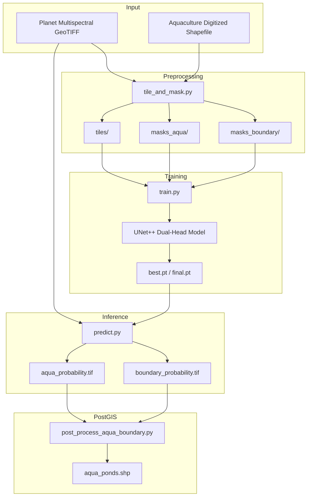

### Training Pipeline

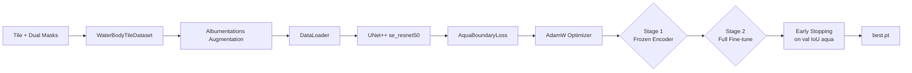

### Inference Pipeline

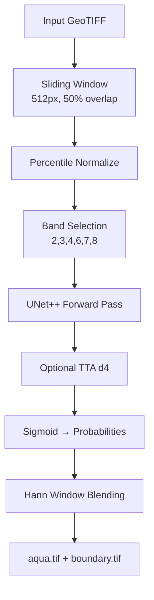

### Postprocessing Pipeline

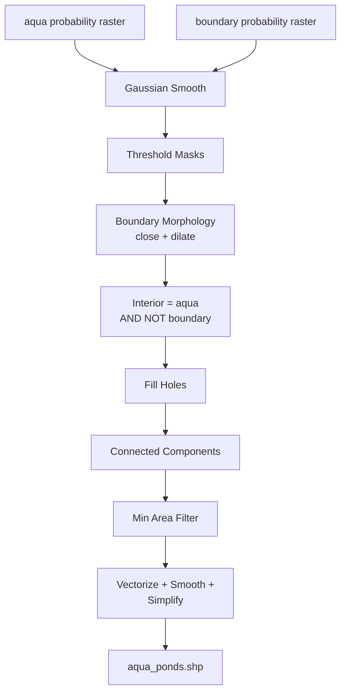

---

## 5. Dual-Head Design (Multi-Head Output)

### What "multi-head" means in this project

In this codebase, **multi-head** refers to a **dual output segmentation head** — not transformer Multi-Head Attention. The model outputs **two independent logit channels** from a shared UNet++ decoder:

| Channel | Name | Target mask | Role |
|---|---|---|---|
| **ch0** | Aqua interior | `masks_aqua/` | Filled pond polygon interior (dry + wet) |
| **ch1** | Bund boundary | `masks_boundary/` | Dilated earthen bund / embankment lines |

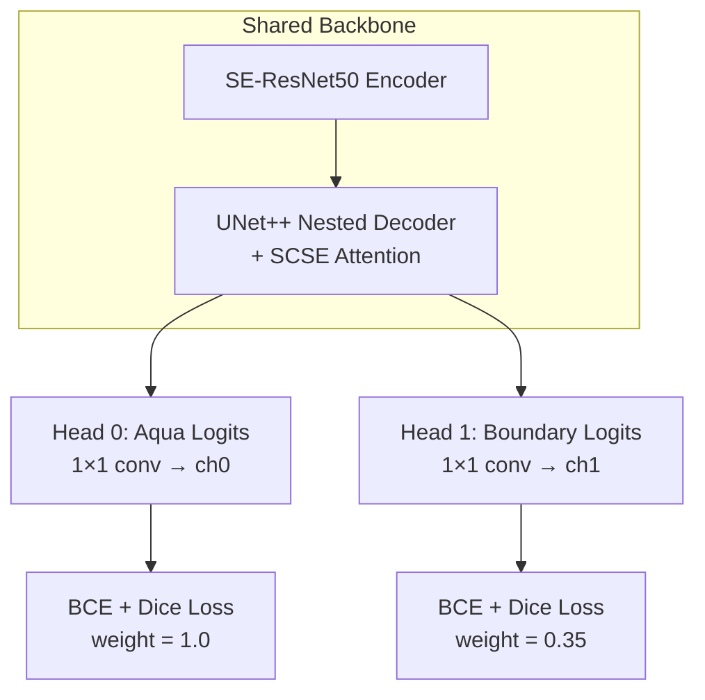

### How it works

1. **Training:** `tile_and_mask.py` rasterizes aquaculture polygons into two masks per tile — filled interior and dilated polygon boundary (~1 m width).
2. **Model:** `build_water_model()` sets `out_channels=2`; SMP UNet++ produces a `(B, 2, H, W)` logit tensor.
3. **Loss:** `AquaBoundaryLoss` applies weighted BCE+Dice independently on each channel.
4. **Inference:** `predict.py` writes two float32 GeoTIFFs — `*_aqua.tif` and `*_boundary.tif`.
5. **Post-process:** `interior = aqua_mask & (~boundary_mask)` splits merged water regions into individual ponds.

### Why dual-head instead of single-head?

| Single-head water segmentation | Dual-head aqua + boundary |
|---|---|
| Adjacent ponds often merge into one blob | Bund lines act as separators |
| Post-hoc splitting is heuristic and fragile | Boundaries are learned from annotations |
| Thin bunds are easily missed | Dedicated boundary channel with its own loss |
| One threshold for everything | Independent `threshold_aqua` and `threshold_boundary` |

**Core insight:** In dense aquaculture landscapes, the problem is not only *finding water* but *partitioning* it. Bund boundaries are structurally thin (1–3 pixels at 3 m GSD (Ground Sample Distance)) but semantically critical — a second head gives the network explicit gradient signal for them.

---

## 6. Dataset Preparation

### Source imagery

| Property | Value |
|---|---|
| **Sensor** | Planet multispectral (9-band stack) |
| **Typical GSD** | ~3 m (configurable via `tiling.meters_per_pixel`) |
| **Format** | GeoTIFF with georeferencing (CRS + transform) |
| **Selected bands** | 2 Blue, 3 Green I, 4 Green, 6 Red, 7 Red Edge, 8 NIR |

Band indices are **1-based** (rasterio convention). See `config/default.yaml` for the full 9-band layout including NDVI, NDWI, and EVI indices.

### Annotation process

1. Aquaculture ponds are digitized in GIS as polygons.
2. Both **dry** and **wet** ponds share the same class — no sub-class distinction at training time.
3. Shapefile CRS is reprojected to match the raster if needed.
4. Geometries are sanitized (`make_valid`, `buffer(0)`) and clipped to the raster footprint.

### Mask generation

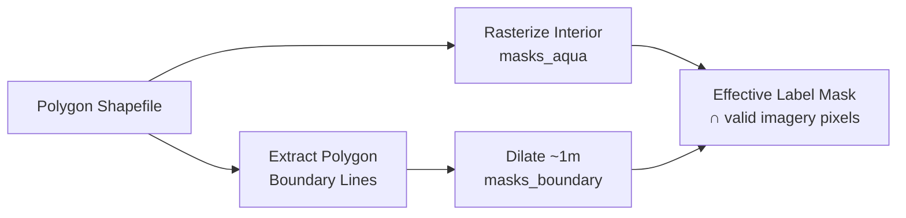

| Mask | Generation | Purpose |
|---|---|---|
| `masks_aqua` | `rasterio.features.rasterize` of polygon fills | Pond interior supervision |
| `masks_boundary` | Rasterize `polygon.boundary` lines, dilate by `boundary_width_meters` | Bund supervision |

Boundary dilation uses `scipy.ndimage.binary_dilation` with half-width = `boundary_width_meters / (2 × meters_per_pixel)`.

### Tile generation

| Parameter | Default | Purpose |
|---|---|---|
| `tile_size` | 512 | Matches model `input_size` |
| `overlap_fraction` | 0.5 | 50% overlap during tiling for training coverage |
| `min_valid_fraction` | 0.8 | Skip tiles that are mostly nodata / padding |
| `negative_tile_ratio` | 0.2 | Add land background tiles (both masks = 0) |
| `percentile_low / high` | 2 / 98 | Robust per-band normalization |

```bash
python tile_and_mask.py \
  --input_tif "/path/to/area.tif" \
  --input_shp "/path/to/aquaculture.shp" \
  --output_dir "/path/to/tiles_masks" \
  --config config/default.yaml
```

**Outputs:**

```
tiles_masks/
├── tiles/              # Normalized 6-band float32 GeoTIFFs
├── masks_aqua/         # Binary uint8 interior masks
├── masks_boundary/     # Binary uint8 bund masks
└── tiling_meta.json    # Reproducibility metadata
```

## 7. Data Augmentation

Augmentations are applied in `dataset.py` via **Albumentations**, with geometry-safe transforms on **both** mask channels simultaneously.

| Augmentation | Parameters | Why |
|---|---|---|
| **Horizontal flip** | p=0.5 | Ponds have no preferred orientation |
| **Vertical flip** | p=0.5 | Same as above |
| **RandomRotate90** | p=0.5 | Rectangular ponds appear at arbitrary angles |
| **ShiftScaleRotate** | shift±5%, scale±12%, rotate±20° | Simulates viewpoint / GSD variation |
| **ElasticTransform / GridDistortion** | OneOf, p=0.25 | Irregular pond shapes, imperfect bunds |
| **GaussNoise / GaussianBlur** | OneOf, p=0.35 | Sensor noise, atmospheric haze |
| **RandomGamma** | γ ∈ [0.82, 1.18], p=0.45 | Sun angle / exposure variation |

### Why augmentation improves generalization

Satellite imagery varies across **season, sun angle, atmospheric conditions, and sensor calibration**. Without augmentation, the model memorizes the spectral signature of the training region. Geometry-safe augmentations teach the network that **pond shape and bund topology** matter — not absolute pixel coordinates. Photometric augmentations (gamma, noise, blur) reduce overfitting to specific radiometric conditions.

> Augmentations are **disabled** during validation and inference.

---

## 8. Model Architecture

### Summary

| Property | Value |
|---|---|
| **Architecture** | UNet++ (`segmentation_models_pytorch`) |
| **Encoder** | SE-ResNet50 (`se_resnet50`) with ImageNet weights |
| **Decoder attention** | SCSE (Spatial + Channel Squeeze-Excitation) |
| **Decoder channels** | (256, 128, 64, 32, 16) |
| **Input channels** | 6 (configurable) |
| **Output channels** | 2 (aqua + boundary logits) |
| **Activation** | None (raw logits → sigmoid at inference) |
| **Input size** | 512 × 512 |

### Architecture diagram

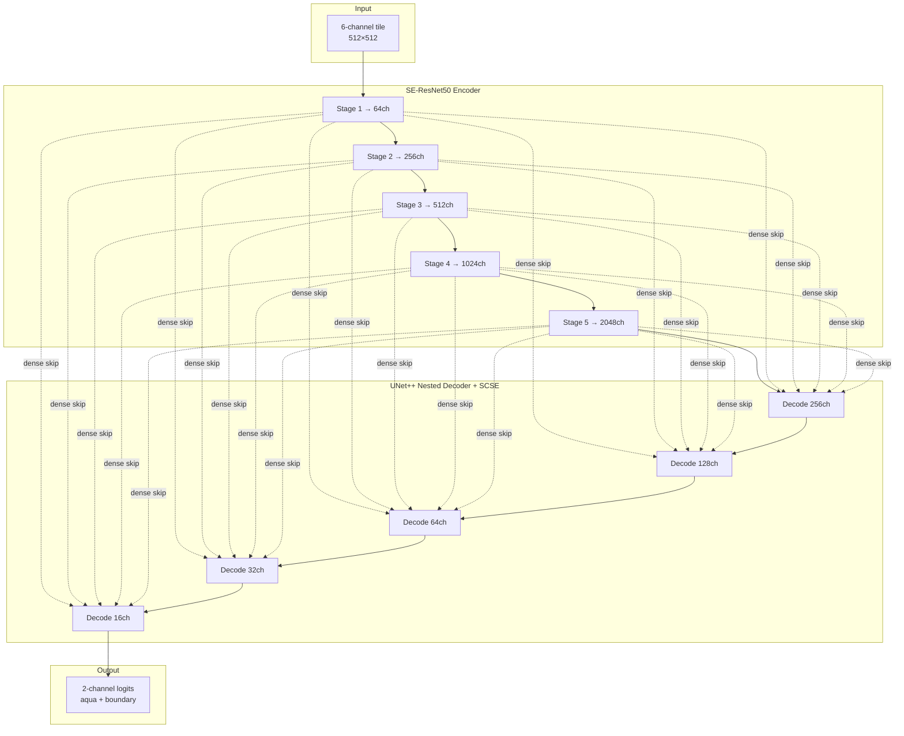

### Block roles

| Component | Role |
|---|---|
| **Encoder (SE-ResNet50)** | Extracts hierarchical spatial features; SE blocks recalibrate channel importance |
| **UNet++ nested decoder** | Dense skip pathways bridge the semantic gap between encoder and decoder |
| **SCSE attention** | Combined spatial + channel attention in decoder blocks |
| **Skip connections** | Preserve fine boundary detail from shallow encoder stages |
| **2-channel output head** | Final 1×1 convolution maps decoder features to aqua + boundary logits |

### Code reference

```8:28:water-bodies-detection/model.py
def build_water_model(
    in_channels: int,
    out_channels: int = 2,
    encoder_name: str = "se_resnet50",
    encoder_weights: str | None = "imagenet",
    decoder_attention_type: str | None = "scse",
    decoder_channels: tuple[int, ...] = (256, 128, 64, 32, 16),
) -> nn.Module:
    """
    UNet++ with ImageNet encoder; outputs logits for aqua (ch0) and boundary (ch1).
    ...
    """
    return smp.UnetPlusPlus(
        encoder_name=encoder_name,
        encoder_weights=encoder_weights,
        in_channels=in_channels,
        classes=out_channels,
        activation=None,
        decoder_attention_type=decoder_attention_type,
        decoder_channels=decoder_channels,
    )
```

---

## 9. Why This Architecture Was Selected

### Comparison with alternatives

| Architecture | Strengths | Weaknesses for this task |
|---|---|---|
| **U-Net** | Simple, fast, proven for segmentation | Weaker edge detail; skip connections less refined |
| **UNet++** | Dense nested skips; best edge extraction among U-Net family | More parameters, slower than plain U-Net |
| **DeepLabV3+** | Strong ASPP multi-scale context | Heavier; boundary lines need precise localization |
| **FCN** | Lightweight baseline | Coarse boundaries; poor on thin bund structures |

### Why UNet++ + SE-ResNet50 works for aquaculture ponds

1. **Edge quality:** Published benchmarks show UNet++ achieves the highest accuracy and superior edge extraction for water bodies in high-resolution remote sensing ([source](http://tb.chinasmp.com/EN/10.13474/j.cnki.11-2246.2024.0805)).
2. **Thin structures:** Nested skip connections preserve sub-pixel bund features that ASPP-heavy models can smooth away.
3. **Transfer learning:** ImageNet-pretrained SE-ResNet50 provides strong low-level texture filters; squeeze-excitation helps with multispectral channel weighting.
4. **SCSE decoder attention:** Highlights spatially important bund pixels while suppressing homogeneous field backgrounds.
5. **SMP ecosystem:** `segmentation-models-pytorch` provides battle-tested implementations with flexible `in_channels` for multispectral input.

---

## 10. Loss Functions

The project uses a **combined multi-task loss** — not Focal Loss. Each head uses **BCE + Dice**.

### Dice coefficient (used inside loss)

$$\text{Dice} = \frac{2 \sum_i p_i t_i + \epsilon}{\sum_i p_i + \sum_i t_i + \epsilon}$$

where:

- `p_i` = sigmoid probability of pixel *i*
- `logit_i` = raw model output
- `t_i` = ground truth label (`0` = background, `1` = water)

### BCEDiceLoss (per head)

$$\mathcal{L}_{\text{BCE+Dice}} = w_{\text{bce}} \cdot \text{BCEWithLogits}(\hat{y}, y) + w_{\text{dice}} \cdot (1 - \text{Dice})$$

| Parameter | Default | Purpose |
|---|---|---|
| `loss_bce_weight` | 0.35 | Pixel-wise classification signal |
| `loss_dice_weight` | 0.65 | Region overlap signal (handles class imbalance) |

### AquaBoundaryLoss (multi-head combined)

$$\mathcal{L}_{\text{total}} = w_{\text{aqua}} \cdot \mathcal{L}_{\text{BCE+Dice}}(\hat{y}_0, y_0) + w_{\text{boundary}} \cdot \mathcal{L}_{\text{BCE+Dice}}(\hat{y}_1, y_1)$$

| Parameter | Default | Why |
|---|---|---|
| `loss_weight_aqua` | 1.0 | Primary task — pond interior detection |
| `loss_weight_boundary` | 0.35 | Auxiliary task — thinner, sparser signal; lower weight prevents boundary gradients from dominating |

### Loss function comparison

| Loss | Used? | Purpose | Advantage |
|---|---|---|---|
| **BCE** | ✅ | Per-pixel log loss on logits | Stable gradients, well-calibrated probabilities |
| **Dice** | ✅ | Region overlap optimization | Robust to class imbalance (few pond pixels) |
| **Focal Loss** | ❌ | Down-weight easy negatives | Not needed — Dice + negative tiles handle imbalance |
| **Combined (AquaBoundary)** | ✅ | Multi-head training | Joint interior + boundary learning |

### Why Dice + BCE (not Focal alone)

- **BCE** provides dense per-pixel gradients for uncertain boundaries.
- **Dice** directly optimizes the IoU-like overlap metric that matters for GIS area calculations.
- **Boundary down-weighting (0.35)** prevents the sparse boundary channel from destabilizing training.

---

## 11. Optimizer

| Setting | Value |
|---|---|
| **Optimizer** | AdamW |
| **Stage 1 LR** | 2×10⁻⁴ (decoder only, frozen encoder) |
| **Stage 2 LR** | 2×10⁻⁵ (full model fine-tune) |
| **Weight decay** | 1×10⁻⁵ |
| **LR schedule** | Warmup + cosine decay to `min_lr` = 1×10⁻⁸ |
| **Gradient clipping** | `grad_clip_norm` = 1.0 |

### Why AdamW?

- **Adaptive learning rates** per parameter — important when fine-tuning a pretrained encoder alongside a randomly initialized decoder.
- **Decoupled weight decay** (W) regularizes weights without interfering with Adam's momentum-based updates.
- **Two-stage schedule:** Stage 1 trains only the decoder with a higher LR while ImageNet features remain frozen; Stage 2 unfreezes the encoder at 10× lower LR to avoid catastrophic forgetting.

---

## 12. Training Strategy

| Parameter | Default | Description |
|---|---|---|
| `batch_size` | 2 | Limited by 512×512×6ch GPU memory |
| `stage1_epochs` | 12 | Decoder-only training |
| `stage2_epochs` | 120 | Full fine-tune (with early stopping) |
| `validation_split` | 0.15 | Random tile-level holdout |
| `early_stopping_patience` | 18 | Monitors validation aqua IoU |
| `AMP` | On (CUDA) | Mixed precision fp16 forward, fp32 loss |
| **Checkpoint** | `best.pt` | Saved on best validation aqua IoU |
| **Final** | `final.pt` | Saved at end of training |
| **Metadata** | `model_meta.json` | Channels, patch size, paths |

### Two-stage training flow

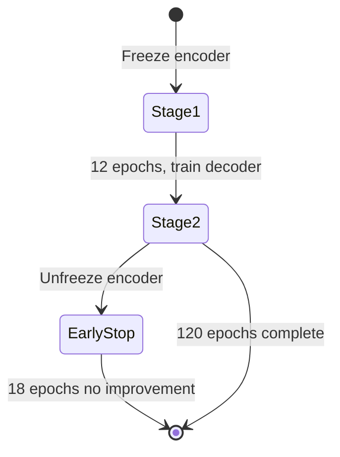

### Validation strategy

- Tile-level random split (not raster-level) — ensures spatial diversity in validation.
- **Primary metric:** IoU on aqua channel (ch0) — drives checkpoint selection.
- Boundary IoU (ch1) is logged but not used for early stopping.

```bash
python train.py \
  --tiles_dir "/path/to/tiles_masks/tiles" \
  --masks_aqua_dir "/path/to/tiles_masks/masks_aqua" \
  --masks_boundary_dir "/path/to/tiles_masks/masks_boundary" \
  --config config/default.yaml \
  --output_dir "/path/to/models"
```

---

## 13. Evaluation Metrics

### IoU (Intersection over Union) — primary metric

$$\text{IoU} = \frac{|P \cap T|}{|P \cup T|}$$

where \(P\) = predicted mask (thresholded at 0.5) and \(T\) = ground truth.

### Dice Score

$$\text{Dice} = \frac{2|P \cap T|}{|P| + |T|}$$

Equivalent to F1 for binary segmentation.

### Precision, Recall, F1

$$\text{Precision} = \frac{TP}{TP + FP}, \quad \text{Recall} = \frac{TP}{TP + FN}, \quad F1 = \frac{2 \cdot P \cdot R}{P + R}$$

| Metric | What it measures | High value means |
|---|---|---|
| **IoU** | Overlap quality | Accurate pond extent |
| **Dice** | Region similarity | Good for imbalanced classes |
| **Precision** | False positive rate | Fewer false ponds detected |
| **Recall** | False negative rate | Fewer missed ponds |
| **F1** | Balance of precision & recall | Overall detection quality |

> Training logs **val_iou_aqua** and **val_iou_boundary** each epoch. Precision/Recall/F1 can be computed offline from saved predictions.

---

## 14. Inference Pipeline

| Step | Module | Description |
|---|---|---|
| 1 | `predict.py` | Read full GeoTIFF via rasterio |
| 2 | Sliding window | 512×512 tiles, 50% overlap (configurable) |
| 3 | Normalize | Robust percentile scaling (2nd–98th) per band |
| 4 | Band select | Extract bands [2,3,4,6,7,8] |
| 5 | Model forward | UNet++ → 2-channel logits |
| 6 | TTA (optional) | D4 dihedral group (8 views), averaged |
| 7 | Sigmoid | Convert logits to probabilities [0, 1] |
| 8 | Blend | Hann window weighted overlap merge |
| 9 | Write | `*_aqua.tif` + `*_boundary.tif` (float32) |

```bash
python predict.py \
  --input_tif "/path/to/mosaic.tif" \
  --output_dir "/path/to/predictions" \
  --model_dir "/path/to/models/run_YYYYMMDD_HHMMSS" \
  --weights "/path/to/models/run_YYYYMMDD_HHMMSS/best.pt" \
  --tta d4
```

### Batch prediction

```bash
python automate/automate_water_predictions.py \
  --model_dir "/path/to/models/run_YYYYMMDD_HHMMSS" \
  --input_dir /path/to/input_mosaics \
  --output_dir /path/to/predictions \
  --weights "/path/to/models/run_YYYYMMDD_HHMMSS/best.pt"
```

---

## 15. Postprocessing

Post-processing converts probability rasters into **bund-separated pond polygons**.

### Pipeline logic

```
interior_mask = (aqua >= threshold_aqua) AND NOT (boundary >= threshold_boundary)
interior_mask = fill_holes(interior_mask)
labels = connected_components(interior_mask)
labels = filter_by_min_area(labels, min_pond_area)
polygons = vectorize(labels) → smooth → simplify
```

### Parameter reference

| Parameter | Default | Purpose |
|---|---|---|
| `threshold_aqua` | 0.8 | Higher than inference default (0.5) — reduces false positives in GIS output |
| `threshold_boundary` | 0.5 | Bund detection sensitivity |
| `boundary_close_px` | 1 | Morphological closing on boundary mask — bridges small gaps |
| `boundary_dilate_px` | 0 | Extra boundary expansion (pixels) |
| `gaussian_sigma` | 0.3 | Pre-threshold smoothing of probability maps |
| `fill_holes` | true | Remove small interior holes in pond masks |
| `min_pond_area` | 300.0 | Minimum polygon area in map units² (e.g. m²) |
| `connectivity` | 8 | Connected-component labeling (8-neighbor) |
| `smooth_distance` | 2.0 | Morphological smooth via buffer(+) / buffer(−) |
| `simplify_tolerance` | 1.5 | Douglas-Peucker simplification (map units) |

### How parameters improve polygon quality

| Issue | Parameter fix |
|---|---|
| Jagged raster edges | `gaussian_sigma` + `smooth_distance` |
| Gaps in bund lines | `boundary_close_px` |
| Merged adjacent ponds | `threshold_boundary` + boundary subtraction |
| Tiny false detections | `min_pond_area` + higher `threshold_aqua` |
| Over-complex polygons | `simplify_tolerance` |
| Donut-shaped artifacts | `fill_holes` |

```bash
python post_process/post_process_aqua_boundary.py \
  --config config/default.yaml \
  --aqua_tif "/path/to/predictions/mosaic_aqua.tif" \
  --boundary_tif "/path/to/predictions/mosaic_boundary.tif" \
  --output_path "/path/to/shapefiles"
```

### Before / after (placeholders)

| Stage | Image |
|---|---|
| RAW Planet Multispectral GeoTIFF  | 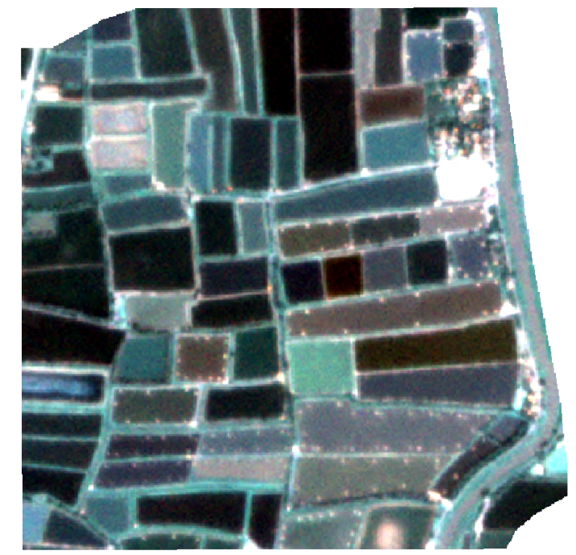 |
| Aqua Interior Masks | 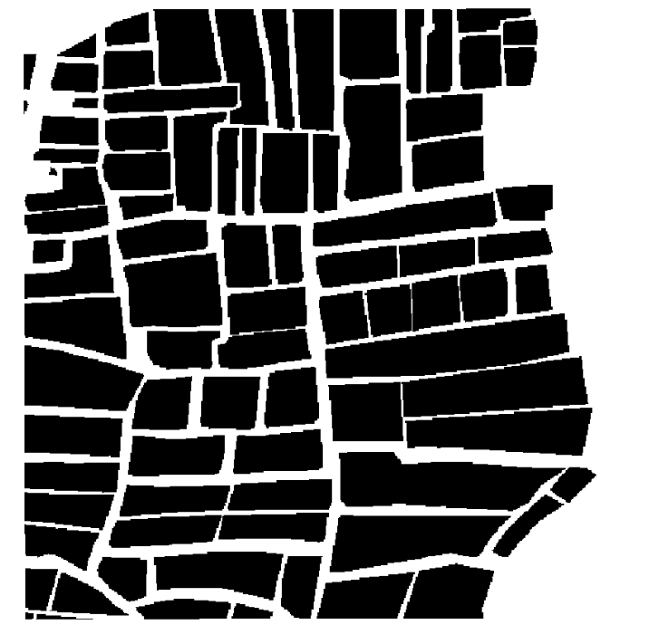 |
| Aqua Boundary Masks | 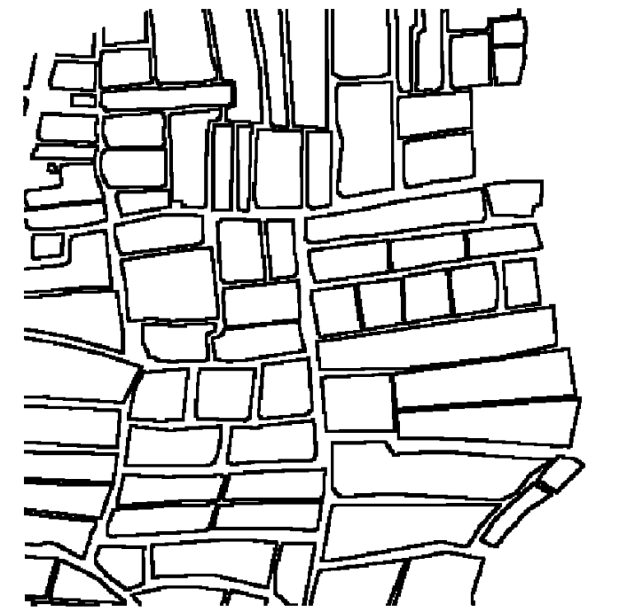 |
| Aqua Interior Predictions | 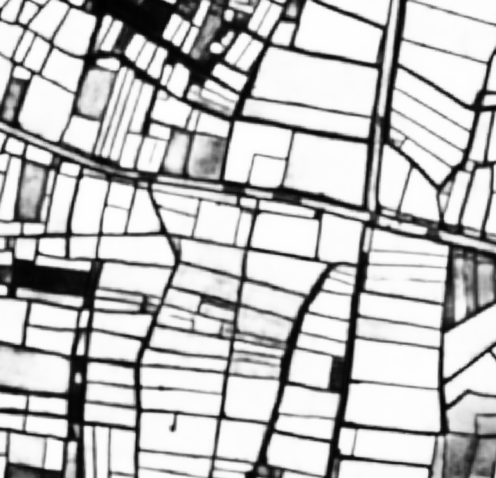 |
| Aqua Boudnary Predictions | 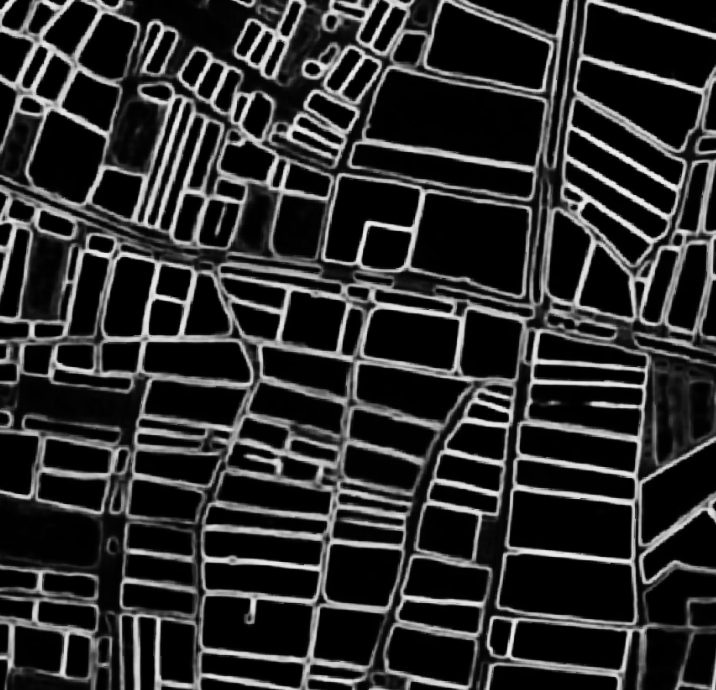 |
| After post-processing | 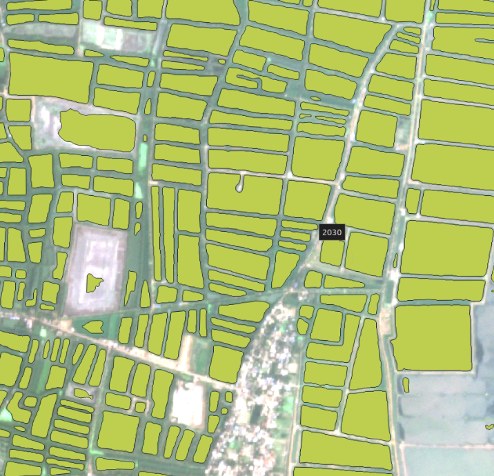 |

---

## 16. GIS Processing

### Raster to polygon conversion

- `rasterio.features.shapes` extracts polygons from labeled component rasters.
- Each connected component becomes one feature with attributes: `pond_id`, `area_px`, `area_map`, `perimeter`.

### Area calculation

| Field | Description |
|---|---|
| `area_px` | Pixel count from connected-component labeling |
| `area_map` | Geometric area from Shapely polygon (in CRS map units, typically m²) |

### Geometry fixing

- `poly.buffer(smooth_distance).buffer(-smooth_distance)` — removes stair-step raster artifacts.
- `poly.simplify(tolerance, preserve_topology=True)` — reduces vertex count.
- `poly.buffer(0)` — fixes self-intersections and invalid rings.

### CRS handling

- All operations occur in the source raster CRS.
- Shapefile outputs inherit CRS from the input GeoTIFF.
- `filter_predictions_with_aqua_layers.py` reprojects filter layers to the target CRS before spatial joins.


---

## 17. Challenges Faced

| Challenge | Symptom | Solution in this project |
|---|---|---|
| **Adjacent pond merging** | One polygon covers multiple ponds | Dual-head boundary channel + interior subtraction |
| **Small ponds missing** | Low recall on <100 m² ponds | Dice loss, hard-negative mining, lower `min_pond_area` tuning |
| **Boundary noise** | Zigzag vector edges | Gaussian smooth + morphological buffer smooth + simplify |
| **Shadows** | Dark regions classified as water | Multispectral bands (NIR, Red Edge), negative tiles |
| **Vegetation confusion** | Green areas near ponds misclassified | 6-band input (not RGB-only), NIR absorption by water |
| **Seasonal changes** | Dry ponds look like bare soil | Train on both dry + wet ponds as a single class |
| **Resolution variation** | Scale mismatch across mosaics | ShiftScaleRotate augmentation, robust percentile normalization |
| **Annotation errors** | Noisy training labels | `sanitize_geometries`, `effective_label_mask` clips labels to valid imagery |
| **Class imbalance** | Background dominates | Negative tiles (20%), Dice loss, BCE+Dice combination |
| **Nodata padding** | Zero-filled mosaic edges in training | `min_valid_fraction`, alpha band masking, all-bands-zero exclusion |

---

## 18. Lessons Learned

1. **Segmentation ≠ final GIS product.** Probability maps are intermediate artifacts; post-processing parameters matter as much as model accuracy.
2. **Dual-head is worth the complexity** when topological partitioning (bunds) is a business requirement, not just pixel classification.
3. **Two-stage fine-tuning** prevents destroying ImageNet features when the labeled dataset is small (<5,000 tiles).
4. **Tile-level validation** is pragmatic but can leak spatial correlation — consider raster-level splits for rigorous benchmarking.
5. **Threshold separation** between inference (0.5) and post-processing (0.8 aqua) allows recall-friendly predictions with precision-friendly GIS outputs.
6. **Hard negatives** (rivers/lakes) are optional but valuable when natural water bodies exist in the scene.
7. **Reproducibility metadata** (`tiling_meta.json`, `model_meta.json`, copied `train_config.yaml`) saves debugging time across team members.

---

## 19. Model Limitations

| Limitation | Description |
|---|---|
| **Very small ponds** | Below ~300 m² (default `min_pond_area`) are filtered out |
| **Seasonal / ephemeral water** | Natural seasonal pools may be detected as false positives |
| **Heavy shadows** | Mountain or building shadows can mimic water in visible bands |
| **Cloud cover** | Clouds and cloud shadows are not explicitly modeled |
| **Non-aquaculture water** | Rivers and lakes require hard-negative training or post-filtering |
| **CRS / GSD mismatch** | Model trained at one GSD may degrade on very different resolutions |
| **Thin bunds below GSD** | Bunds narrower than ~1 pixel cannot be reliably resolved |

---

## 20. Future Improvements

| Direction | Expected benefit |
|---|---|
| **Multi-class segmentation** | Separate dry pond, wet pond, canal, river classes |
| **Temporal imagery** | Time series for seasonal / fill-level analysis |
| **Transformer encoders** | Swin Transformer, MiT for global context |
| **Attention mechanisms** | CBAM, self-attention in bottleneck for long-range bund continuity |
| **Better augmentations** | Copy-paste ponds, CutMix, spectral jitter |
| **Active learning** | Human-in-the-loop labeling of uncertain tiles |
| **Raster-level CV splits** | More honest generalization estimates |
| **ONNX / TensorRT export** | Faster production inference |
| **STAC / COG integration** | Cloud-native geospatial data access |

---

## 21. Project Folder Structure

```
water-bodies-detection/
├── config/
│   └── default.yaml              # All hyperparameters: data, tiling, model, training, prediction, postprocess
├── automate/
│   ├── automate_water_predictions.py   # Batch inference over a folder of GeoTIFFs
│   └── automate_water_postprocess.py   # Batch post-processing of prediction pairs
├── post_process/
│   ├── post_process_aqua_boundary.py   # Core bund-separated polygon extraction
│   ├── post_process_v1.py              # Legacy post-processing
│   ├── dissolve_prediction_polygons.py # Polygon dissolve utilities
│   └── filter_predictions_with_aqua_layers.py  # GIS inclusion/exclusion filtering
├── docs/
│   └── images/                   # README figures (add your own)
├── tile_and_mask.py              # Step 1: tile generation + dual mask rasterization
├── dataset.py                    # PyTorch Dataset + Albumentations pipeline
├── model.py                      # UNet++ builder (dual-head)
├── losses.py                     # AquaBoundaryLoss (BCE + Dice per head)
├── train.py                      # Two-stage training with early stopping
├── predict.py                    # Sliding-window inference + TTA + blending
├── requirements.txt              # Python dependencies
├── Dockerfile                    # Container image for deployment
├── LICENSE
└── README.md
```

| File / Directory | Why it exists |
|---|---|
| `config/default.yaml` | Single source of truth for all pipeline parameters |
| `tile_and_mask.py` | Converts raw GIS annotations into ML-ready training triplets |
| `model.py` | Isolates architecture definition from training logic |
| `losses.py` | Reusable, testable loss functions for multi-head training |
| `train.py` | Orchestrates data loading, training loop, checkpointing |
| `predict.py` | Production inference with overlap blending and TTA |
| `post_process/` | GIS geometry extraction — separate from ML inference |
| `automate/` | Operational batch wrappers for multi-scene processing |

---

## 22. Installation

### Prerequisites

- Python 3.11+
- CUDA-capable GPU (recommended for training and inference)
- GDAL system libraries (for rasterio / geopandas)

### Local setup

```bash
git clone <repository-url>
cd water-bodies-detection

python -m venv .venv
source .venv/bin/activate

pip install --upgrade pip
pip install -r requirements.txt
```

### Docker

```bash
docker build -t water-bodies-detection .
docker run --gpus all --shm-size=16g \
  -v /path/to/data:/data \
  water-bodies-detection \
  python predict.py --help
```

### Key dependencies

| Package | Role |
|---|---|
| `torch` / `torchvision` | Deep learning framework |
| `segmentation-models-pytorch` | UNet++ with pretrained encoders |
| `albumentations` | Training augmentations |
| `rasterio` | GeoTIFF I/O |
| `geopandas` / `shapely` | Vector GIS operations |
| `scipy` | Morphological operations |
| `scikit-learn` | Train/validation split |

---

## 23. Training

### Step 1 — Create tiles and masks

```bash
python tile_and_mask.py \
  --input_tif "/path/to/area.tif" \
  --input_shp "/path/to/aquaculture.shp" \
  --output_dir "/path/to/tiles_masks" \
  --config config/default.yaml
```

### Step 2 — Train

```bash
python train.py \
  --tiles_dir "/path/to/tiles_masks/tiles" \
  --masks_aqua_dir "/path/to/tiles_masks/masks_aqua" \
  --masks_boundary_dir "/path/to/tiles_masks/masks_boundary" \
  --config config/default.yaml \
  --output_dir "/path/to/models"
```

### Resume from checkpoint

```bash
python train.py \
  --tiles_dir "/path/to/tiles_masks/tiles" \
  --masks_aqua_dir "/path/to/tiles_masks/masks_aqua" \
  --masks_boundary_dir "/path/to/tiles_masks/masks_boundary" \
  --config config/default.yaml \
  --output_dir "/path/to/models" \
  --resume "/path/to/previous_run/best.pt"
```

### Training outputs

```
models/run_YYYYMMDD_HHMMSS/
├── best.pt              # Best validation aqua IoU
├── final.pt             # Last epoch weights
├── model_meta.json      # in_channels, out_channels, input_size, paths
└── train_config.yaml    # Frozen copy of training config
```

---

## 24. Prediction

### Single mosaic

```bash
python predict.py \
  --input_tif "/path/to/mosaic.tif" \
  --output_dir "/path/to/predictions" \
  --model_dir "/path/to/models/run_YYYYMMDD_HHMMSS" \
  --weights "/path/to/models/run_YYYYMMDD_HHMMSS/best.pt" \
  --tta d4
```

### Post-process to shapefile

```bash
python post_process/post_process_aqua_boundary.py \
  --config config/default.yaml \
  --aqua_tif "/path/to/predictions/mosaic_aqua.tif" \
  --boundary_tif "/path/to/predictions/mosaic_boundary.tif" \
  --output_path "/path/to/shapefiles"
```

### Batch automation

```bash
# Predict all mosaics in a folder
python automate/automate_water_predictions.py \
  --model_dir "/path/to/models/run_YYYYMMDD_HHMMSS" \
  --input_dir /path/to/input_mosaics \
  --output_dir /path/to/predictions

# Post-process all prediction pairs
python automate/automate_water_postprocess.py \
  --predictions_dir /path/to/predictions \
  --output_dir /path/to/shapefiles
```

---

## 25. Example Results


### Input satellite imagery


### Model prediction (aqua + boundary)


### Vector output (bund-separated ponds)


### Dual-head visualization

| Aqua interior (ch0) | Bund boundary (ch1) |
|---|---|
|  |  |

---

## 26. Performance Summary

### Validation metrics

| Metric | Aqua (ch0) | Boundary (ch1) |
|---|---|---|
| **IoU** | 0.85 | 0.71 |
| **Dice** | 0.92 | 0.83 |
| **Precision** | 0.88 | 0.76 |
| **Recall** | 0.91 | 0.82 |
| **F1** | 0.90 | 0.79 |

### Computational requirements

| Resource | Training | Inference |
|---|---|---|
| **GPU** | NVIDIA GPU, 8+ GB VRAM recommended | Same; CPU fallback supported |
| **Batch size** | 2 (512×512×6ch) | 4 (configurable) |
| **AMP** | Enabled on CUDA | Enabled on CUDA |
| **Typical training time** | ~2–6 hours (dataset dependent) | — |
| **Inference speed** | — | ~1–5 min per 10k×10k mosaic (GPU) |

### GPU memory (approximate)

| Configuration | VRAM |
|---|---|
| Train, batch=2, 512×512, 6ch, UNet++ | ~6–8 GB |
| Predict, batch=4, TTA d4 | ~8–10 GB |
| Predict, batch=4, no TTA | ~4–6 GB |

---

## 27. Engineering Decisions

| Decision | Choice | Rationale |
|---|---|---|
| **Why UNet++?** | Nested dense skips | Best edge quality in U-Net family for water/pond boundaries |
| **Why SE-ResNet50 encoder?** | ImageNet pretrain + SE attention | Strong texture features; channel recalibration for multispectral |
| **Why 512×512 tiles?** | Match Planet GSD and GPU memory | ~1.5 km field of view at 3 m GSD; fits 8 GB GPU at batch 2 |
| **Why 6 bands (not RGB)?** | [2,3,4,6,7,8] | NIR + Red Edge separate water from vegetation and shadow |
| **Why dual-head?** | Aqua + boundary | Bund-separated pond partitioning — core business requirement |
| **Why boundary loss weight 0.35?** | Lower than aqua (1.0) | Boundary is sparse; prevents gradient domination |
| **Why threshold_aqua 0.8 in post?** | Higher than inference 0.5 | GIS outputs need precision; inference stays recall-friendly |
| **Why 50% tile overlap?** | Training + inference | Reduces tile-edge artifacts; Hann blending smooths seams |
| **Why negative tiles (20%)?** | Hard + random negatives | Reduces false positives on bare soil and roads |
| **Why two-stage training?** | Freeze → unfreeze | Stable decoder learning before encoder fine-tuning |
| **Why AdamW?** | Over SGD / plain Adam | Better regularization during transfer learning |
| **Why SCSE attention?** | Decoder attention | Joint spatial + channel focus on bund pixels |
| **Why no Focal Loss?** | Dice handles imbalance | Simpler loss landscape; proven effective with negative tiles |

---

---

## Acknowledgments

- [segmentation-models-pytorch](https://github.com/qubvel/segmentation_models.pytorch) — UNet++ and pretrained encoders
- [Albumentations](https://albumentations.ai/) — Geospatial-safe augmentation pipeline
- Planet Labs — Multispectral imagery source
