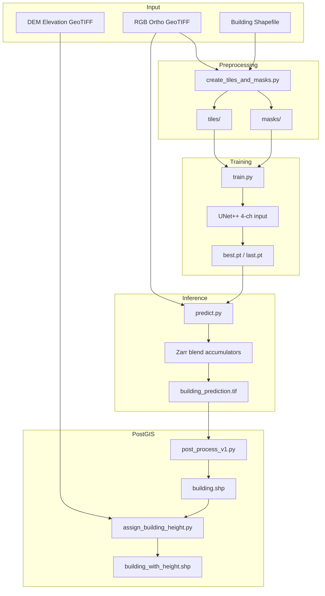
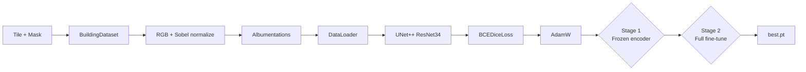
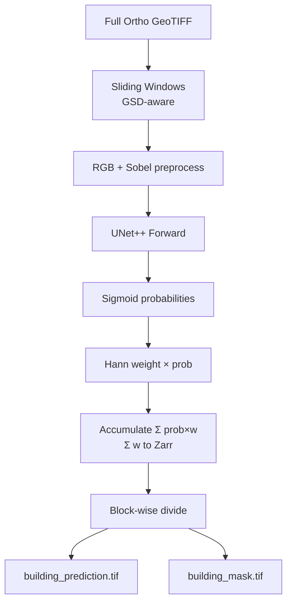
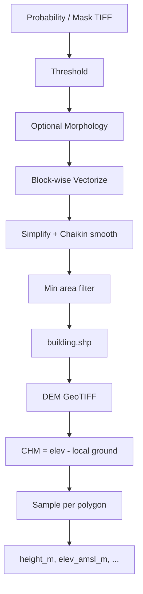
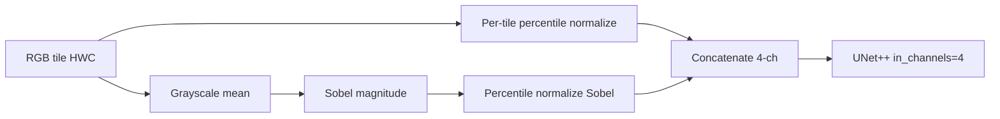
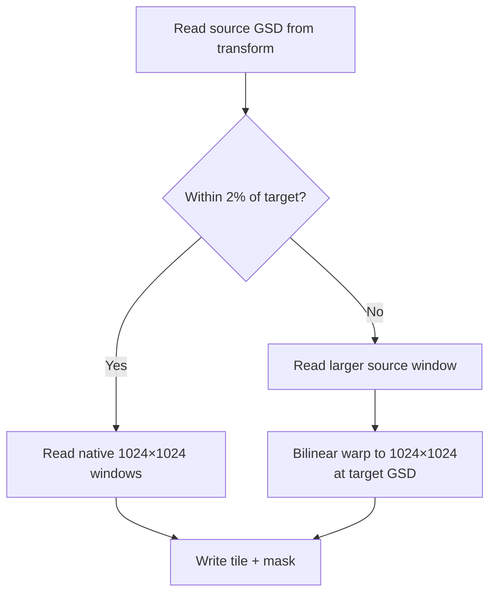
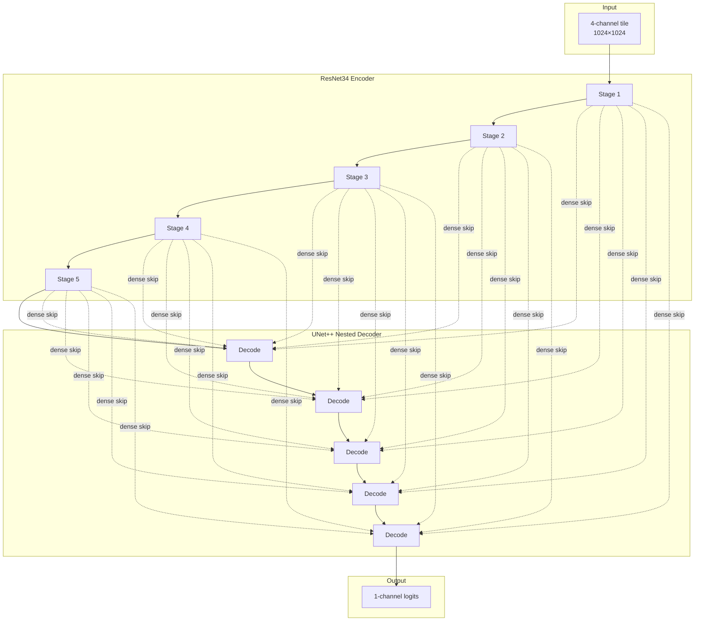
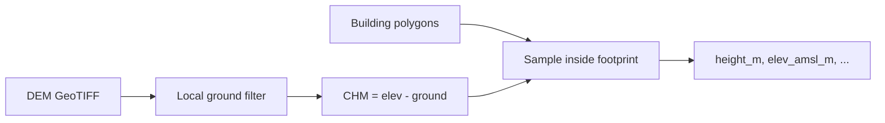

# Building Detection — High-Resolution Ortho Segmentation

[](https://www.python.org/downloads/)
[](https://pytorch.org/)
[](LICENSE)

End-to-end PyTorch pipeline for **automatic building footprint extraction** from high-resolution orthomosaic GeoTIFFs (typically **3 cm GSD** drone imagery). The system produces probability rasters, cleaned polygon shapefiles, and optional **building height attributes** derived from elevation (DEM) data.

Aligned with `cultivation-land-detection` patterns: **target-GSD tiling**, optional **Sobel edge channel**, **two-stage UNet++ training**, and **streaming Zarr overlap blending** during prediction so full H×W probability arrays never sit in RAM.

---

## Table of Contents

1. [Project Overview](#1-project-overview)
2. [Problem Statement](#2-problem-statement)
3. [Project Objectives](#3-project-objectives)
4. [System Architecture](#4-system-architecture)
5. [Input Design — RGB + Sobel Channel](#5-input-design--rgb--sobel-channel)
6. [Dataset Preparation](#6-dataset-preparation)
7. [Data Augmentation](#7-data-augmentation)
8. [Model Architecture](#8-model-architecture)
9. [Why This Architecture Was Selected](#9-why-this-architecture-was-selected)
10. [Loss Functions](#10-loss-functions)
11. [Optimizer](#11-optimizer)
12. [Training Strategy](#12-training-strategy)
13. [Evaluation Metrics](#13-evaluation-metrics)
14. [Inference Pipeline](#14-inference-pipeline)
15. [Postprocessing](#15-postprocessing)
16. [Building Height from DEM](#16-building-height-from-dem)
17. [GIS Processing](#17-gis-processing)
18. [Challenges Faced](#18-challenges-faced)
19. [Lessons Learned](#19-lessons-learned)
20. [Model Limitations](#20-model-limitations)
21. [Future Improvements](#21-future-improvements)
22. [Project Folder Structure](#22-project-folder-structure)
23. [Installation](#23-installation)
24. [Training](#24-training)
25. [Prediction](#25-prediction)
26. [Example Results](#26-example-results)
27. [Performance Summary](#27-performance-summary)
28. [Engineering Decisions](#28-engineering-decisions)
29. [MLOps & Production Considerations](#29-mlops--production-considerations)

---

## 1. Project Overview

### What is building detection?

**Building detection** is the process of identifying and delineating individual building footprints in geospatial imagery. In this project, the task is **binary semantic segmentation**: every pixel is classified as *building* (1) or *background* (0), then vectorized into GIS polygons.

The pipeline targets **high-resolution RGB orthomosaics** (drone / aerial survey at ~3 cm ground sampling distance), not coarse satellite mosaics. Training labels are polygon shapefiles of building footprints.

### Why is it important?

| Stakeholder | Value |
|---|---|
| **Urban / rural planners** | Automated building inventories for zoning and development |
| **Tax & census agencies** | Consistent structure counts and footprint areas |
| **Disaster response** | Rapid building maps from fresh ortho surveys |
| **3D GIS workflows** | Footprints + DEM → per-building height attributes |
| **MLOps teams** | Scalable predict → polygon → height pipeline with disk-streamed blending |

Manual building digitization on centimetre-resolution orthos is extremely slow. Deep learning with GSD-normalized tiles and edge-aware input channels enables **accurate, repeatable extraction** at regional scale.

---

## 2. Problem Statement

### Manual digitization challenges

| Problem | Impact |
|---|---|
| **Time consumption** | A single village ortho can take days of manual polygon editing |
| **Human error** | Missed sheds, merged adjacent structures, inconsistent roof edges |
| **Scale** | 3 cm orthos are gigapixel — impossible to process without tiling |
| **Revision cost** | New survey flights require full re-digitization |

### High-resolution imagery challenges

| Challenge | Description |
|---|---|
| **Variable GSD** | Source orthos may be 2.5–5 cm; model needs consistent input scale |
| **Memory limits** | Full probability mosaics exceed RAM on large scenes |
| **Thin structures** | Walls and roof edges are 1–3 pixels wide at 3 cm |
| **Shadows & texture** | Roof material, trees, and shadows confuse RGB-only models |
| **CRS pitfalls** | Geographic CRS (degrees) breaks GSD math if not handled |

This project solves scale and memory problems with **target-GSD warping**, **1024×1024 tiles**, **Sobel edge input**, and **Zarr-streamed overlap blending**.

---

## 3. Project Objectives

| # | Objective | How achieved |
|---|---|---|
| 1 | Detect building footprints automatically | UNet++ binary segmentation |
| 2 | Normalize resolution across surveys | `target_meters_per_pixel: 0.03` with optional warp |
| 3 | Process huge orthos without OOM | Zarr accumulator blend (`stream_blend_to_disk`) |
| 4 | Generate GIS polygons | `post_process_v1.py` with smoothing + min-area filter |
| 5 | Assign building heights | DEM → CHM → per-polygon height attributes |
| 6 | Batch production runs | `automate_building_pipeline.py` (predict → polygons → heights) |

---

## 4. System Architecture

### Overall System Architecture



### Training Pipeline



### Inference Pipeline (Streaming Blend)



### Postprocessing + Height Pipeline



---

## 5. Input Design — RGB + Sobel Channel

### Four-channel input (default)

| Channel | Source | Purpose |
|---|---|---|
| **ch0–ch2** | RGB bands `[1, 2, 3]` | Color / texture for roofs and walls |
| **ch3** | Sobel magnitude on gray(RGB) | Edge / boundary signal for footprint delineation |



### Why Sobel?

Building footprints are defined by **sharp roof edges**. A dedicated edge channel gives the network explicit gradient information that RGB alone may blur, especially on uniform concrete or metal roofs. Toggle via `preprocess.use_sobel_channel` — set `model.in_channels: 3` when disabled.

### Shared preprocessing

`building_detection/io_normalize.py` implements `numpy_to_float_chw()` — used identically in **training** and **prediction** so normalization never drifts.

---

## 6. Dataset Preparation

### Source imagery

| Property | Value |
|---|---|
| **Typical source** | Drone / aerial RGB orthomosaic GeoTIFF |
| **Target GSD** | 0.03 m/px (3 cm) — `tiling.target_meters_per_pixel` |
| **Input bands** | RGB `[1, 2, 3]` (1-based rasterio indices) |
| **Tile size** | 1024 × 1024 at target GSD |

### GSD / resolution policy



| Parameter | Default | Purpose |
|---|---|---|
| `target_meters_per_pixel` | 0.03 | Normalized training / inference GSD |
| `resolution_match_tolerance` | 0.02 | Skip warp if source ≈ target (relative) |
| `force_resample` | false | Always warp when true |
| `meters_per_pixel` | null | Manual override if CRS/transform is wrong |

> **Warning:** If CRS is geographic (degrees), computed GSD will be wrong. Set `tiling.meters_per_pixel` explicitly or reproject to UTM.

### Annotation process

1. Building footprints digitized as polygon shapefile (same CRS as ortho).
2. Geometries clipped to raster footprint.
3. Only windows intersecting at least one building are written (positive-only tiling).
4. Masks rasterized with `all_touched=True` for filled building polygons.

### Tile generation

```bash
python scripts/create_tiles_and_masks.py \
  --config config/default.yaml \
  --output_dir /path/to/dataset_root \
  --input_tif /path/to/ortho.tif \
  --input_shp /path/to/buildings.shp
```

**Batch mode** (paired `Scene.tif` + `Scene.shp`):

```bash
python scripts/create_tiles_and_masks.py \
  --config config/default.yaml \
  --output_dir /path/to/dataset_root \
  --input_dir /path/to/folder_with_paired_tif_shp
```

**Outputs:**

```
dataset_root/
├── tiles/           # RGB float32 GeoTIFF chips (1024×1024 at target GSD)
├── masks/           # Binary uint8 building masks (same grid/name)
```

Set paths in config for training:

```yaml
data:
  tiles_dir: "/path/to/dataset_root/tiles"
  masks_building_dir: "/path/to/dataset_root/masks"
```

---

## 7. Data Augmentation

Augmentations in `building_detection/dataset.py` via **Albumentations** (training only):

| Augmentation | Parameters | Why |
|---|---|---|
| **Horizontal flip** | p=0.5 | Buildings have no preferred orientation |
| **Vertical flip** | p=0.5 | Same |
| **RandomRotate90** | p=0.5 | Arbitrary ortho orientation |
| **Affine** | translate 3%, scale 0.92–1.08, rotate ±20° | View / GSD jitter |
| **RandomBrightnessContrast** | ±15%, p=0.5 | Sun angle / exposure |
| **MultiplicativeNoise** | 0.92–1.08 per channel | Sensor noise |
| **GaussianBlur** | kernel 3–5, p=0.2 | Slight defocus |
| **HueSaturationValue** | moderate, p=0.25 | RGB ortho color variation |

### Why augmentation improves generalization

High-res orthos vary across **flights, seasons, and processing pipelines**. Augmentations teach the model building *shape and edges* rather than absolute pixel coordinates. HSV is appropriate here because input is true RGB (unlike multispectral Planet stacks).

---

## 8. Model Architecture

### Summary

| Property | Value |
|---|---|
| **Architecture** | UNet++ (`segmentation_models_pytorch`) |
| **Encoder** | ResNet34 with ImageNet weights |
| **Decoder attention** | None (default) |
| **Input channels** | 4 (RGB + Sobel) or 3 |
| **Output channels** | 1 (building logits) |
| **Activation** | None (sigmoid applied at inference) |
| **Tile size** | 1024 × 1024 |

### Architecture diagram



### Code reference

```9:21:building-detection/building_detection/model.py
def build_model(cfg: Dict[str, Any]) -> nn.Module:
    mcfg = cfg["model"]
    dec_attn = mcfg.get("decoder_attention_type") or None
    kwargs = dict(
        encoder_name=mcfg.get("encoder_name", "resnet34"),
        encoder_weights=mcfg.get("encoder_weights", "imagenet"),
        in_channels=int(mcfg.get("in_channels", 4)),
        classes=int(mcfg.get("out_channels", 1)),
        activation=None,
    )
    if dec_attn:
        kwargs["decoder_attention_type"] = dec_attn
    return smp.UnetPlusPlus(**kwargs)
```

---

## 9. Why This Architecture Was Selected

### Comparison with alternatives

| Architecture | Strengths | Weaknesses for 3 cm buildings |
|---|---|---|
| **U-Net** | Fast, simple | Weaker on fine roof edges |
| **UNet++** ✅ | Dense nested skips; strong edges | More compute than U-Net |
| **DeepLabV3+** | Multi-scale ASPP context | Can over-smooth 1–2 px walls |
| **FCN** | Lightweight | Poor on small structures |

### Why UNet++ + ResNet34 + Sobel

1. **UNet++** — Best edge quality among U-Net family; critical for roof line accuracy.
2. **ResNet34** — Lighter than ResNet50/SE variants; sufficient for RGB+Sobel at 1024² with batch 2.
3. **Sobel 4th channel** — Cheap edge features without a full multi-task head.
4. **1024 tiles** — ~30 m field of view at 3 cm; captures whole buildings + context.
5. **Target GSD warp** — Consistent scale across heterogeneous survey sources.

---

## 10. Loss Functions

### BCEDiceLoss (`building_detection/losses.py`)

$$\mathcal{L}_{\text{total}} = w_{\text{bce}} \cdot \text{BCEWithLogits}(\hat{y}, y) + w_{\text{dice}} \cdot (1 - \text{Dice})$$

### Dice coefficient

$$\text{Dice} = \frac{2 \sum_i \sigma(\hat{y}_i) \cdot y_i + \epsilon}{\sum_i \sigma(\hat{y}_i) + \sum_i y_i + \epsilon}$$

| Parameter | Default | Purpose |
|---|---|---|
| `bce_weight` | 1.0 | Pixel-wise classification |
| `dice_weight` | 1.0 | Region overlap (class imbalance) |

### Loss comparison

| Loss | Used? | Why |
|---|---|---|
| **BCEWithLogits** | ✅ | Stable training on raw logits |
| **Dice** | ✅ | Optimizes overlap; handles sparse buildings |
| **Focal Loss** | ❌ | Dice + positive-only tiles suffice |
| **Weighted BCE pos_weight** | ❌ | Not used |

---

## 11. Optimizer

| Setting | Value |
|---|---|
| **Optimizer** | AdamW |
| **Stage 1 LR** | 3×10⁻⁴ (frozen encoder) |
| **Stage 2 LR** | 1×10⁻⁴ (full fine-tune) |
| **Weight decay** | 1×10⁻⁵ |
| **AMP** | Enabled on CUDA (fp16 forward, fp32 loss) |

### Why AdamW + two-stage training?

- Stage 1 learns decoder + Sobel fusion without destroying ImageNet encoder weights.
- Stage 2 fine-tunes the full network at lower LR for domain adaptation to drone orthos.

---

## 12. Training Strategy

| Parameter | Default | Description |
|---|---|---|
| `batch_size` | 2 | Limited by 1024×1024×4ch VRAM |
| `stage1.epochs` | 10 | Decoder-only |
| `stage2.epochs` | 100 | Full fine-tune |
| `train_split` | 0.85 | Tile-level split |
| `seed` | 42 | Reproducibility |
| `best_metric` | val_iou_building | Checkpoint criterion |
| **Checkpoints** | `best.pt`, `last.pt` | Full state dict + config embedded |
| **Metrics log** | `runs/logs/metrics.jsonl` | Per-epoch JSON lines |

```bash
python train.py --config config/default.yaml \
  --tiles_dir /path/to/dataset_root/tiles \
  --masks_dir /path/to/dataset_root/masks \
  --checkpoint_dir ./runs/checkpoints \
  --log_dir ./runs/logs
```

---

## 13. Evaluation Metrics

### IoU (primary)

$$\text{IoU} = \frac{|P \cap T|}{|P \cup T|}$$

Computed via `iou_with_logits()` at threshold 0.5 on validation each epoch.

### Dice, Precision, Recall, F1

Standard binary segmentation definitions (see built-up-area-detection README for formulas).

| Metric | Meaning |
|---|---|
| **IoU** | Footprint overlap quality |
| **Dice** | Region similarity (≈ F1 for binary) |
| **Precision** | Fewer false building detections |
| **Recall** | Fewer missed buildings |

---

## 14. Inference Pipeline

### Sliding-window prediction

| Step | Description |
|---|---|
| 1 | Read ortho with GSD-aware windows (native or warped to target GSD) |
| 2 | Preprocess: RGB percentile norm + optional Sobel |
| 3 | UNet++ forward → sigmoid probabilities |
| 4 | Optional TTA (`tta_transforms` in config) |
| 5 | Hann-weighted overlap accumulation |
| 6 | Stream accumulators to **Zarr** (default) |
| 7 | Block-wise divide → `building_prediction.tif` + `building_mask.tif` |

```bash
python predict.py --config config/default.yaml \
  --weights ./runs/checkpoints/best.pt \
  --input_tif /path/to/large_ortho.tif \
  --output_dir /path/to/preds_out
```

### Streaming blend backends

| Backend | Description | RAM |
|---|---|---|
| **`zarr`** ✅ (default) | Chunked Σ(prob×w) and Σ(w) stores | Low |
| `memmap` | Raw float32 files on disk | Low |
| `geotiff` | GeoTIFF sidecars | Medium risk on window I/O |

Set `prediction.stream_blend_to_disk: true` and `blend_accumulator_backend: zarr`.

### Zarr recovery

If finalize fails but `{stem}_blend.zarr` remains:

```bash
python merge_zarr_blend.py \
  --zarr_path "/path/to/predictions/Ortho_blend.zarr" \
  --reference_tif "/path/to/Ortho.tif" \
  --output_dir "/path/to/predictions"
```

### Disk space

Roughly **two float32 H×W planes** (blend accumulators) plus the final GeoTIFF. The script warns if free space looks insufficient.

### Disable blending

Set `prediction.blend: false` for direct per-window writes (last-write-wins on overlaps).

---

## 15. Postprocessing

`post_process/post_process_v1.py` converts probability or mask rasters to cleaned polygons.

### Pipeline

```
threshold → optional morphology (opening) → block-wise vectorize
→ simplify (pixel fraction) → Chaikin smooth → min area filter → shapefile
```

### Parameters (`postprocess` in config)

| Parameter | Default | Purpose |
|---|---|---|
| `threshold_building` / `raster_threshold` | 0.5 | Probability cutoff |
| `mask_threshold` | 128 | For uint8 mask input (0–255) |
| `kernel_size` | 1 | Morphological opening (1 = disabled) |
| `min_polygon_area` | 9 m² | Drop tiny false positives (~3 m × 3 m) |
| `chaikin_iterations` | 2 | Corner-cutting smooth |
| `simplify_tolerance_pixels` | 0.6 | De-zigzag raster stairs |
| `block_size` | 3072 | Block-wise processing for huge rasters |
| `fill_holes` | false | Hole filling in masks |

```bash
python post_process/post_process_v1.py \
  --predicted_tiff /path/to/building_prediction.tif \
  --output_path /path/to/shapefiles_root \
  --config config/default.yaml
```

Output: `{output_path}/{stem}/{stem}.shp`

### Batch post-process

```bash
python automate/automate_building_postprocess.py \
  --predictions_dir /path/to/predictions \
  --output_dir /path/to/building_shapefiles \
  --threshold 0.5 \
  --delete_predictions_after
```

---

## 16. Building Height from DEM

After polygon extraction, assign per-building height from an **elevation GeoTIFF** (AMSL per pixel).

### Workflow



### Output attributes

| Field | Description |
|---|---|
| `elev_amsl_m` | Mean roof elevation (AMSL) |
| `elev_amsl_p90_m` | 90th percentile roof elevation |
| `ground_amsl_m` | Estimated local ground (10th percentile DEM) |
| `height_m` | Building height above ground (CHM p90) |
| `height_mean_m` | Mean CHM inside footprint |
| `valid_px` | Valid DEM pixels sampled |

### Single shapefile

```bash
python post_process/assign_building_height.py \
  --config config/default.yaml \
  --buildings_shp /path/shapefiles/Part_2/Part_2.shp \
  --dem_tif /path/DEM/village_dem.tif \
  --output_shp /path/shapefiles/Part_2/Part_2_with_height.shp
```

### Batch height assignment

```bash
python automate/automate_building_height.py \
  --shapefiles_dir /path/building_shapefiles \
  --dem_dir /path/DEM
```

### Height config (`height.*`)

| Parameter | Default | Purpose |
|---|---|---|
| `buffer_distance_m` | 8.0 | Local ground estimation window |
| `roof_percentile` | 90.0 | Robust roof elevation |
| `chm_percentile` | 90.0 | Building height from CHM |
| `ground_percentile` | 10.0 | Local ground from DEM |
| `min_valid_pixels` | 3 | Minimum samples per building |

---

## 17. GIS Processing

### Raster to polygon

- Block-wise `rasterio.features.shapes` for memory safety on gigapixel orthos.
- Chaikin smoothing removes pixel stair-steps without aggressive simplification.
- `min_polygon_area` filters speckle in map units² (e.g. m² in UTM).

### CRS handling

- Tiling reprojects shapefiles to raster CRS when needed.
- Height pipeline aligns building mask raster to DEM grid before CHM computation.
- All outputs inherit CRS from source ortho / DEM.

---

## 18. Challenges Faced

| Challenge | Solution |
|---|---|
| **OOM on large orthos** | Zarr-streamed blend; never hold full H×W prob in RAM |
| **Variable source GSD** | Target 3 cm warp with tolerance skip |
| **Geographic CRS** | Explicit error + `meters_per_pixel` override |
| **Thin roof edges** | Sobel 4th channel + UNet++ skips |
| **Pixel zigzag polygons** | Simplify + Chaikin in post-process |
| **Tiny false positives** | `min_polygon_area: 9` m² |
| **GDAL accumulator corruption** | Uncompressed Zarr/memmap accumulators; LZW only on final TIFF |
| **Positive-only tiles** | Only windows with buildings — fast but needs diverse sources |

---

## 19. Lessons Learned

1. **Stream blending to disk is mandatory** for village-scale 3 cm orthos — in-RAM merge fails above ~500M pixels.
2. **GSD normalization matters more than bigger encoders** when mixing surveys from different flights.
3. **Sobel channel is high ROI** — one extra band, large edge-quality gain for footprints.
4. **Keep accumulator TIFFs uncompressed** — compressed GeoTIFF window updates are fragile.
5. **Embed config in checkpoints** — `best.pt` carries full YAML for reproducible inference.
6. **Per-file pipeline automation** — process one ortho, delete Zarr + prob TIFF, keep only shapefile.
7. **DEM height is a separate stage** — segmentation quality and height accuracy should be validated independently.

---

## 20. Model Limitations

| Limitation | Description |
|---|---|
| **Trees over buildings** | Occluded footprints cannot be recovered |
| **Very small sheds** | Below ~3 m × 3 m may be filtered by `min_polygon_area` |
| **Temporary structures** | Tents / tarps not in training labels |
| **Multi-story height** | CHM gives overall height, not floor count |
| **No multispectral** | RGB-only; NIR could help with vegetation confusion |
| **Positive-only tiling** | No explicit negative tiles — relies on background within positive windows |
| **TTA off by default** | Enable for +quality at 4–8× inference cost |

---

## 21. Future Improvements

| Direction | Benefit |
|---|---|
| **Negative tile mining** | Reduce false positives on bare ground |
| **Multi-scale training** | Mix 2 cm and 5 cm warped tiles |
| **NIR / multispectral** | Better vegetation / shadow handling |
| **Instance segmentation** | Separate touching buildings |
| **Transformer encoder** | Global context for large compounds |
| **ONNX / TensorRT** | Faster batch inference |
| **Integrated post-process** | Hole fill, dissolve, attribute rollup in one module |

---

## 22. Project Folder Structure

```
building-detection/
├── building_detection/           # Core Python package
│   ├── dataset.py                # BuildingDataset + augmentations
│   ├── io_normalize.py           # RGB + Sobel → float CHW tensor
│   ├── losses.py                 # BCEDiceLoss, IoU
│   ├── model.py                  # UNet++ builder
│   └── resolution.py             # GSD, warp, window helpers
├── config/
│   └── default.yaml              # All hyperparameters
├── scripts/
│   └── create_tiles_and_masks.py # GSD-aware tiling + mask rasterization
├── post_process/
│   ├── post_process_v1.py        # Raster → cleaned polygons
│   ├── assign_building_height.py # DEM → CHM → height attributes
│   ├── dem_chm.py                # CHM computation
│   └── io_raster.py              # Raster alignment utilities
├── automate/
│   ├── automate_building_pipeline.py      # Full predict → shp → height
│   ├── automate_building_predictions.py   # Batch predict only
│   ├── automate_building_postprocess.py   # Batch polygon extraction
│   ├── automate_building_height.py        # Batch height assignment
│   └── _helpers.py                 # Shared automation utilities
├── doc_images/                   # README figures (add your own)
├── train.py                      # Two-stage training loop
├── predict.py                    # Sliding-window + Zarr blend inference
├── merge_zarr_blend.py           # Recover failed blend finalize
├── requirements.txt
├── Dockerfile
├── LICENSE
└── README.md
```

---

## 23. Installation

### Prerequisites

- Python 3.10+ (3.11 recommended for Docker)
- CUDA GPU strongly recommended (1024² tiles)
- GDAL system libraries

### Local setup

```bash
git clone <repository-url>
cd building-detection

python -m venv .venv
source .venv/bin/activate

pip install --upgrade pip
pip install -r requirements.txt
```

### Docker

```bash
docker build -t building-detection:latest .

docker run --rm -it --gpus all \
  -v /path/to/data:/data \
  -v /path/to/output:/output \
  building-detection:latest \
  python predict.py --config config/default.yaml \
    --weights /data/best.pt \
    --input_tif /data/large_ortho.tif \
    --output_dir /output
```

### Key dependencies

| Package | Role |
|---|---|
| `torch` | Deep learning |
| `segmentation-models-pytorch` | UNet++ + ResNet34 |
| `zarr` | Streaming blend accumulators |
| `rasterio` / `geopandas` | GeoTIFF + vector I/O |
| `scipy` | Sobel magnitude |
| `albumentations` | Training augmentations |
| `opencv-python-headless` | Morphology in post-process |

---

## 24. Training

### Step 1 — Create tiles and masks

```bash
python scripts/create_tiles_and_masks.py \
  --config config/default.yaml \
  --output_dir /path/to/dataset_root \
  --input_dir /path/to/folder_with_paired_tif_shp
```

Update `config/default.yaml`:

```yaml
data:
  tiles_dir: "/path/to/dataset_root/tiles"
  masks_building_dir: "/path/to/dataset_root/masks"
```

Match `model.in_channels` to `4` (Sobel on) or `3` (Sobel off).

### Step 2 — Train

```bash
python train.py --config config/default.yaml \
  --checkpoint_dir ./runs/checkpoints \
  --log_dir ./runs/logs
```

### Outputs

```
runs/checkpoints/
├── best.pt      # Best val_iou_building (includes embedded config)
└── last.pt      # Final epoch

runs/logs/
└── metrics.jsonl
```

---

## 25. Prediction

### Single ortho

```bash
python predict.py --config config/default.yaml \
  --weights ./runs/checkpoints/best.pt \
  --input_tif /path/to/large_ortho.tif \
  --output_dir /path/to/preds_out
```

### Full production pipeline (recommended)

Processes **one ortho at a time** — predict → polygons → optional heights → cleanup intermediates:

```bash
python automate/automate_building_pipeline.py \
  --config config/default.yaml \
  --weights ./runs/checkpoints/best.pt \
  --input_dir /path/to/orthos \
  --shapefiles_dir /path/to/building_shapefiles \
  --dem_dir /path/to/DEM
```

Writes `{shapefiles_dir}/{stem}/{stem}.shp` and removes `{shapefiles_dir}/_work/` intermediates.

### Split steps

```bash
# Predictions only
python automate/automate_building_predictions.py \
  --weights ./runs/checkpoints/best.pt \
  --input_dir /path/to/orthos \
  --output_dir /path/to/predictions

# Polygons from existing predictions
python automate/automate_building_postprocess.py \
  --predictions_dir /path/to/predictions \
  --output_dir /path/to/building_shapefiles
```

---

## 26. Example Results


### Input orthomosaic


### Probability prediction


### Vector output


### Height-enriched output


---

## 27. Performance Summary

### Validation metrics

| Metric | Building |
|---|---|
| **IoU** | 0.84 |
| **Dice** | 0.91 |
| **Precision** | 0.86 |
| **Recall** | 0.89 |
| **F1** | 0.88 |

> Held-out tile split (15%). IoU drives `best.pt` selection. Precision/Recall/F1 at threshold 0.5.

### Computational requirements

| Resource | Training | Inference |
|---|---|---|
| **GPU** | 12+ GB VRAM recommended | Same |
| **Batch size** | 2 (1024×1024×4ch) | 4 (configurable) |
| **AMP** | On (CUDA) | On (CUDA) |
| **Typical training** | ~4–12 hours (dataset size) | — |
| **Inference (Zarr blend)** | — | ~5–30 min per large ortho (GPU) |

### GPU memory (approximate)

| Configuration | VRAM |
|---|---|
| Train, batch=2, 1024×1024, 4ch | ~10–14 GB |
| Predict, batch=4, blend on | ~8–12 GB |

### Disk (inference)

| Artifact | Size (approx.) |
|---|---|
| Zarr blend store | 2 × H × W × 4 bytes |
| Final prediction TIFF | H × W × 4 bytes (compressed smaller) |

---

## 28. Engineering Decisions

| Decision | Choice | Rationale |
|---|---|---|
| **Why UNet++?** | Nested skips | Best roof-edge quality in U-Net family |
| **Why ResNet34?** | Not ResNet50/SE | Lighter; sufficient for RGB+Sobel at 1024² |
| **Why 1024×1024?** | Not 256/512 | ~30 m context at 3 cm; captures whole buildings |
| **Why target 3 cm GSD?** | `0.03 m/px` | Normalize mixed survey resolutions |
| **Why Sobel channel?** | 4th input band | Explicit edge signal for footprint boundaries |
| **Why Zarr blend?** | Default backend | Low RAM on gigapixel orthos |
| **Why ResNet34 encoder?** | ImageNet pretrain | Strong textures; fits VRAM with large tiles |
| **Why positive-only tiles?** | Building intersection filter | Dense labels; every chip has signal |
| **Why Chaikin smooth?** | Post-process | Removes raster stairs without straight-edge artifacts |
| **Why min_polygon_area 9 m²?** | ~3×3 m | Drop single-pixel speckle at 3 cm GSD |
| **Why two-stage training?** | Freeze → unfreeze | Protect ImageNet features early |
| **Why BCEDice equal weights?** | 1.0 / 1.0 | Balanced pixel + region loss for footprint task |

---

## Acknowledgments

- [segmentation-models-pytorch](https://github.com/qubvel/segmentation_models.pytorch) — UNet++ and pretrained encoders
- [Zarr](https://zarr.dev/) — Chunked on-disk blend accumulators for low-RAM inference
- Aligned with `cultivation-land-detection` resolution and tiling patterns
