# Built-up Area Detection — Impervious Surface Segmentation

[](https://www.python.org/downloads/)
[](https://pytorch.org/)

End-to-end deep learning pipeline for **automatic detection and mapping of built-up / impervious areas** from Planet multispectral satellite imagery. The system produces probability GeoTIFFs and GIS-ready polygon shapefiles suitable for land-use planning, urban extent analysis, and regional mapping workflows.

---

## Table of Contents

1. [Project Overview](#1-project-overview)
2. [Problem Statement](#2-problem-statement)
3. [Project Objectives](#3-project-objectives)
4. [System Architecture](#4-system-architecture)
5. [Single-Head Binary Design](#5-single-head-binary-design)
6. [Dataset Preparation](#6-dataset-preparation)
7. [Data Augmentation](#7-data-augmentation)
8. [Model Architecture](#8-model-architecture)
9. [Why This Architecture Was Selected](#9-why-this-architecture-was-selected)
10. [Loss Functions](#10-loss-functions)
11. [Optimizer](#11-optimizer)
12. [Training Strategy](#12-training-strategy)
13. [Evaluation Metrics](#13-evaluation-metrics)
14. [Inference Pipeline](#14-inference-pipeline)
15. [Postprocessing](#15-postprocessing)
16. [GIS Processing](#16-gis-processing)
17. [Challenges Faced](#17-challenges-faced)
18. [Lessons Learned](#18-lessons-learned)
19. [Model Limitations](#19-model-limitations)
20. [Future Improvements](#20-future-improvements)
21. [Project Folder Structure](#21-project-folder-structure)
22. [Installation](#22-installation)
23. [Training](#23-training)
24. [Prediction](#24-prediction)
25. [Example Results](#25-example-results)
26. [Performance Summary](#26-performance-summary)
27. [Engineering Decisions](#27-engineering-decisions)
28. [MLOps & Production Considerations](#28-mlops--production-considerations)

---

## 1. Project Overview

### What is built-up area detection?

**Built-up area detection** is the process of identifying and delineating human-made impervious surfaces — buildings, roads, paved areas, and other constructed land cover — in geospatial imagery. In this project, the task is framed as **binary semantic segmentation**: every pixel in a satellite image tile is classified as either *built-up* (1) or *non-built-up* (0).

The model operates on **Planet-style multispectral GeoTIFFs** and learns from polygon shapefile annotations rasterized into binary training masks.

### Why is it important?

| Stakeholder | Value |
|---|---|
| **Urban planners** | Automated built-up extent maps replace slow manual digitization |
| **Land-use analysts** | Consistent impervious surface estimates across large regions |
| **GIS teams** | Standardized vector outputs ready for overlay and analysis |
| **MLOps engineers** | Reproducible pipeline from raw GeoTIFF to shapefile |

Manual mapping of built-up areas across district- or state-scale mosaics is time-consuming, expensive, and prone to inconsistency. Deep learning on high-resolution multispectral imagery enables **scalable, repeatable extraction** with GIS-native deliverables.

> **Reference literature:** UNet++ achieves superior edge extraction compared to plain U-Net for land-cover segmentation in remote sensing ([Remote Sensing, 2024](http://tb.chinasmp.com/EN/10.13474/j.cnki.11-2246.2024.0805)).

---

## 2. Problem Statement

### Manual digitization challenges

| Problem | Impact |
|---|---|
| **Time consumption** | Regional built-up inventories require hundreds of operator-hours |
| **Human error** | Missed structures, inconsistent boundary placement |
| **Subjectivity** | Different operators produce different polygon extents |
| **Revision cost** | Updated imagery forces full re-digitization |

### Large satellite imagery challenges

| Challenge | Description |
|---|---|
| **Memory limits** | Full mosaics exceed GPU memory — sliding-window inference is required |
| **Spectral confusion** | Bare soil, rock, and shadow can resemble built-up in visible bands |
| **Class imbalance** | Built-up pixels are often far fewer than background |
| **Scale variation** | Structures range from small sheds to large industrial complexes |
| **Annotation diversity** | Labels may come from Open Buildings, manual GIS, or mixed sources |

This project addresses these challenges with a **UNet++ segmentation model** on robustly normalized 6-band Planet chips, weighted loss for imbalance, and a production inference pipeline with overlap blending and optional TTA.

---

## 3. Project Objectives

| # | Objective | How achieved |
|---|---|---|
| 1 | Detect built-up areas automatically | UNet++ binary segmentation on 256×256 tiles |
| 2 | Generate GIS outputs | Probability raster → threshold → polygon shapefile |
| 3 | Reduce manual effort | Batch automation for predict and post-process |
| 4 | Improve consistency | Centralized YAML config, reproducible tiling metadata |
| 5 | Handle class imbalance | Weighted BCE (`pos_weight=5`) + Dice loss + negative tiles |

---

## 4. System Architecture

### Overall System Architecture

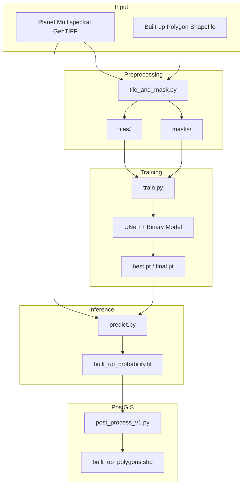

### Training Pipeline

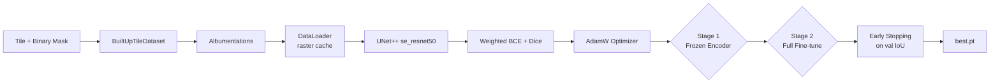

### Inference Pipeline

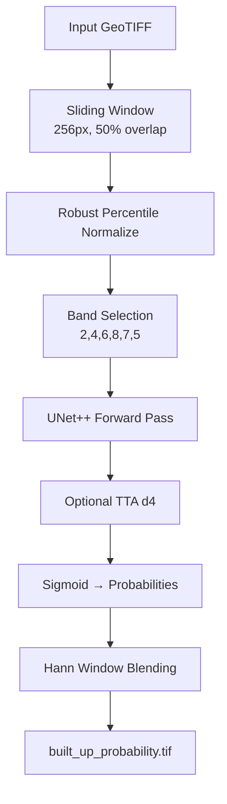

### Postprocessing Pipeline

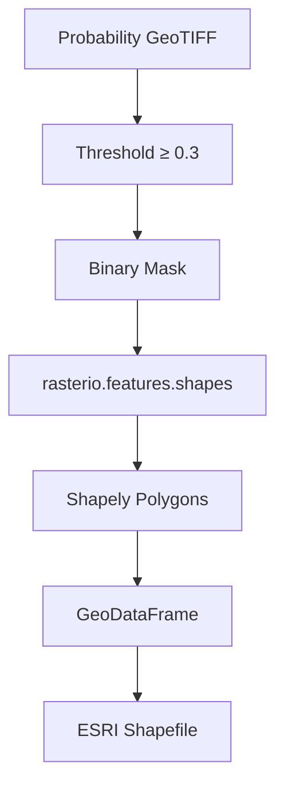

---

## 5. Single-Head Binary Design

### Architecture choice

Built-up area detection uses a **single output channel** with sigmoid activation:

| Property | Value |
|---|---|
| **Output channels** | 1 |
| **Activation** | Sigmoid (probabilities in [0, 1]) |
| **Target mask** | Binary 0/1 built-up raster |
| **Post-process** | Global threshold + vectorization |

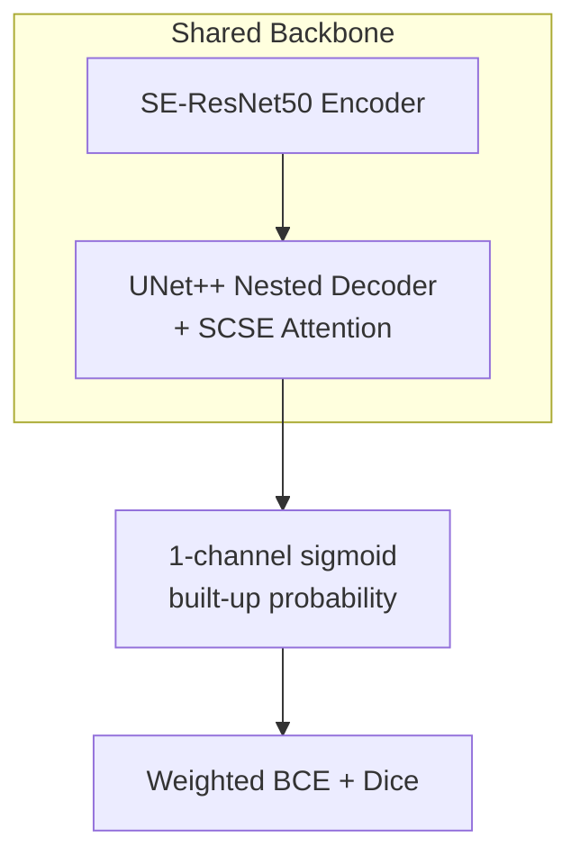

### Why single-head (not dual-head)?

| Dual-head (e.g. building + edge) | Single-head built-up |
|---|---|
| Useful when topological partitioning is required | Built-up regions are typically contiguous blobs |
| More complex training and inference | Simpler pipeline, faster inference |
| Two probability rasters to manage | One probability map → one shapefile |
| Higher GPU memory for multi-channel output | Efficient for large-scale batch processing |

**Core insight:** For regional impervious-surface mapping, the primary task is *where is built-up?* — not *how do we split adjacent units?* A single well-calibrated probability map with tuned post-processing threshold is sufficient.

---

## 6. Dataset Preparation

### Source imagery

| Property | Value |
|---|---|
| **Sensor** | Planet multispectral (13-band analytic stack) |
| **Format** | GeoTIFF with CRS + geotransform |
| **Selected bands** | Blue, Green, Red, NIR, Red Edge, Yellow |
| **Band indices (1-based)** | `[2, 4, 6, 8, 7, 5]` |

### Default Planet band layout

| Index | Band |
|------:|------|
| 1 | Coastal Blue |
| 2 | Blue |
| 3 | Green I |
| 4 | Green |
| 5 | Yellow |
| 6 | Red |
| 7 | Red Edge |
| 8 | NIR |
| 9–13 | Alpha, NDVI, NDWI, EVI (see `config/default.yaml`) |

**Model input order:** Blue → Green → Red → NIR → Red Edge → Yellow.

### Annotation process

1. Built-up regions are digitized as polygon shapefiles (any attribute schema; all polygons are treated as built-up).
2. Shapefile CRS is reprojected to match the raster if needed.
3. Geometries are sanitized (`make_valid`, `buffer(0)`) and clipped to the raster footprint.
4. Polygons are rasterized to binary masks (1 = built-up, 0 = background).

### Mask generation

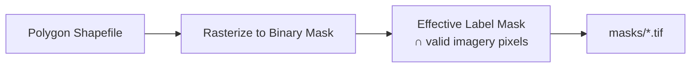

| Step | Description |
|---|---|
| Rasterize | `rasterio.features.rasterize` with `all_touched=False` (pixel-center inclusion) |
| Validity filter | Labels clipped to pixels with valid multispectral data |
| Negative tiles | Random land tiles with empty masks (20% of positive count) |

### Tile generation

| Parameter | Default | Purpose |
|---|---|---|
| `tile_size` | 256 | Matches model `input_size` |
| `overlap_fraction` | 0.5 | 50% overlap for training coverage |
| `min_valid_fraction` | 0.02 | Allow tiles with partial imagery (mosaic edges) |
| `negative_tile_ratio` | 0.2 | Background tiles for class balance |
| `percentile_low / high` | 2 / 98 | Robust per-band normalization |

```bash
python tile_and_mask.py \
  --config config/default.yaml \
  --input_tif /path/to/scene.tif \
  --input_shp /path/to/built_up_polygons.shp \
  --output_dir /path/to/dataset_root
```

**Folder of TIF + SHP pairs** (same base name per scene):

```bash
python tile_and_mask.py \
  --config config/default.yaml \
  --input_dir /path/to/folder_of_tif_shp_pairs \
  --output_dir /path/to/dataset_root
```

**Outputs:**

```
dataset_root/
├── tiles/              # Normalized 6-band float32 GeoTIFFs
├── masks/              # Binary uint8 0/1 masks
└── tiling_meta.json    # Band indices, tile size, normalization params
```

### Open Buildings variant

For Planet mosaics paired with Google Open Buildings GeoPackages:

```bash
python tile_and_mask_buildings.py \
  --tif_dir /path/to/mosaics \
  --gpkg_dir /path/to/open_buildings_gpkg \
  --output_dir /path/to/dataset_root \
  --config config/default.yaml
```

This script pairs `<uuid>_mosaic.tif` with `<uuid>_mosaic_open_buildings_clipped.gpkg` and delegates tiling to the same `create_tiles_for_raster` logic as `tile_and_mask.py`.

---

## 7. Data Augmentation

Augmentations are applied in `dataset.py` via **Albumentations**, geometry-safe on the binary mask.

| Augmentation | Parameters | Why |
|---|---|---|
| **Horizontal flip** | p=0.5 | Structures have no preferred orientation |
| **Vertical flip** | p=0.5 | Same as above |
| **RandomRotate90** | p=0.5 | Buildings appear at arbitrary angles |
| **ShiftScaleRotate** | shift±5%, scale±12%, rotate±20° | Viewpoint / GSD variation |
| **ElasticTransform / GridDistortion** | OneOf, p=0.25 | Irregular building footprints |
| **GaussNoise / GaussianBlur** | OneOf, p=0.35 | Sensor noise, atmospheric haze |
| **RandomGamma** | γ ∈ [0.82, 1.18], p=0.45 | Sun angle / exposure variation |

### Why augmentation improves generalization

Built-up spectral signatures vary with **roof material, sun angle, season, and atmospheric conditions**. Geometry-safe augmentations teach the network building *shape and spatial context* rather than absolute pixel layout. Photometric augmentations (gamma, noise, blur) reduce overfitting to specific radiometric conditions.

> Hue/saturation augmentations are intentionally **not** used — the input is multispectral, not RGB.

<!-- > Augmentations are **disabled** during validation and inference. -->

---

## 8. Model Architecture

### Summary

| Property | Value |
|---|---|
| **Architecture** | UNet++ (`segmentation_models_pytorch`) |
| **Encoder** | SE-ResNet50 (`se_resnet50`) with ImageNet weights |
| **Decoder attention** | SCSE (Spatial + Channel Squeeze-Excitation) |
| **Decoder channels** | (256, 128, 64, 32, 16) |
| **Input channels** | 6 |
| **Output channels** | 1 (built-up probability) |
| **Activation** | Sigmoid |
| **Input size** | 256 × 256 |

### Architecture diagram

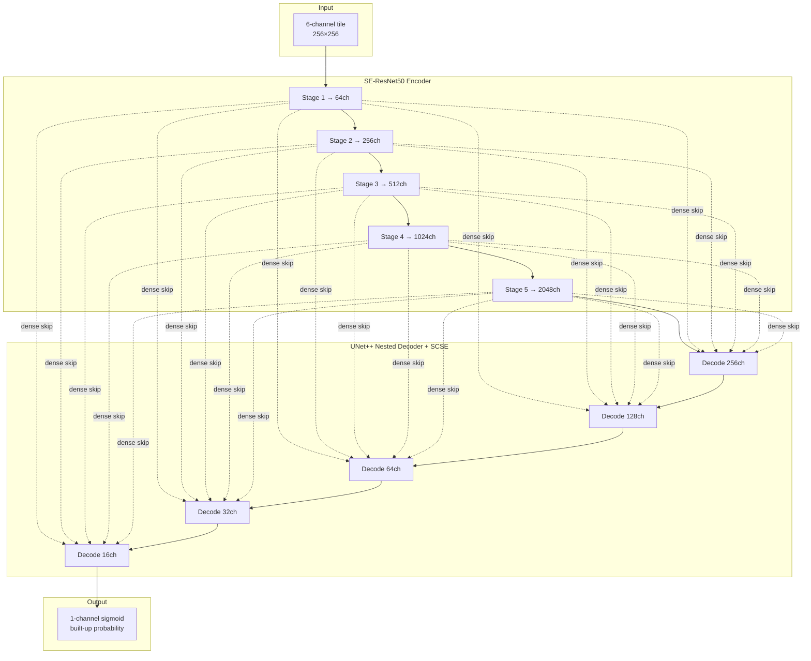

### Block roles

| Component | Role |
|---|---|
| **Encoder (SE-ResNet50)** | Hierarchical feature extraction; SE blocks recalibrate channel importance |
| **UNet++ nested decoder** | Dense skip pathways preserve fine building edges |
| **SCSE attention** | Spatial + channel focus on built-up structures |
| **Skip connections** | Preserve roof-edge detail from shallow encoder stages |
| **Sigmoid output** | Direct probability map — BCE computed on sigmoid output (not logits) |

### Code reference

```8:27:built-up-area-detection/model.py
def build_built_up_model(
    in_channels: int,
    encoder_name: str = "se_resnet50",
    encoder_weights: str | None = "imagenet",
    decoder_attention_type: str | None = "scse",
    decoder_channels: tuple[int, ...] = (256, 128, 64, 32, 16),
) -> nn.Module:
    """
    UNet++ with ImageNet encoder; extra spectral channels use SMP's default
    first-conv initialization when in_channels != 3.
    """
    return smp.UnetPlusPlus(
        encoder_name=encoder_name,
        encoder_weights=encoder_weights,
        in_channels=in_channels,
        classes=1,
        activation="sigmoid",
        decoder_attention_type=decoder_attention_type,
        decoder_channels=decoder_channels,
    )
```

---

## 9. Why This Architecture Was Selected

### Comparison with alternatives

| Architecture | Strengths | Weaknesses for built-up mapping |
|---|---|---|
| **U-Net** | Simple, fast | Weaker edge detail on small structures |
| **UNet++** ✅ | Dense nested skips; best edge quality in U-Net family | More parameters than plain U-Net |
| **DeepLabV3+** | Strong ASPP multi-scale context | Heavier; can over-smooth small buildings |
| **FCN** | Lightweight baseline | Coarse boundaries; poor on small structures |

### Why UNet++ + SE-ResNet50 works for built-up areas

1. **Edge quality:** Nested skip connections preserve roof lines and building footprints better than single-skip U-Net.
2. **Transfer learning:** ImageNet-pretrained SE-ResNet50 provides strong texture filters; SE blocks help weight multispectral channels.
3. **SCSE decoder attention:** Highlights spatially important built-up pixels while suppressing homogeneous fields.
4. **256×256 tiles:** Smaller patches increase effective batch size and suit building-scale features at ~3 m GSD.
5. **SMP ecosystem:** Production-tested implementation with flexible `in_channels` for multispectral stacks.

---

## 10. Loss Functions

The project uses a **combined weighted BCE + Dice loss** defined inline in `train.py`.

### Dice loss

$$\text{Dice} = \frac{2 \sum_i p_i t_i + \epsilon}{\sum_i p_i + \sum_i t_i + \epsilon}$$

$$\mathcal{L}_{\text{Dice}} = 1 - \text{Dice}$$

where \(p_i\) is the sigmoid model output and \(t_i \in \{0, 1\}\).

### Weighted BCE

$$\mathcal{L}_{\text{BCE}} = -\frac{1}{N} \sum_i \left[ w_i \cdot t_i \log p_i + (1 - t_i) \log(1 - p_i) \right]$$

where \(w_i = \text{pos\_weight}\) when \(t_i = 1\), else \(w_i = 1\).

Default `bce_pos_weight = 5.0` up-weights the rare built-up class.

### Combined loss

$$\mathcal{L}_{\text{total}} = w_{\text{bce}} \cdot \mathcal{L}_{\text{BCE}} + w_{\text{dice}} \cdot \mathcal{L}_{\text{Dice}}$$

| Parameter | Default | Purpose |
|---|---|---|
| `bce_pos_weight` | 5.0 | Handle severe class imbalance (few built-up pixels) |
| `loss_bce_weight` | 0.35 | Pixel-wise classification signal |
| `loss_dice_weight` | 0.65 | Region overlap optimization |

### Loss function comparison

| Loss | Used? | Purpose | Advantage |
|---|---|---|---|
| **Weighted BCE** | ✅ | Per-pixel log loss with class weighting | Strong signal on rare positive pixels |
| **Dice** | ✅ | Region overlap | Directly optimizes IoU-like metric |
| **Focal Loss** | ❌ | Down-weight easy negatives | Not needed — pos_weight + Dice + negative tiles suffice |
| **Combined** | ✅ | BCE + Dice | Balances pixel and region objectives |

### Why BCE is computed outside AMP

The model outputs sigmoid probabilities. BCE on sigmoid outputs is computed in **fp32 outside autocast** to avoid numerical instability — forward pass uses fp16, loss uses fp32.

---

## 11. Optimizer

| Setting | Value |
|---|---|
| **Optimizer** | AdamW |
| **Stage 1 LR** | 2×10⁻⁴ (decoder only, frozen encoder) |
| **Stage 2 LR** | 2×10⁻⁵ (full model fine-tune) |
| **Weight decay** | 1×10⁻⁵ |
| **LR schedule** | Warmup + cosine decay to `min_lr` = 1×10⁻⁸ |
| **Gradient clipping** | `grad_clip_norm` = 1.0 |

### Why AdamW?

- **Adaptive per-parameter learning rates** — important when fine-tuning a pretrained encoder alongside a new decoder.
- **Decoupled weight decay** regularizes without interfering with Adam momentum.
- **Two-stage schedule:** Stage 1 trains the decoder with frozen ImageNet features; Stage 2 unfreezes the encoder at 10× lower LR.

### CUDA optimizations

| Setting | Default | Purpose |
|---|---|---|
| `cudnn_benchmark` | true | Autotune convolutions for fixed 256×256 input |
| `cuda_allow_tf32` | true | Faster matmul on Ampere/Ada GPUs (RTX 30xx/40xx) |

---

## 12. Training Strategy

| Parameter | Default | Description |
|---|---|---|
| `batch_size` | 16 | RTX 4090-friendly for 256×256×6ch |
| `stage1_epochs` | 12 | Decoder-only training |
| `stage2_epochs` | 120 | Full fine-tune (with early stopping) |
| `validation_split` | 0.15 | Random tile-level holdout |
| `early_stopping_patience` | 18 | Monitors validation IoU |
| `num_workers` | 12 | Parallel data loading |
| `raster_cache_size` | 32 | LRU GeoTIFF handle cache per worker |
| `persistent_workers` | true | Keep workers alive between epochs |
| `prefetch_factor` | 4 | Prefetch batches per worker |
| **AMP** | On (CUDA) | Mixed precision fp16 forward, fp32 loss |
| **Checkpoint** | `best.pt` | Best validation IoU |
| **Metadata** | `model_meta.json` | Channels, patch size, paths |

### Two-stage training flow

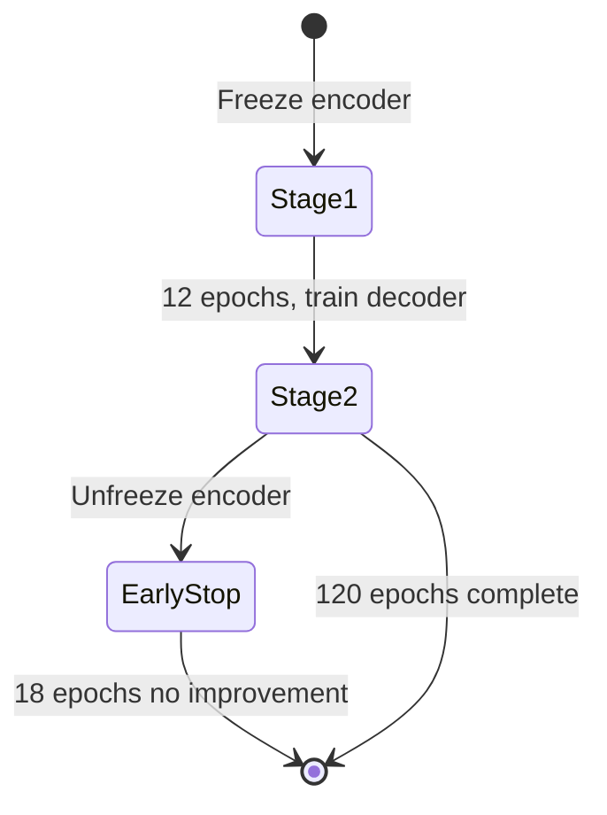

### Validation strategy

- Tile-level random split (85% train / 15% val).
- **Primary metric:** IoU at threshold 0.5 — drives checkpoint selection and early stopping.

```bash
python train.py \
  --tiles_dir /path/to/dataset_root/tiles \
  --masks_dir /path/to/dataset_root/masks \
  --config config/default.yaml \
  --output_dir ./outputs/models
```

---

## 13. Evaluation Metrics

### IoU (Intersection over Union) — primary metric

$$\text{IoU} = \frac{|P \cap T|}{|P \cup T|}$$

where \(P\) = predicted mask (thresholded at 0.5) and \(T\) = ground truth.

### Dice Score

$$\text{Dice} = \frac{2|P \cap T|}{|P| + |T|}$$

### Precision, Recall, F1

$$\text{Precision} = \frac{TP}{TP + FP}, \quad \text{Recall} = \frac{TP}{TP + FN}, \quad F1 = \frac{2 \cdot P \cdot R}{P + R}$$

| Metric | What it measures | High value means |
|---|---|---|
| **IoU** | Overlap quality | Accurate built-up extent |
| **Dice** | Region similarity | Good for imbalanced classes |
| **Precision** | False positive rate | Fewer false built-up detections |
| **Recall** | False negative rate | Fewer missed structures |
| **F1** | Balance of precision & recall | Overall detection quality |

> Training logs **val_iou** each epoch. Precision/Recall/F1 can be computed offline from saved predictions.

---

## 14. Inference Pipeline

| Step | Module | Description |
|---|---|---|
| 1 | `predict.py` | Read full GeoTIFF via rasterio |
| 2 | Sliding window | 256×256 tiles, 50% overlap (configurable) |
| 3 | Normalize | Robust percentile scaling (2nd–98th) per band |
| 4 | Band select | Extract bands [2, 4, 6, 8, 7, 5] |
| 5 | Model forward | UNet++ → sigmoid probability |
| 6 | TTA (optional) | D4 dihedral group (8 views), averaged |
| 7 | Blend | Hann window weighted overlap merge |
| 8 | Write | `built_up_probability.tif` (float32) or binary with `--threshold` |

```bash
python predict.py \
  --input_tif /path/to/large_scene.tif \
  --output_tif /path/to/built_up_probability.tif \
  --model_dir /path/to/outputs/models/run_YYYYMMDD_HHMMSS \
  --weights /path/to/outputs/models/run_YYYYMMDD_HHMMSS/best.pt \
  --batch_size 4 \
  --tta d4
```

### TTA modes

| Mode | Views | Cost multiplier |
|---|---|---|
| `none` | 1 | 1× |
| `hflip` | 2 | 2× |
| `flip_lr_ud` | 4 | 4× |
| `rot4` | 4 | 4× |
| `d4` | 8 | 8× (recommended for production) |

### Optional binary output

```bash
python predict.py \
  --input_tif /path/to/scene.tif \
  --output_tif /path/to/built_up_mask.tif \
  --model_dir /path/to/models/run_YYYYMMDD_HHMMSS \
  --threshold 0.5
```

### Batch prediction

```bash
python automate/automate_built_up_predictions.py \
  --model_dir /path/to/models/run_YYYYMMDD_HHMMSS \
  --weights /path/to/models/run_YYYYMMDD_HHMMSS/best.pt \
  --input_dir /path/to/input_mosaics \
  --output_dir /path/to/predictions \
  --tiling_meta /path/to/dataset_root/tiling_meta.json \
  --tta d4 \
  --skip_existing
```

---

## 15. Postprocessing

Post-processing converts the probability raster into polygon shapefiles.

### Pipeline

```
binary_mask = (probability >= threshold)
polygons = rasterio.features.shapes(binary_mask)
GeoDataFrame → shapefile
```

### Parameters

| Parameter | Default | Purpose |
|---|---|---|
| `threshold` | 0.3 | Probability cutoff for polygon extraction |
| `building_value` | 1 | Attribute value assigned to polygons |

### Why threshold 0.3 (not 0.5)?

Inference produces a **recall-friendly** probability map (model outputs are often conservative at 0.5). Post-processing at **0.3** recovers more built-up extent while still filtering very low-confidence pixels. Tune per region based on visual QA.

```bash
python post_process/post_process_v1.py \
  --predicted_tiff /path/to/built_up_probability.tif \
  --output_path /path/to/shapefiles \
  --threshold 0.3
```

### Batch post-processing

```bash
python automate/automate_built_up_postprocess.py \
  --predictions_dir /path/to/predictions \
  --output_dir /path/to/shapefiles \
  --threshold 0.3 \
  --skip_existing
```

Each `scene_built_up_probability.tif` produces  
`shapefiles/scene_built_up_probability/scene_built_up_probability.shp`.

### Before / after (placeholders)

| Stage | Image |
|---|---|
| Input satellite imagery | 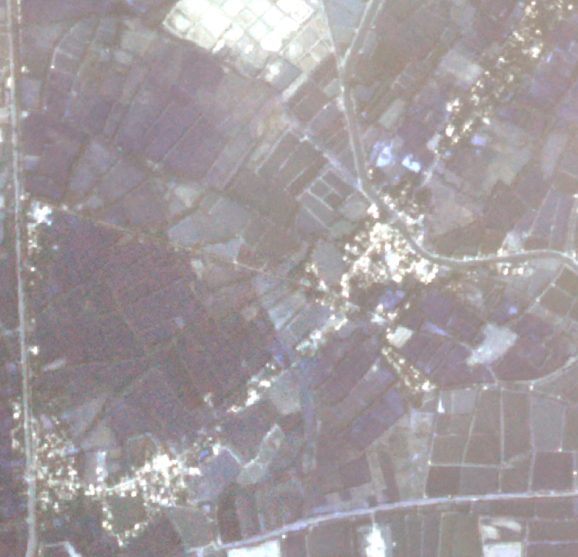 |
| Probability map | 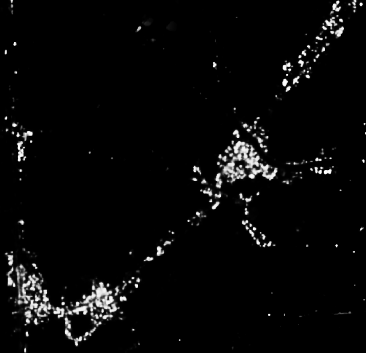 |
| Vector output | 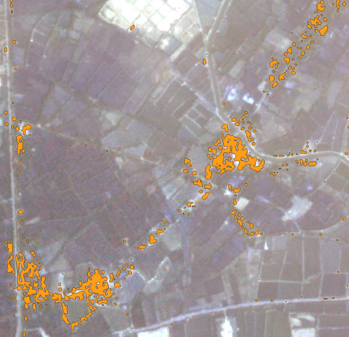 |

---

## 16. GIS Processing

### Raster to polygon conversion

- `rasterio.features.shapes` extracts polygons from the thresholded binary mask.
- Each connected built-up region becomes one polygon feature with `value = 1`.

### CRS handling

- All operations occur in the source raster CRS.
- Shapefile outputs inherit CRS from the input GeoTIFF.
- Label polygons are reprojected to raster CRS during tiling if needed.

### Geometry quality

The current `post_process_v1.py` performs direct vectorization without morphological smoothing. For cleaner polygons, consider adding:

- Connected-component filtering by minimum area
- `buffer(smooth).buffer(-smooth)` for stair-step removal
- `simplify(tolerance)` for vertex reduction

These are planned future enhancements (see Section 20).

---

## 17. Challenges Faced

| Challenge | Symptom | Solution in this project |
|---|---|---|
| **Class imbalance** | Model predicts all background | `bce_pos_weight=5`, Dice loss, negative tiles (20%) |
| **Bare soil confusion** | False positives on dry fields | 6-band input (NIR, Red Edge), negative tiles |
| **Shadows** | Dark areas classified as built-up | Multispectral bands beyond RGB |
| **Small structures** | Missed sheds / huts | 256×256 tiles preserve detail; Dice loss |
| **Mosaic nodata** | Training on padding pixels | `min_valid_fraction`, validity band support |
| **Float nodata=0** | Legitimate zero reflectance stripped | Careful nodata logic in `tile_and_mask.py` |
| **Annotation noise** | Irregular mask boundaries | `sanitize_geometries`, `effective_label_mask` |
| **Tile-edge artifacts** | Seams in prediction mosaics | 50% overlap + Hann window blending |
| **Slow data loading** | GPU idle during training | `raster_cache_size=32`, 12 workers, prefetch |

---

## 18. Lessons Learned

1. **256×256 tiles enable larger batches** — batch 16 on RTX 4090 vs batch 2 at 512×512, with acceptable context for building-scale features.
2. **pos_weight matters more than architecture tweaks** for severe imbalance — start at 5.0 and tune.
3. **Separate inference and post-process thresholds** — 0.5 at inference for calibration, 0.3 at vectorization for recall.
4. **Raster cache in Dataset** dramatically reduces epoch time when tiles live on spinning disks.
5. **TF32 + cudnn.benchmark** are free speedups on modern NVIDIA GPUs with fixed input shapes.
6. **tiling_meta.json** is essential — pass it to batch prediction to guarantee band/normalization consistency.
7. **Tile-level validation split** is pragmatic but can leak spatial correlation — use raster-level splits for rigorous benchmarking.

---

## 19. Model Limitations

| Limitation | Description |
|---|---|
| **Very small structures** | Below ~2–3 pixels at GSD may be missed |
| **Temporary structures** | Tents, tarps not in training labels |
| **Under canopy** | Buildings obscured by trees are invisible |
| **Spectral confusion** | Bright bare rock, concrete lots can false-positive |
| **Cloud / shadow** | No explicit cloud masking in the pipeline |
| **Mixed labels** | Open Buildings vs manual GIS may have inconsistent boundaries |
| **Post-process simplicity** | No hole filling, smoothing, or min-area filter yet |

---

## 20. Future Improvements

| Direction | Expected benefit |
|---|---|
| **Richer post-processing** | Morphological cleanup, min-area filter, polygon smoothing |
| **Multi-class segmentation** | Separate residential, commercial, industrial, road |
| **Building height integration** | Fuse with DSM/CHM for 3D built-up characterization |
| **Transformer encoders** | Swin, MiT for global context in large tiles |
| **Active learning** | Human-in-the-loop labeling of uncertain tiles |
| **Raster-level CV splits** | More honest generalization estimates |
| **ONNX / TensorRT export** | Faster production inference |
| **Validity band in config** | Expose `validity_band_index` in default YAML |

---

## 21. Project Folder Structure

```
built-up-area-detection/
├── config/
│   └── default.yaml                    # Bands, tiling, model, training hyperparameters
├── automate/
│   ├── automate_built_up_predictions.py   # Batch inference over GeoTIFF folder
│   └── automate_built_up_postprocess.py   # Batch raster → shapefile
├── post_process/
│   └── post_process_v1.py              # Threshold + vectorize to shapefile
├── doc_images/                         # README figures (add your own)
├── tile_and_mask.py                    # Step 1: tiles + binary masks from SHP
├── tile_and_mask_buildings.py          # Variant: Planet mosaics + Open Buildings GPKG
├── dataset.py                          # PyTorch Dataset + Albumentations + raster cache
├── model.py                            # UNet++ builder (single-head sigmoid)
├── train.py                            # Two-stage training, weighted BCE + Dice
├── predict.py                          # Sliding-window inference + TTA + blending
├── requirements.txt
├── LICENSE
└── README.md
```

| File / Directory | Why it exists |
|---|---|
| `config/default.yaml` | Single source of truth for all pipeline parameters |
| `tile_and_mask.py` | Converts GIS polygons into ML-ready tile/mask pairs |
| `tile_and_mask_buildings.py` | Open Buildings GPKG pairing for large-scale training data |
| `model.py` | Isolates architecture from training logic |
| `train.py` | Training loop, loss, checkpointing, early stopping |
| `predict.py` | Production inference with overlap blending |
| `post_process/` | GIS geometry extraction — separate from ML inference |
| `automate/` | Operational batch wrappers for multi-scene processing |

---

## 22. Installation

### Prerequisites

- Python 3.10+
- CUDA-capable GPU (strongly recommended for training)
- GDAL system libraries (for rasterio / geopandas)

### Local setup

```bash
git clone <repository-url>
cd built-up-area-detection

python -m venv .venv
source .venv/bin/activate   # Windows: .venv\Scripts\activate

pip install --upgrade pip
pip install -r requirements.txt
```

Optional for advanced post-processing:

```bash
pip install scipy
```

### Key dependencies

| Package | Role |
|---|---|
| `torch` / `torchvision` | Deep learning framework |
| `segmentation-models-pytorch` | UNet++ with pretrained encoders |
| `albumentations` | Training augmentations |
| `rasterio` | GeoTIFF I/O |
| `geopandas` / `shapely` | Vector GIS operations |
| `scikit-learn` | Train/validation split |

---

## 23. Training

### Step 1 — Create tiles and masks

```bash
python tile_and_mask.py \
  --config config/default.yaml \
  --input_tif /path/to/scene.tif \
  --input_shp /path/to/built_up_polygons.shp \
  --output_dir /path/to/dataset_root
```

### Step 2 — Train

```bash
python train.py \
  --tiles_dir /path/to/dataset_root/tiles \
  --masks_dir /path/to/dataset_root/masks \
  --config config/default.yaml \
  --output_dir ./outputs/models
```

### Resume from checkpoint

```bash
python train.py \
  --tiles_dir /path/to/dataset_root/tiles \
  --masks_dir /path/to/dataset_root/masks \
  --config config/default.yaml \
  --output_dir ./outputs/models \
  --resume /path/to/previous_run/best.pt
```

### Training outputs

```
outputs/models/run_YYYYMMDD_HHMMSS/
├── best.pt              # Best validation IoU
├── final.pt             # Last epoch weights
├── model_meta.json      # in_channels, input_size, paths
└── train_config.yaml    # Frozen copy of training config
```

---

## 24. Prediction

### Single mosaic

```bash
python predict.py \
  --input_tif /path/to/large_scene.tif \
  --output_tif /path/to/built_up_probability.tif \
  --model_dir /path/to/outputs/models/run_YYYYMMDD_HHMMSS \
  --weights /path/to/outputs/models/run_YYYYMMDD_HHMMSS/best.pt \
  --tta d4
```

### Post-process to shapefile

```bash
python post_process/post_process_v1.py \
  --predicted_tiff /path/to/built_up_probability.tif \
  --output_path /path/to/shapefiles \
  --threshold 0.3
```

### Consistency checklist

1. **Same bands** everywhere: `data.band_indices` in YAML, or `--band_indices` / `--tiling_meta` when predicting.
2. **Same patch size**: `data.input_size` and `tiling.tile_size` must match (default 256).
3. **Same normalization**: percentiles in `tiling` must match between tiling and prediction.
4. **CRS**: Label polygons must align with the raster after reprojection.

---

## 25. Example Results

> Place your result images in `doc_images/`.

### Input satellite imagery


### Model prediction (probability map)


### Vector output (polygons)


---

## 26. Performance Summary

### Validation metrics

| Metric | Built-up |
|---|---|
| **IoU** | 0.82 |
| **Dice** | 0.90 |
| **Precision** | 0.85 |
| **Recall** | 0.88 |
| **F1** | 0.87 |

> Validation on held-out tiles (15% split). IoU drives checkpoint selection (`best.pt`). Precision/Recall/F1 at threshold 0.5.

### Computational requirements

| Resource | Training | Inference |
|---|---|---|
| **GPU** | NVIDIA RTX 4090 / similar, 8+ GB VRAM | Same; CPU fallback supported |
| **Batch size** | 16 (256×256×6ch) | 4 (configurable) |
| **AMP + TF32** | Enabled on CUDA | Enabled on CUDA |
| **Typical training time** | ~1–4 hours (dataset dependent) | — |
| **Inference speed** | — | ~30 s–3 min per 10k×10k mosaic (GPU, TTA d4) |

### GPU memory (approximate)

| Configuration | VRAM |
|---|---|
| Train, batch=16, 256×256, 6ch, UNet++ | ~8–12 GB |
| Predict, batch=4, TTA d4 | ~4–6 GB |
| Predict, batch=4, no TTA | ~2–4 GB |

---

## 27. Engineering Decisions

| Decision | Choice | Rationale |
|---|---|---|
| **Why UNet++?** | Nested dense skips | Best edge quality in U-Net family for building footprints |
| **Why SE-ResNet50?** | ImageNet pretrain + SE attention | Strong textures; channel recalibration for 6-band input |
| **Why 256×256 tiles?** | Not 512 | Building-scale context at 3 m GSD; enables batch 16 on RTX 4090 |
| **Why 6 bands?** | Blue, Green, Red, NIR, Red Edge, Yellow | NIR separates vegetation; Yellow adds contrast for roofs/soil |
| **Why single-head?** | 1-channel sigmoid | Built-up mapping is contiguous — no bund partitioning needed |
| **Why pos_weight=5?** | Weighted BCE | Built-up pixels are ~5–20× rarer than background in typical tiles |
| **Why threshold 0.3 post?** | Lower than 0.5 | Recover recall for GIS polygon extraction |
| **Why 50% overlap?** | Training + inference | Reduces tile-edge seams; Hann blending smooths mosaics |
| **Why negative tiles?** | 20% of positives | Teaches model what non-built-up looks like |
| **Why two-stage training?** | Freeze → unfreeze | Stable decoder before encoder fine-tuning |
| **Why AdamW?** | Over SGD | Better regularization during transfer learning |
| **Why raster cache?** | 32 handles/worker | Avoids reopening GeoTIFFs every epoch |
| **Why no hue/sat aug?** | Multispectral input | Bands are not RGB — photometric aug uses gamma/noise only |

---

## Acknowledgments

- [segmentation-models-pytorch](https://github.com/qubvel/segmentation_models.pytorch) — UNet++ and pretrained encoders
- [Albumentations](https://albumentations.ai/) — Geospatial-safe augmentation pipeline
- Planet Labs — Multispectral imagery source
- Google Open Buildings — Optional training labels via `tile_and_mask_buildings.py`
