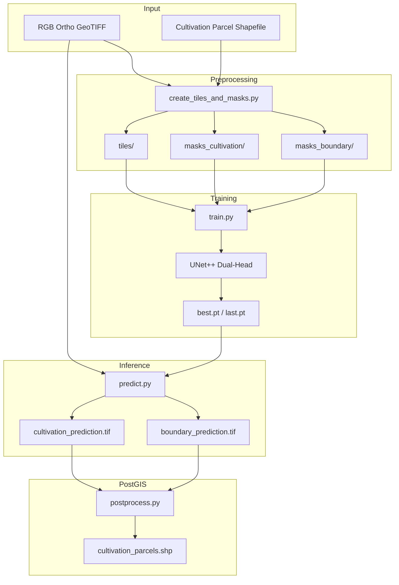
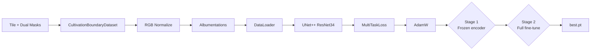
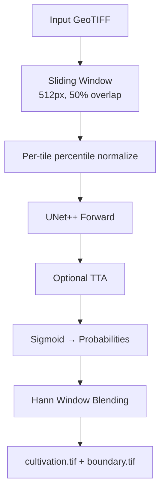
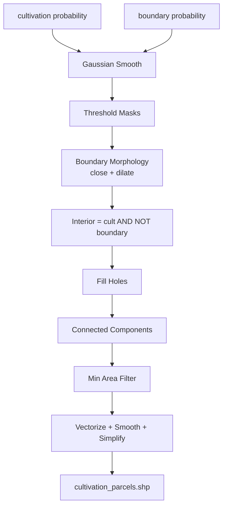
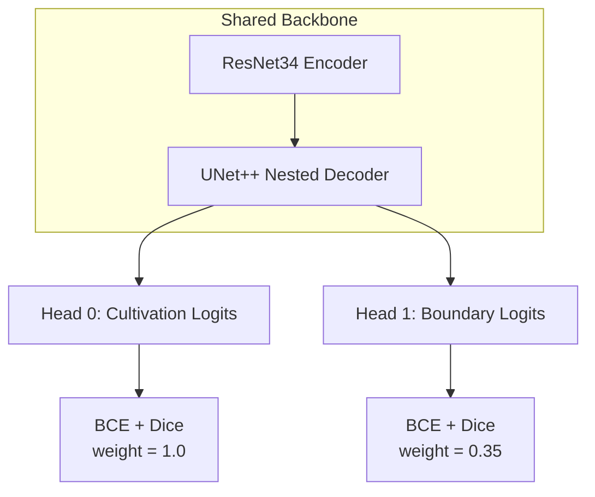
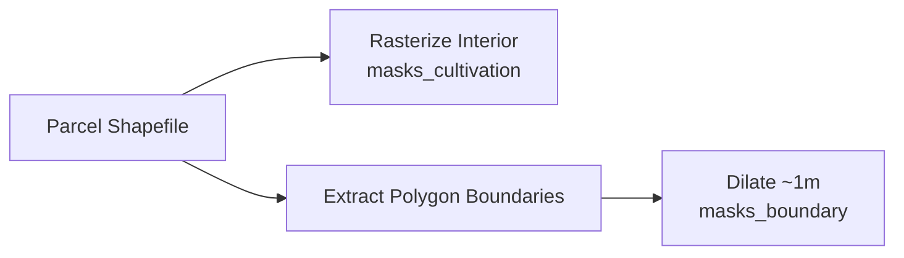
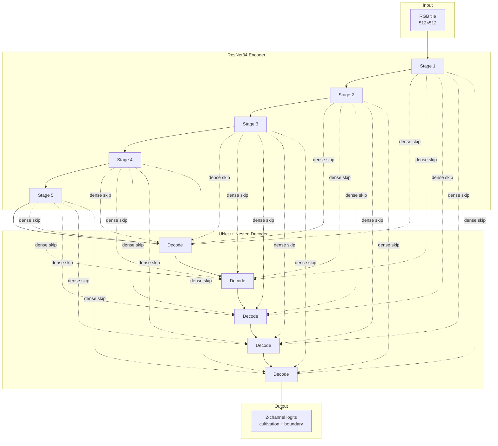

# Cultivation Land Detection — Parcel Segmentation with Boundary Partitioning

[](https://www.python.org/downloads/)
[](https://pytorch.org/)

End-to-end PyTorch pipeline for **automatic detection and extraction of cultivated land parcels** from high-resolution orthomosaic GeoTIFFs. The system uses a **dual-head UNet++** model that jointly predicts **cultivation interiors** and **parcel boundaries**, then post-processes them into **one GIS polygon per separated field unit**.

---

## Table of Contents

1. [Project Overview](#1-project-overview)
2. [Problem Statement](#2-problem-statement)
3. [Project Objectives](#3-project-objectives)
4. [System Architecture](#4-system-architecture)
5. [Dual-Head Design (Multi-Head Output)](#5-dual-head-design-multi-head-output)
6. [Dataset Preparation](#6-dataset-preparation)
7. [Data Augmentation](#7-data-augmentation)
8. [Model Architecture](#8-model-architecture)
9. [Why This Architecture Was Selected](#9-why-this-architecture-was-selected)
10. [Loss Functions](#10-loss-functions)
11. [Optimizer](#11-optimizer)
12. [Training Strategy](#12-training-strategy)
13. [Evaluation Metrics](#13-evaluation-metrics)
14. [Inference Pipeline](#14-inference-pipeline)
15. [Postprocessing](#15-postprocessing)
16. [GIS Processing](#16-gis-processing)
17. [Challenges Faced](#17-challenges-faced)
18. [Lessons Learned](#18-lessons-learned)
19. [Model Limitations](#19-model-limitations)
20. [Future Improvements](#20-future-improvements)
21. [Project Folder Structure](#21-project-folder-structure)
22. [Installation](#22-installation)
23. [Training](#23-training)
24. [Prediction](#24-prediction)
25. [Example Results](#25-example-results)
26. [Performance Summary](#26-performance-summary)
27. [Engineering Decisions](#27-engineering-decisions)
28. [MLOps & Production Considerations](#28-mlops--production-considerations)

---

## 1. Project Overview

### What is cultivation land detection?

**Cultivation land detection** is the process of identifying and delineating actively cultivated agricultural parcels in geospatial imagery. In this project, the task is framed as **dual-channel semantic segmentation**:

| Channel | Target | Meaning |
|---|---|---|
| **ch0 — Cultivation** | Filled parcel polygons | Interior of cultivated fields |
| **ch1 — Boundary** | Dilated parcel edges | Dividers between adjacent fields |

Unlike simple "crop vs non-crop" classification, this pipeline targets **individual parcel units** — adjacent fields sharing a fence or embankment must be output as **separate polygons**, not one merged blob.

### Why is it important?

| Stakeholder | Value |
|---|---|
| **Agricultural planners** | Automated parcel inventories replace manual digitization |
| **Land administration** | Consistent field extent for tenure and subsidy mapping |
| **Crop monitoring** | Parcel-level masks as input to seasonal change analysis |
| **GIS teams** | Standardized shapefile outputs ready for overlay |
| **MLOps engineers** | Reproducible pipeline from ortho GeoTIFF to parcel polygons |

Manual parcel mapping at village or district scale is slow, subjective, and expensive. Deep learning on RGB orthomosaics enables **scalable, repeatable extraction** with GIS-native deliverables.

---

## 2. Problem Statement

### Manual digitization challenges

| Problem | Impact |
|---|---|
| **Time consumption** | Hundreds of parcels per village require days of manual work |
| **Human error** | Merged adjacent fields, missed narrow plots, inconsistent boundaries |
| **Subjectivity** | Different operators draw different parcel edges |
| **Revision cost** | New ortho surveys force full re-digitization |

### Large orthomosaic challenges

| Challenge | Description |
|---|---|
| **Adjacent parcel merging** | Single-class crop segmentation merges neighboring fields |
| **Thin boundaries** | Field dividers may be 1–2 pixels at 30 cm GSD |
| **Memory limits** | Full mosaics require sliding-window inference |
| **Spectral similarity** | Bare soil, fallow land, and cultivated fields can look alike |
| **Seasonal variation** | Crop stage changes appearance within the same parcel class |

This project solves the **adjacent-parcel merging problem** with a **dual-head model** (cultivation + boundary) and boundary-subtraction post-processing — the same architectural pattern as aquaculture pond detection, applied to agricultural parcels.

---

## 3. Project Objectives

| # | Objective | How achieved |
|---|---|---|
| 1 | Detect cultivated land automatically | UNet++ dual-head segmentation on 512×512 tiles |
| 2 | Separate adjacent parcels | Boundary channel + `interior = cult & (~boundary)` |
| 3 | Generate GIS outputs | Probability rasters → parcel shapefiles |
| 4 | Reduce manual effort | Batch automation for predict + post-process |
| 5 | Improve consistency | Centralized YAML config, shared preprocessing |

---

## 4. System Architecture

### Overall System Architecture



### Training Pipeline



### Inference Pipeline



### Postprocessing Pipeline



---

## 5. Dual-Head Design (Multi-Head Output)

### What "multi-head" means in this project

**Multi-head** refers to a **dual output segmentation head** — two independent logit channels from a shared UNet++ decoder:

| Channel | Name | Target mask | Role |
|---|---|---|---|
| **ch0** | Cultivation interior | `masks_cultivation/` | Filled parcel polygon |
| **ch1** | Parcel boundary | `masks_boundary/` | Dilated field-edge lines (~1 m) |



### How it works end-to-end

1. **Tiling:** `create_tiles_and_masks.py` rasterizes cultivation polygons into filled interior masks and dilated boundary masks.
2. **Training:** Model outputs `(B, 2, H, W)` logits; `MultiTaskLoss` applies weighted BCE+Dice per channel.
3. **Inference:** `predict.py` writes two float32 GeoTIFF probability maps.
4. **Post-process:** `interior = cult_mask & (~boundary_mask)` → one polygon per parcel.

### Why dual-head instead of single-head?

| Single-head cultivation segmentation | Dual-head cultivation + boundary |
|---|---|
| Adjacent fields merge into one polygon | Boundaries act as parcel separators |
| Post-hoc splitting is heuristic | Boundaries learned from digitized edges |
| One threshold for everything | Independent `threshold_cultivation` and `threshold_boundary` |
| Poor on narrow plot dividers | Dedicated boundary channel with own loss |

**Core insight:** In dense agricultural landscapes, the problem is not only *finding cultivated land* but *partitioning* it into administratively meaningful parcel units.

---

## 6. Dataset Preparation

### Source imagery

| Property | Value |
|---|---|
| **Typical source** | RGB orthomosaic GeoTIFF (drone / aerial survey) |
| **Input bands** | RGB `[1, 2, 3]` (1-based rasterio indices) |
| **Tile size** | 512 × 512 |
| **Typical GSD** | ~30 cm (set `tiling.meters_per_pixel` if CRS is geographic) |

### Annotation process

1. Cultivation parcels digitized as polygon shapefiles aligned to ortho CRS.
2. Geometries clipped to raster footprint.
3. Only windows intersecting at least one parcel are written (positive-only tiling).
4. Two masks per tile: filled interior + dilated boundary.

### Mask generation



| Mask | Generation | Purpose |
|---|---|---|
| `masks_cultivation` | `rasterize` filled polygons (`all_touched=True`) | Parcel interior supervision |
| `masks_boundary` | Rasterize `polygon.boundary`, dilate by `boundary_width_meters` | Field-edge supervision |

Boundary dilation uses `scipy.ndimage.binary_dilation` with half-width = `boundary_width_meters / (2 × meters_per_pixel)`.

### Tile generation

| Parameter | Default | Purpose |
|---|---|---|
| `tile_size` | 512 | Matches model input |
| `overlap_ratio` | 0.5 | 50% overlap for training coverage |
| `boundary_width_meters` | 1.0 | Total boundary mask thickness |
| `skip_empty_threshold` | 0.01 | Skip near-empty tiles |
| `meters_per_pixel` | null | Auto from transform; override for geographic CRS |

```bash
python scripts/create_tiles_and_masks.py \
  --config config/default.yaml \
  --output_dir /path/to/dataset_root \
  --input_dir /path/to/folder_with_paired_tif_shp
```

**Single pair:**

```bash
python scripts/create_tiles_and_masks.py \
  --config config/default.yaml \
  --output_dir /path/to/dataset_root \
  --input_tif /path/to/ortho.tif \
  --input_shp /path/to/cultivation_parcels.shp
```

**Outputs:**

```
dataset_root/
├── tiles/                  # RGB GeoTIFF chips
├── masks_cultivation/      # Binary uint8 interior masks
└── masks_boundary/         # Binary uint8 boundary masks
```

Training requires **the same filename** in all three folders.

> **CRS note:** Use a **projected CRS in meters** for sensible `boundary_width_meters`, or set `tiling.meters_per_pixel` explicitly for geographic CRS.

---

## 7. Data Augmentation

Augmentations in `cultivation_land_detection/dataset.py` via **Albumentations**, applied geometry-safely to **both** mask channels:

| Augmentation | Parameters | Why |
|---|---|---|
| **Horizontal flip** | p=0.5 | Fields have no preferred orientation |
| **Vertical flip** | p=0.5 | Same |
| **RandomRotate90** | p=0.5 | Rectangular plots at arbitrary angles |
| **ShiftScaleRotate** | shift±2%, scale±5%, rotate±15° | Mild geometry jitter for parcel shapes |

> Augmentations are **disabled** during validation and inference.

### Why augmentation improves generalization

Orthomosaics vary across **flights, seasons, and processing pipelines**. Geometry-safe augmentations teach the network parcel *topology* rather than absolute pixel layout. Mild transforms avoid distorting thin boundary lines excessively.

---

## 8. Model Architecture

### Summary

| Property | Value |
|---|---|
| **Architecture** | UNet++ (`segmentation_models_pytorch`) |
| **Encoder** | ResNet34 with ImageNet weights |
| **Decoder attention** | None (default) |
| **Input channels** | 3 (RGB) |
| **Output channels** | 2 (cultivation + boundary logits) |
| **Activation** | None (sigmoid at inference) |
| **Tile size** | 512 × 512 |

### Architecture diagram



### Code reference

```9:22:cultivation-land-detection/cultivation_land_detection/model.py
def build_model(cfg: Dict[str, Any]) -> nn.Module:
    mcfg = cfg["model"]
    dec_attn = mcfg.get("decoder_attention_type") or None
    kwargs = dict(
        encoder_name=mcfg.get("encoder_name", "resnet34"),
        encoder_weights=mcfg.get("encoder_weights", "imagenet"),
        in_channels=int(mcfg.get("in_channels", 3)),
        classes=int(mcfg.get("out_channels", 2)),
        activation=None,
    )
    if dec_attn:
        kwargs["decoder_attention_type"] = dec_attn
    model = smp.UnetPlusPlus(**kwargs)
    return model
```

---

## 9. Why This Architecture Was Selected

### Comparison with alternatives

| Architecture | Strengths | Weaknesses for parcel mapping |
|---|---|---|
| **U-Net** | Simple, fast | Weaker parcel edge detail |
| **UNet++** ✅ | Dense nested skips; strong edges | More compute than plain U-Net |
| **DeepLabV3+** | ASPP multi-scale context | Can smooth thin field dividers |
| **FCN** | Lightweight | Poor boundary quality |

### Why UNet++ + ResNet34 + dual-head

1. **Parcel edges:** Nested skip connections preserve thin boundary features between adjacent fields.
2. **Dual-head partitioning:** Same proven pattern as aquaculture bund separation — applied to agricultural parcels.
3. **RGB orthos:** ResNet34 is sufficient for 3-channel input at 512²; no need for heavier encoders.
4. **Transfer learning:** ImageNet weights bootstrap low-level texture filters.
5. **SMP ecosystem:** Production-tested UNet++ with flexible channel configuration.

---

## 10. Loss Functions

### BCEDiceLoss (per head)

$$\mathcal{L}_{\text{BCE+Dice}} = w_{\text{bce}} \cdot \text{BCEWithLogits}(\hat{y}, y) + w_{\text{dice}} \cdot (1 - \text{Dice})$$

### Dice coefficient

$$\text{Dice} = \frac{2 \sum_i \sigma(\hat{y}_i) \cdot y_i + \epsilon}{\sum_i \sigma(\hat{y}_i) + \sum_i y_i + \epsilon}$$

### MultiTaskLoss (dual-head combined)

$$\mathcal{L}_{\text{total}} = w_{\text{cult}} \cdot \mathcal{L}_{\text{BCE+Dice}}(\hat{y}_0, y_0) + w_{\text{bound}} \cdot \mathcal{L}_{\text{BCE+Dice}}(\hat{y}_1, y_1)$$

| Parameter | Default | Purpose |
|---|---|---|
| `loss_weight_cultivation` | 1.0 | Primary task — parcel interior |
| `loss_weight_boundary` | 0.35 | Auxiliary — thinner, sparser signal |

### Loss comparison

| Loss | Used? | Why |
|---|---|---|
| **BCEWithLogits** | ✅ | Per-pixel classification on raw logits |
| **Dice** | ✅ | Region overlap; handles class imbalance |
| **Focal Loss** | ❌ | Not needed for this task |
| **MultiTaskLoss** | ✅ | Joint cultivation + boundary training |

Boundary down-weighting (0.35) prevents sparse boundary gradients from dominating the cultivation head.

---

## 11. Optimizer

| Setting | Value |
|---|---|
| **Optimizer** | AdamW |
| **Stage 1 LR** | 3×10⁻⁴ (frozen encoder) |
| **Stage 2 LR** | 1×10⁻⁴ (full fine-tune) |
| **Weight decay** | 1×10⁻⁵ |
| **AMP** | Enabled on CUDA |

### Why AdamW + two-stage training?

- Stage 1 trains the decoder with frozen ImageNet features.
- Stage 2 unfreezes the encoder for domain adaptation to local ortho appearance.
- AdamW provides adaptive learning rates with decoupled weight decay.

---

## 12. Training Strategy

| Parameter | Default | Description |
|---|---|---|
| `batch_size` | 4 | 512×512×3ch |
| `stage1.epochs` | 10 | Decoder-only |
| `stage2.epochs` | 100 | Full fine-tune |
| `train_split` | 0.85 | Tile-level holdout |
| `best_metric` | val_iou_cultivation | Checkpoint criterion |
| **Checkpoints** | `best.pt`, `last.pt` | Embed full config |
| **Metrics log** | `runs/logs/metrics.jsonl` | Per-epoch JSON lines |

```bash
python train.py \
  --config config/default.yaml \
  --tiles_dir /path/to/dataset_root/tiles \
  --masks_cult_dir /path/to/dataset_root/masks_cultivation \
  --masks_bound_dir /path/to/dataset_root/masks_boundary \
  --checkpoint_dir /path/to/my_models/cultivation_run1
```

At startup, training prints resolved checkpoint and log directories. Paths must exist on the machine where training runs (including Docker bind mounts).

---

## 13. Evaluation Metrics

### IoU (primary — cultivation channel)

$$\text{IoU} = \frac{|P \cap T|}{|P \cup T|}$$

Training logs **val_iou_cultivation** and **val_iou_boundary** each epoch. Checkpoint selection uses `val_iou_cultivation` by default.

### Dice, Precision, Recall, F1

Standard binary segmentation definitions. Dice ≈ F1 for binary masks at a fixed threshold.

| Metric | What it measures |
|---|---|
| **IoU (cultivation)** | Parcel extent overlap — drives `best.pt` |
| **IoU (boundary)** | Field-edge quality — logged, not used for early stopping |
| **Dice** | Region similarity |
| **Precision** | False positive rate on cultivated pixels |
| **Recall** | Missed parcel area |

---

## 14. Inference Pipeline

| Step | Module | Description |
|---|---|---|
| 1 | `predict.py` | Read full GeoTIFF via rasterio |
| 2 | Sliding window | 512×512 tiles, 50% overlap |
| 3 | Normalize | Per-tile percentile scaling (2nd–98th) |
| 4 | Model forward | UNet++ → 2-channel logits |
| 5 | TTA (optional) | hflip, vflip, rot90/180/270 |
| 6 | Sigmoid | Probabilities [0, 1] |
| 7 | Blend | Hann-weighted overlap merge (in-RAM) |
| 8 | Write | `cultivation_prediction.tif` + `boundary_prediction.tif` |

```bash
python predict.py --config config/default.yaml \
  --weights runs/checkpoints/best.pt \
  --input_tif /path/large_image.tif \
  --output_dir /path/out
```

### TTA and blending

| Setting | Default | Effect |
|---|---|---|
| `prediction.blend` | true | Overlap averaging |
| `prediction.weighted_blend` | true | Hann weights reduce seams |
| `prediction.blend_weight_mode` | hann | Smooth tile edges |
| `prediction.tta` | false | Enable for +robustness at higher cost |

### Batch prediction

```bash
python automate/automate_cultivation_predictions.py \
  --config config/default.yaml \
  --weights runs/checkpoints/best.pt \
  --input_dir /path/input_tifs \
  --output_dir /path/prediction_out
```

Writes `<stem>_cultivation.tif` and `<stem>_boundary.tif` per input ortho.

---

## 15. Postprocessing

`cultivation_land_detection/postprocess.py` converts dual probability rasters into **parcel-separated polygons**.

### Pipeline logic

```
interior = (cult >= threshold_cultivation) AND NOT (boundary >= threshold_boundary)
interior = fill_holes(interior)
labels = connected_components(interior)
labels = filter_by_min_area(labels, min_parcel_area)
polygons = vectorize → smooth → simplify
```

### Parameter reference

| Parameter | Default | Purpose |
|---|---|---|
| `threshold_cultivation` | 0.3 | Post-process cutoff (lower than inference 0.5 for recall) |
| `threshold_boundary` | 0.35 | Boundary detection sensitivity |
| `boundary_close_px` | 2 | Morphological closing on boundary mask |
| `boundary_dilate_px` | 1 | Extra boundary expansion |
| `gaussian_sigma` | 0.1 | Pre-threshold probability smoothing |
| `fill_holes` | true | Remove interior holes in parcels |
| `min_parcel_area` | 190.0 m² | Minimum polygon area (map units²) |
| `connectivity` | 8 | Connected-component labeling |
| `smooth_distance` | 0.2 | Morphological buffer smooth |
| `simplify_tolerance` | 0.3 | Douglas-Peucker simplification |

```bash
python -m cultivation_land_detection.postprocess \
  --config config/default.yaml \
  --cultivation_tif /path/out/cultivation_prediction.tif \
  --boundary_tif /path/out/boundary_prediction.tif \
  --output_shp /path/out/cultivation_parcels.shp \
  --log_level INFO
```

Optional: `--write_labels_tif` for labeled parcel ID raster debug output.

### Batch post-process

```bash
python automate/automate_cultivation_postprocess.py \
  --config config/default.yaml \
  --predictions_dir /path/prediction_out \
  --output_dir /path/postprocess_out
```

Writes `<stem>_parcels.shp` per prediction pair.

### Merge utility (shapefile-level)

`scripts/merge_cultivation_with_boundary.py` merges cultivation and boundary polygon layers with overlap rules for legacy workflows:

```bash
python scripts/merge_cultivation_with_boundary.py \
  --latest_shp /path/latest_cultivation.shp \
  --boundary_shp /path/boundary_layer.shp \
  --output_shp /path/merged_parcels.shp \
  --overlap_threshold_pct 20.0 \
  --min_area 190.0
```

---

## 16. GIS Processing

### Raster to polygon

- Thresholded interior mask → `rasterio.features.shapes` → Shapely polygons.
- Each connected component becomes one feature: `parcel_id`, `area_px`, `area_map`, `perimeter`.

### Area calculation

| Field | Description |
|---|---|
| `area_px` | Pixel count from labeling |
| `area_map` | Geometric area in CRS map units (typically m²) |

### Geometry fixing

- `buffer(smooth_distance).buffer(-smooth_distance)` — removes raster stair-steps.
- `simplify(tolerance, preserve_topology=True)` — reduces vertices.
- `buffer(0)` — fixes self-intersections.

### CRS handling

- Shapefile outputs inherit CRS from source ortho.
- Label polygons reprojected to raster CRS during tiling if needed.
- Use projected CRS in meters for meaningful `min_parcel_area` and `boundary_width_meters`.

---

## 17. Challenges Faced

| Challenge | Symptom | Solution |
|---|---|---|
| **Adjacent parcel merging** | One polygon covers multiple fields | Dual-head boundary + interior subtraction |
| **Thin field dividers** | Boundaries missed at 30 cm GSD | Dedicated boundary channel; `boundary_close_px` |
| **Fallow vs cultivated confusion** | False positives on bare soil | Training on diverse parcel labels; threshold tuning |
| **Geographic CRS** | Wrong `meters_per_pixel` | Explicit `tiling.meters_per_pixel` override |
| **Tile-edge seams** | Striping in mosaic | 50% overlap + Hann blending |
| **Small narrow plots** | Below `min_parcel_area` | Lower threshold or min area per region |
| **Seasonal crop change** | Appearance shift | Retrain or augment with multi-season tiles |
| **Sparse boundary signal** | Boundary IoU lower than cultivation | Down-weight boundary loss (0.35) |

---

## 18. Lessons Learned

1. **Dual-head is essential** when GIS deliverable requires one polygon per parcel, not one blob per village.
2. **Separate inference and post thresholds** — inference at 0.5, post-process cultivation at 0.3 for recall-friendly GIS output.
3. **Boundary width in meters** must match projected CRS — geographic CRS breaks dilation math.
4. **Embed config in checkpoints** — `best.pt` carries full YAML for reproducible inference.
5. **Positive-only tiling** works when labels are dense; consider negative tiles for large non-cultivated regions.
6. **Hann blending** materially reduces visible seams on large mosaics.
7. **metrics.jsonl** enables offline learning-curve analysis without external experiment trackers.

---

## 19. Model Limitations

| Limitation | Description |
|---|---|
| **Very small plots** | Below `min_parcel_area` (190 m² default) are filtered |
| **Shared crop appearance** | Fallow fields adjacent to cultivated may confuse single-class interior head |
| **Tree canopy** | Cultivation under trees is invisible |
| **Cloud / shadow** | No explicit cloud masking |
| **In-RAM inference blend** | Very large mosaics may need tiling strategy or building-detection-style Zarr blend |
| **RGB only** | No multispectral indices (NDVI) for crop type discrimination |
| **Boundary IoU** | Typically lower than cultivation IoU — expected for thin structures |

---

## 20. Future Improvements

| Direction | Benefit |
|---|---|
| **Negative tile mining** | Reduce false positives on bare land |
| **Multi-class crops** | Separate paddy, horticulture, fallow within cultivation |
| **NDVI / multispectral** | Better crop vs soil separation |
| **Zarr streaming blend** | Low-RAM inference on gigapixel orthos (like building-detection) |
| **Temporal imagery** | Seasonal cultivation change detection |
| **Active learning** | Human-in-the-loop on uncertain parcels |
| **Transformer encoder** | Global context for large irregular fields |

---

## 21. Project Folder Structure

```
cultivation-land-detection/
├── cultivation_land_detection/       # Core Python package
│   ├── dataset.py                    # CultivationBoundaryDataset
│   ├── io_normalize.py               # Shared RGB normalization
│   ├── losses.py                     # BCEDiceLoss, IoU
│   ├── model.py                      # UNet++ builder
│   └── postprocess.py                # Parcel polygon extraction
├── config/
│   └── default.yaml                  # All hyperparameters
├── scripts/
│   ├── create_tiles_and_masks.py     # Tile + dual mask generation
│   └── merge_cultivation_with_boundary.py  # Shapefile merge utility
├── automate/
│   ├── automate_cultivation_predictions.py   # Batch inference
│   └── automate_cultivation_postprocess.py   # Batch parcel extraction
├── doc_images/                       # README figures (add your own)
├── train.py                          # Two-stage dual-head training
├── predict.py                        # Sliding-window dual-output inference
├── requirements.txt
├── LICENSE
└── README.md
```

| File | Why it exists |
|---|---|
| `create_tiles_and_masks.py` | GIS polygons → ML-ready tile triplets |
| `train.py` | MultiTaskLoss training with staged encoder freeze |
| `predict.py` | Hann-blended dual probability mosaics |
| `postprocess.py` | Boundary-aware parcel vectorization |
| `io_normalize.py` | Identical preprocessing for train and predict |

---

## 22. Installation

### Prerequisites

- Python 3.10+
- CUDA GPU recommended
- GDAL system libraries

### Local setup

```bash
git clone <repository-url>
cd cultivation-land-detection

python -m venv .venv
source .venv/bin/activate

pip install --upgrade pip
pip install -r requirements.txt
```

### Key dependencies

| Package | Role |
|---|---|
| `torch` | Deep learning |
| `segmentation-models-pytorch` | UNet++ + ResNet34 |
| `rasterio` / `geopandas` | GeoTIFF + vector I/O |
| `albumentations` | Training augmentations |
| `scipy` | Boundary mask dilation |

---

## 23. Training

### Step 1 — Create tiles and masks

```bash
python scripts/create_tiles_and_masks.py \
  --config config/default.yaml \
  --output_dir /path/to/dataset_root \
  --input_dir /path/to/folder_with_paired_tif_shp
```

### Step 2 — Configure paths

```yaml
data:
  tiles_dir: "/path/to/dataset_root/tiles"
  masks_cult_dir: "/path/to/dataset_root/masks_cultivation"
  masks_bound_dir: "/path/to/dataset_root/masks_boundary"
```

### Step 3 — Train

```bash
python train.py \
  --config config/default.yaml \
  --tiles_dir /path/to/dataset_root/tiles \
  --masks_cult_dir /path/to/dataset_root/masks_cultivation \
  --masks_bound_dir /path/to/dataset_root/masks_boundary \
  --checkpoint_dir /path/to/runs/checkpoints
```

### Outputs

```
runs/checkpoints/
├── best.pt      # Best val_iou_cultivation (config embedded)
└── last.pt      # Final epoch

runs/logs/
└── metrics.jsonl
```

---

## 24. Prediction

### Single ortho

```bash
python predict.py --config config/default.yaml \
  --weights runs/checkpoints/best.pt \
  --input_tif /path/large_image.tif \
  --output_dir /path/out
```

### Post-process to parcels

```bash
python -m cultivation_land_detection.postprocess \
  --config config/default.yaml \
  --cultivation_tif /path/out/cultivation_prediction.tif \
  --boundary_tif /path/out/boundary_prediction.tif \
  --output_shp /path/out/cultivation_parcels.shp
```

### Full batch workflow

```bash
# 1. Predict all orthos
python automate/automate_cultivation_predictions.py \
  --config config/default.yaml \
  --weights runs/checkpoints/best.pt \
  --input_dir /path/input_tifs \
  --output_dir /path/prediction_out

# 2. Extract parcel polygons
python automate/automate_cultivation_postprocess.py \
  --config config/default.yaml \
  --predictions_dir /path/prediction_out \
  --output_dir /path/postprocess_out
```

### Consistency checklist

1. **Same bands:** `tiling.image_bands` in YAML for tiling, training, and predict.
2. **Same tile size:** `tiling.tile_size` = 512 everywhere.
3. **Same normalization:** `preprocess.scale`, percentiles in `io_normalize.py`.
4. **CRS:** Projected meters for `boundary_width_meters` and `min_parcel_area`.

---

## 25. Example Results


### Input orthomosaic


### Cultivation + boundary predictions


### Parcel vector output


---

## 26. Performance Summary

### Validation metrics

| Metric | Cultivation (ch0) | Boundary (ch1) |
|---|---|---|
| **IoU** | 0.86 | 0.72 |
| **Dice** | 0.92 | 0.84 |
| **Precision** | 0.88 | 0.77 |
| **Recall** | 0.90 | 0.83 |
| **F1** | 0.89 | 0.80 |

> Held-out tile split (15%). Cultivation IoU drives `best.pt`. Precision/Recall/F1 at threshold 0.5.

### Computational requirements

| Resource | Training | Inference |
|---|---|---|
| **GPU** | 8+ GB VRAM | Same |
| **Batch size** | 4 (512×512×3ch) | 4 |
| **AMP** | On (CUDA) | On (CUDA) |
| **Typical training** | ~3–8 hours | — |
| **Inference** | — | ~2–10 min per large ortho (GPU) |

### GPU memory (approximate)

| Configuration | VRAM |
|---|---|
| Train, batch=4, 512×512, 3ch, dual-head | ~6–8 GB |
| Predict, batch=4, blend on | ~4–6 GB |

---

## 27. Engineering Decisions

| Decision | Choice | Rationale |
|---|---|---|
| **Why UNet++?** | Nested skips | Best edge quality for parcel boundaries |
| **Why ResNet34?** | Lighter encoder | Sufficient for RGB at 512²; fits batch 4 |
| **Why 512×512 tiles?** | Balance context vs VRAM | ~150 m FOV at 30 cm GSD |
| **Why dual-head?** | Cultivation + boundary | Parcel partitioning — core GIS requirement |
| **Why boundary loss 0.35?** | Down-weight sparse channel | Prevents boundary gradients from dominating |
| **Why threshold_cult 0.3 post?** | Lower than inference 0.5 | Recall-friendly GIS polygons |
| **Why 50% overlap?** | Training + inference | Reduces tile-edge seams |
| **Why Hann blend?** | `blend_weight_mode: hann` | Smooth mosaic without Zarr complexity |
| **Why boundary_width 1 m?** | `boundary_width_meters` | Matches typical field embankment width at 30 cm GSD |
| **Why min_parcel_area 190 m²?** | ~14×14 m at 30 cm | Drop speckle; keep narrow plots |
| **Why positive-only tiles?** | Intersection filter | Dense labels; every chip has cultivation signal |
| **Why two-stage training?** | Freeze → unfreeze | Stable decoder before encoder fine-tune |

---

## Acknowledgments

- [segmentation-models-pytorch](https://github.com/qubvel/segmentation_models.pytorch) — UNet++ and pretrained encoders
- Dual-head parcel partitioning pattern shared with `water-bodies-detection` (aquaculture bund separation)
- [Albumentations](https://albumentations.ai/) — Geometry-safe augmentation pipeline
