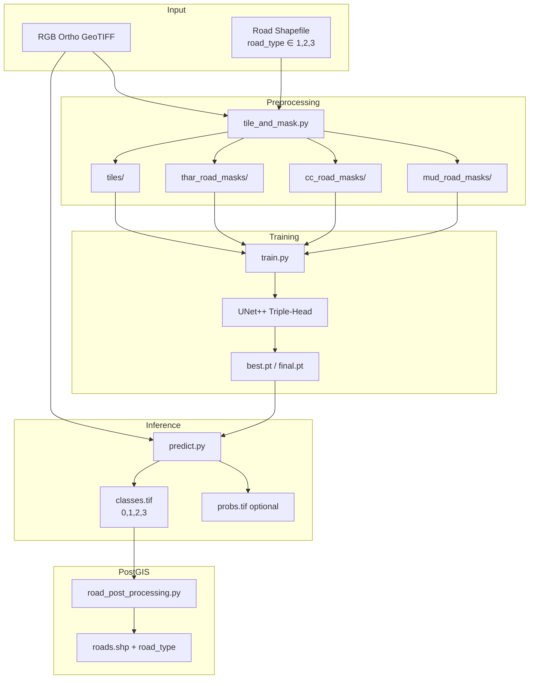
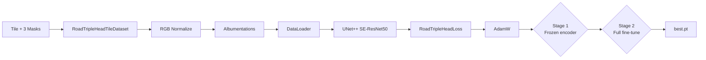
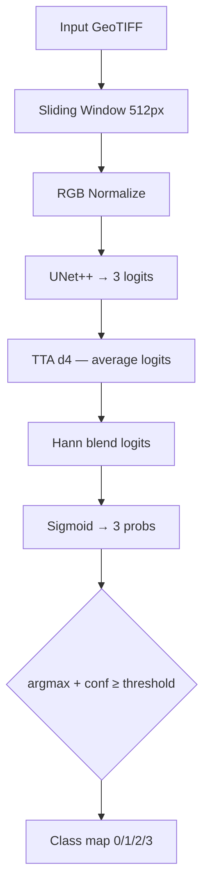
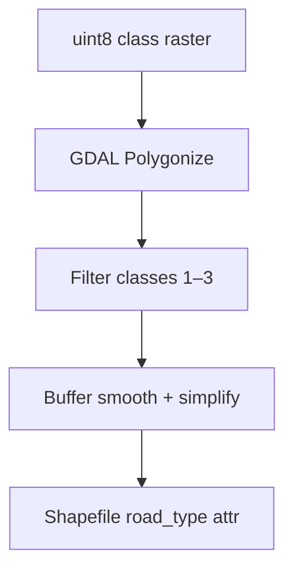
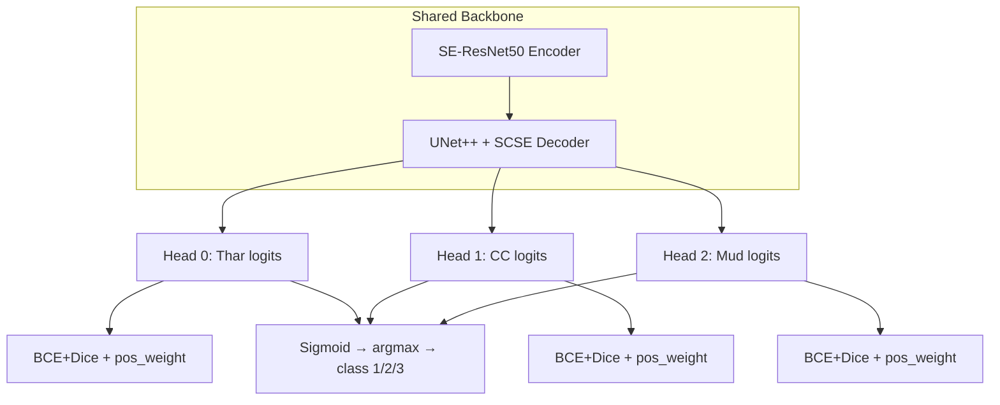
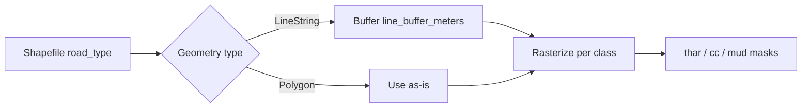
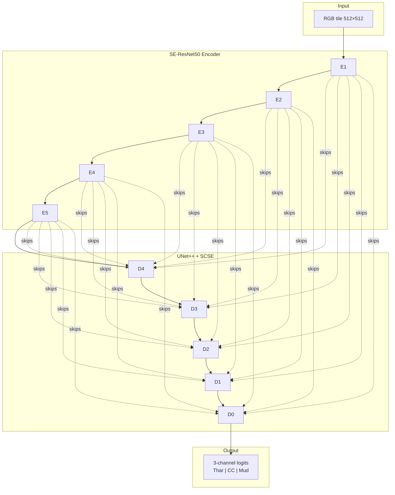

# Multi-Class Road Detection — Triple-Head Road Segmentation

[](https://www.python.org/downloads/)
[](https://pytorch.org/)

End-to-end PyTorch pipeline for **automatic detection and classification of rural road networks** from high-resolution RGB orthomosaic GeoTIFFs. The system uses a **triple-head UNet++** model with **three independent binary outputs** (Thar, CC, Mud/Gravel), then decodes a **multi-class raster** and exports GIS polygon shapefiles with `road_type` attributes.

> **Design note:** This is **not** a single softmax multiclass head. Each road family has its own binary logit channel, with **argmax + confidence threshold** at inference to produce class maps 0 / 1 / 2 / 3.

---

## Table of Contents

1. [Project Overview](#1-project-overview)
2. [Problem Statement](#2-problem-statement)
3. [Project Objectives](#3-project-objectives)
4. [System Architecture](#4-system-architecture)
5. [Triple-Head Design](#5-triple-head-design)
6. [Road Classes](#6-road-classes)
7. [Dataset Preparation](#7-dataset-preparation)
8. [Data Augmentation](#8-data-augmentation)
9. [Model Architecture](#9-model-architecture)
10. [Why This Architecture Was Selected](#10-why-this-architecture-was-selected)
11. [Loss Functions](#11-loss-functions)
12. [Optimizer](#12-optimizer)
13. [Training Strategy](#13-training-strategy)
14. [Evaluation Metrics](#14-evaluation-metrics)
15. [Inference Pipeline](#15-inference-pipeline)
16. [Postprocessing](#16-postprocessing)
17. [GIS Processing](#17-gis-processing)
18. [Challenges Faced](#18-challenges-faced)
19. [Lessons Learned](#19-lessons-learned)
20. [Model Limitations](#20-model-limitations)
21. [Future Improvements](#21-future-improvements)
22. [Project Folder Structure](#22-project-folder-structure)
23. [Installation](#23-installation)
24. [Training](#24-training)
25. [Prediction](#25-prediction)
26. [Example Results](#26-example-results)
27. [Performance Summary](#27-performance-summary)
28. [Engineering Decisions](#28-engineering-decisions)
29. [MLOps & Production Considerations](#29-mlops--production-considerations)

---

## 1. Project Overview

### What is multi-class road detection?

**Multi-class road detection** is the process of identifying, classifying, and delineating rural road networks in geospatial imagery. In this project, roads are categorized into **three material / construction types**:

| Class ID | Name | Description |
|---:|---|---|
| **1** | Thar road | Traditional earthen / village track |
| **2** | CC road | Cement concrete surfaced road |
| **3** | Mud / gravel road | Unpaved gravel or mud surface |

The task uses **triple binary semantic segmentation** — three independent probability maps — rather than a single 4-class softmax output. At inference, per-pixel **argmax across the three sigmoid probabilities** produces the final class map when confidence ≥ threshold.

### Why is it important?

| Stakeholder | Value |
|---|---|
| **Rural connectivity planners** | Automated road inventory by surface type |
| **Infrastructure agencies** | Prioritize CC vs earthen road upgrades |
| **GIS teams** | Standardized vector outputs with `road_type` attribute |
| **Disaster / logistics** | Rapid road network maps from fresh drone orthos |
| **MLOps engineers** | Reproducible tile → train → predict → polygonize pipeline |

Manual road digitization across large orthomosaics is slow and inconsistent. Deep learning on RGB drone imagery enables **scalable, typed road extraction** with GIS-native deliverables.

---

## 2. Problem Statement

### Manual digitization challenges

| Problem | Impact |
|---|---|
| **Time consumption** | Village-scale road networks require days of manual line/polygon editing |
| **Classification errors** | Operators confuse mud tracks with Thar roads |
| **Scale** | High-resolution orthos cover millions of pixels |
| **Geometry types** | Roads arrive as lines, polygons, or mixed — need buffering |

### Technical challenges

| Challenge | Description |
|---|---|
| **Class overlap** | Adjacent road types can look similar in RGB |
| **Thin features** | Roads are 1–5 pixels wide at 30 cm GSD |
| **Class imbalance** | Road pixels are far fewer than background |
| **Multi-class without softmax** | Independent heads allow overlapping training signal per type |
| **Line vs polygon labels** | Centerlines must be buffered before rasterization |

This project addresses classification and scale with **three binary heads**, **auto pos_weight BCE**, **line buffering**, and **Hann-blended sliding-window inference with TTA**.

---

## 3. Project Objectives

| # | Objective | How achieved |
|---|---|---|
| 1 | Detect roads automatically | UNet++ triple-head segmentation on 512×512 RGB tiles |
| 2 | Classify by road type | Separate mask per class; argmax decode at inference |
| 3 | Generate GIS outputs | uint8 class raster → GDAL polygonize → shapefile |
| 4 | Reduce manual effort | Batch automation for predict + post-process |
| 5 | Handle line geometries | `line_buffer_meters` before rasterization |
| 6 | Improve consistency | Centralized YAML config, `model_meta.json` |

---

## 4. System Architecture

### Overall System Architecture



### Training Pipeline



### Inference Pipeline



### Postprocessing Pipeline



---

## 5. Triple-Head Design

### Triple-head vs softmax multiclass

| Approach | This project | Legacy (deprecated) |
|---|---|---|
| **Output** | 3 binary logits (independent sigmoids) | 4-class softmax |
| **Training targets** | 3 separate binary masks | Single integer label map |
| **Inference** | argmax(sigmoid) + confidence gate | argmax(softmax) |
| **Overlap** | Heads can be trained with different pos_weights | Mutually exclusive classes only |



### Why triple binary heads (not one softmax)?

1. **Independent class imbalance** — Thar, CC, and mud roads have different frequencies; each head gets its own `pos_weight`.
2. **Flexible loss weighting** — `loss_weight_thar/cc/mud` per head.
3. **Confidence gating** — Pixels where no head exceeds `predict_confidence_threshold` become background (0).
4. **Proven pattern** — Same spirit as cultivation-land dual-head and water-bodies aqua+boundary.
5. **No mutual-exclusion constraint during training** — Each head learns its own road family; argmax resolves conflicts at decode time.

### Inference decode logic

```python
probs = sigmoid(logits)           # shape (3, H, W)
best  = argmax(probs, axis=0)     # 0, 1, or 2
conf  = max(probs, axis=0)
class_map = (best + 1) if conf >= threshold else 0   # → 1, 2, 3 or background
```

---

## 6. Road Classes

| `road_type` | Head index | Mask folder | Typical appearance |
|---:|---|---|---|
| **1** | 0 (Thar) | `thar_road_masks/` | Earthen village tracks, light brown |
| **2** | 1 (CC) | `cc_road_masks/` | Gray/white concrete strips |
| **3** | 2 (Mud) | `mud_road_masks/` | Gravel / mud unpaved roads |

Shapefile attribute `road_type` must be ∈ {1, 2, 3}. Other values are filtered during tiling.

---

## 7. Dataset Preparation

### Source imagery

| Property | Value |
|---|---|
| **Input** | RGB orthomosaic GeoTIFF (bands `[1, 2, 3]`) |
| **Optional alpha** | Band 4 for footprint gating only (`use_alpha_validity`) — **not** a model channel |
| **Tile size** | 512 × 512 |
| **Overlap** | 50% during tiling |

### Annotation process

1. Roads digitized in GIS with attribute `road_type` ∈ {1, 2, 3}.
2. **Line geometries** buffered by `line_buffer_meters` (default 1.0 m) before rasterization.
3. **Polygon geometries** rasterized directly.
4. Three separate binary masks generated per tile — one per road type.
5. Optional **negative tiles** (all three masks zero) for background balance.

### Mask generation



```bash
python tile_and_mask.py \
  --input_tif /path/image.tif \
  --input_shp /path/roads.shp \
  --output_dir /path/dataset_run \
  --config config/default.yaml
```

**Outputs:**

```
dataset_run/
├── tiles/                  # RGB float32 normalized chips
├── thar_road_masks/        # road_type = 1
├── cc_road_masks/          # road_type = 2
├── mud_road_masks/         # road_type = 3
└── tiling_meta.json
```

**Batch mode** (paired `Scene.tif` + `Scene.shp`):

```bash
python tile_and_mask.py \
  --input_dir /path/folder_with_paired_tif_shp \
  --output_dir /path/dataset_run \
  --config config/default.yaml
```

### Tiling parameters

| Parameter | Default | Purpose |
|---|---|---|
| `tile_size` | 512 | Model input size |
| `overlap_fraction` | 0.5 | Training coverage |
| `line_buffer_meters` | 1.0 | Buffer centerlines to polygons |
| `min_valid_fraction` | 0.75 | Skip nodata-heavy tiles |
| `negative_tile_ratio` | 0.25 | Background tiles |
| `use_alpha_validity` | true | Gate on alpha band 4 |
| `rasterize_all_touched` | false | Pixel-center inclusion |

---

## 8. Data Augmentation

Augmentations in `dataset.py` via **Albumentations** — all three mask channels transformed together:

| Augmentation | Parameters | Why |
|---|---|---|
| **Horizontal flip** | p=0.5 | Roads have no preferred orientation |
| **Vertical flip** | p=0.5 | Same |
| **RandomRotate90** | p=0.5 | Arbitrary ortho orientation |
| **ShiftScaleRotate** | shift±6%, scale±10%, rotate±18° | Geometry jitter |
| **ElasticTransform / GridDistortion** | OneOf, p=0.12 | Irregular road curves |
| **GaussNoise / GaussianBlur** | OneOf, p=0.35 | Sensor noise |
| **RandomGamma** | γ ∈ [0.8, 1.2], p=0.5 | Exposure variation |
| **RandomBrightnessContrast** | ±12%, p=0.45 | Sun angle variation |

> Augmentations disabled during validation and inference.

---

## 9. Model Architecture

### Summary

| Property | Value |
|---|---|
| **Architecture** | UNet++ (`segmentation_models_pytorch`) |
| **Encoder** | SE-ResNet50 with ImageNet weights |
| **Decoder attention** | SCSE |
| **Decoder channels** | (256, 128, 64, 32, 16) |
| **Input channels** | 3 (RGB) |
| **Output channels** | 3 (Thar, CC, Mud logits) |
| **Activation** | None (sigmoid at inference) |
| **Tile size** | 512 × 512 |

### Architecture diagram



### Code reference

```11:27:model.py
def build_road_model(
    in_channels: int,
    num_heads: int = NUM_ROAD_HEADS,
    encoder_name: str = "se_resnet50",
    encoder_weights: str | None = "imagenet",
    decoder_attention_type: str | None = "scse",
    decoder_channels: tuple[int, ...] = (256, 128, 64, 32, 16),
) -> nn.Module:
    return smp.UnetPlusPlus(
        encoder_name=encoder_name,
        encoder_weights=encoder_weights,
        in_channels=in_channels,
        classes=int(num_heads),
        activation=None,
        decoder_attention_type=decoder_attention_type,
        decoder_channels=decoder_channels,
    )
```

---

## 10. Why This Architecture Was Selected

### Comparison with alternatives

| Architecture | Strengths | Weaknesses for typed roads |
|---|---|---|
| **U-Net** | Fast | Weaker thin-road edges |
| **UNet++** ✅ | Best edge quality in U-Net family | More compute |
| **DeepLabV3+** | Multi-scale ASPP | Can over-smooth 1–2 px roads |
| **4-class softmax** (legacy) | Simple decode | Poor per-class imbalance handling; **deprecated** |
| **Triple binary heads** ✅ | Per-class pos_weight + independent Dice | Requires argmax decode step |

### Why UNet++ + SE-ResNet50 + triple heads

1. **Thin linear features** — Nested skips preserve 1–3 pixel road widths.
2. **SCSE attention** — Highlights road pixels in homogeneous field backgrounds.
3. **Triple heads** — Each road type gets dedicated gradient signal and auto `pos_weight`.
4. **RGB orthos** — SE-ResNet50 ImageNet transfer is strong for texture; no multispectral needed.
5. **512 tiles** — ~150 m context at 30 cm GSD; captures road segments + junctions.

---

## 11. Loss Functions

### BCEDiceLoss (per head)

$$\mathcal{L}_{\text{BCE+Dice}} = w_{\text{bce}} \cdot \text{BCEWithLogits}(\hat{y}, y) + w_{\text{dice}} \cdot (1 - \text{Dice})$$

With optional **positive class weighting**:

$$
\mathrm{pos\_weight}
\approx
\min\left(
\mathrm{clip\_max},
\frac{N_{\mathrm{neg}}}{N_{\mathrm{pos}}}
\right)
$$

### RoadTripleHeadLoss (combined)

$$\mathcal{L}_{\text{total}} = w_{\text{thar}} \mathcal{L}_0 + w_{\text{cc}} \mathcal{L}_1 + w_{\text{mud}} \mathcal{L}_2$$

| Parameter | Default | Purpose |
|---|---|---|
| `loss_weight_thar` | 1.0 | Thar head loss weight |
| `loss_weight_cc` | 1.0 | CC head loss weight |
| `loss_weight_mud` | 1.0 | Mud head loss weight |
| `auto_pos_weights` | true | Compute per-head BCE pos_weight from training masks |
| `pos_weight_clip_max` | 40.0 | Cap extreme imbalance weights |

### Loss comparison

| Loss | Used? | Why |
|---|---|---|
| **BCEWithLogits** | ✅ | Per-pixel classification per head |
| **Dice** | ✅ | Region overlap; handles sparse roads |
| **Focal Loss** | ❌ | pos_weight + Dice suffice |
| **Softmax CE** | ❌ | Replaced by triple binary heads |

---

## 12. Optimizer

| Setting | Value |
|---|---|
| **Optimizer** | AdamW |
| **Stage 1 LR** | 3×10⁻⁴ (frozen encoder) |
| **Stage 2 LR** | 3×10⁻⁵ (full fine-tune) |
| **Weight decay** | 1×10⁻⁵ |
| **LR schedule** | Warmup + cosine decay |
| **Gradient clipping** | `grad_clip_norm` = 1.0 |
| **AMP** | Enabled on CUDA |

---

## 13. Training Strategy

| Parameter | Default | Description |
|---|---|---|
| `batch_size` | 2 | 512×512×3ch |
| `stage1_epochs` | 15 | Decoder-only |
| `stage2_epochs` | 150 | Full fine-tune |
| `early_stopping_patience` | 22 | On mean validation IoU |
| `validation_split` | 0.15 | Tile-level holdout |
| **Checkpoint metric** | mean IoU across 3 heads | Saves `best.pt` |
| **Checkpoints** | `best.pt`, `final.pt` | + `model_meta.json` |

```bash
python train.py \
  --tiles_dir /path/dataset_run/tiles \
  --masks_thar_dir /path/dataset_run/thar_road_masks \
  --masks_cc_dir /path/dataset_run/cc_road_masks \
  --masks_mud_dir /path/dataset_run/mud_road_masks \
  --config config/default.yaml \
  --output_dir ./outputs/models
```

Training logs per-head IoU: `h0=Thar`, `h1=CC`, `h2=Mud`.

---

## 14. Evaluation Metrics

### IoU per head

$$\text{IoU}_c = \frac{|P_c \cap T_c|}{|P_c \cup T_c|}$$

### Mean IoU (checkpoint criterion)

$$ \mathrm{meanIoU} = \frac{1}{3}\sum_{c=0}^{2}\mathrm{IoU}_c $$

| Metric | Meaning |
|---|---|
| **IoU (per head)** | Overlap for each road type independently |
| **mean IoU** | Average across Thar, CC, Mud — drives `best.pt` |
| **Dice** | Region similarity (inside BCEDiceLoss) |
| **Precision / Recall** | Computable offline per head |

### Validation metrics (template)

| Metric | Thar (h0) | CC (h1) | Mud (h2) | Mean |
|---|---|---|---|---|
| **IoU** | 0.78 | 0.81 | 0.74 | 0.78 |
| **Dice** | 0.88 | 0.89 | 0.85 | 0.87 |
| **Precision** | 0.82 | 0.85 | 0.79 | — |
| **Recall** | 0.84 | 0.83 | 0.80 | — |
| **F1** | 0.83 | 0.84 | 0.80 | — |

---

## 15. Inference Pipeline

| Step | Description |
|---|---|
| 1 | Read RGB ortho (bands `[1,2,3]`) |
| 2 | Optional alpha band for valid footprint mask |
| 3 | Sliding window 512×512, 50% overlap |
| 4 | Robust percentile normalize per tile |
| 5 | UNet++ forward → 3-channel logits |
| 6 | TTA d4 (8 views) — **average logits** (not probs) |
| 7 | Hann-weighted overlap blend of logits |
| 8 | Sigmoid → 3 probability planes |
| 9 | argmax + confidence threshold → uint8 class map |
| 10 | Write `classes.tif` (+ optional `probs.tif`) |

### Class map encoding

| Pixel value | Meaning |
|---:|---|
| **0** | Background (no road or confidence < threshold) |
| **1** | Thar road |
| **2** | CC road |
| **3** | Mud / gravel road |
| **255** | Invalid / nodata footprint |

```bash
python predict.py \
  --input_tif /path/full.tif \
  --output_class_tif /path/scene_classes.tif \
  --model_dir /path/outputs/models/run_YYYYMMDD_HHMMSS \
  --weights /path/outputs/models/run_YYYYMMDD_HHMMSS/best.pt \
  --tta d4 \
  --output_probs_tif /path/scene_probs.tif
```

### Batch prediction

```bash
python automate/automate_road_predictions.py \
  --model_dir /path/outputs/models/run_YYYYMMDD_HHMMSS \
  --input_dir /path/orthos \
  --output_dir /path/predictions \
  --tta d4 \
  --output_probs \
  --skip_existing
```

Writes `<stem>_classes.tif` and optionally `<stem>_probs.tif` (3-band float32 sigmoid).

### Pure RGB ortho (no alpha)

Set in `config/default.yaml`:

```yaml
tiling:
  use_alpha_validity: false
```

---

## 16. Postprocessing

`post_process/road_post_processing.py` polygonizes the uint8 class raster using **GDAL**.

### Pipeline

```
GDAL Polygonize(class raster)
→ filter polygon values ∈ {1, 2, 3}
→ buffer smooth + simplify
→ shapefile with road_type attribute
```

### Parameters

| Parameter | Default | Purpose |
|---|---|---|
| `simplify_tolerance` | 0.8 | Douglas-Peucker (map units) |
| `buffer_distance` | 0.6 | Morphological smooth via buffer ± |
| `snap_tolerance` | 0.2 | Additional topology simplify |

```bash
python post_process/road_post_processing.py \
  --input_folder /path/pred_tiffs \
  --output_folder /path/out_shp
```

Default glob: `*_classes.tif`

### Batch post-process

```bash
python automate/automate_road_postprocess.py \
  --predictions_dir /path/predictions \
  --output_dir /path/shapefiles \
  --skip_existing
```

Output: `shapefiles/<stem>_classes/<stem>_classes.shp` with `road_type` ∈ {1, 2, 3}.

> **Dependency:** GDAL Python bindings (`osgeo`) required for post-processing.

---

## 17. GIS Processing

### Raster to polygon

- GDAL `Polygonize` converts class raster to vector polygons.
- Each polygon retains integer `road_type` matching raster value (1, 2, or 3).
- Background (0) and nodata (255) are excluded.

### Geometry quality

- `MakeValid()` + `Buffer(0)` fixes topology.
- `SimplifyPreserveTopology` removes pixel stair-steps.
- Buffer out/in smoothing reduces jagged edges.

### CRS handling

- Shapefile inherits CRS from source ortho projection.
- Line buffering uses CRS map units (metres in projected CRS).
- Set `tiling.meters_per_pixel` explicitly for geographic CRS.

### Label requirements

| Field | Requirement |
|---|---|
| `road_type` | Integer ∈ {1, 2, 3} |
| Geometry | LineString (buffered) or Polygon |
| CRS | Same as ortho (or reprojected during tiling) |

---

## 18. Challenges Faced

| Challenge | Solution |
|---|---|
| **Thin roads missed** | UNet++ skips + SCSE; lower confidence threshold |
| **Class confusion (Thar vs mud)** | Independent heads with auto pos_weight |
| **Line centerline labels** | `line_buffer_meters` buffering before rasterize |
| **Class imbalance** | `auto_pos_weights` + negative tiles (25%) |
| **Tile-edge seams** | 50% overlap + Hann logit blending |
| **Overlapping head predictions** | argmax decode with confidence gate |
| **RGBA ortho footprint** | Alpha validity gating (not model input) |
| **Legacy softmax checkpoints** | Incompatible — retrain with triple-head masks |

---

## 19. Lessons Learned

1. **Triple binary heads outperform softmax** for imbalanced multi-type linear features.
2. **Average logits in TTA**, then sigmoid once — more stable than averaging probabilities.
3. **Auto pos_weight** per head is high ROI for rural road datasets.
4. **Line buffering** must match expected road width at GSD — tune `line_buffer_meters`.
5. **Confidence threshold** (`predict_confidence_threshold: 0.5`) controls false-positive rate on background.
6. **Alpha for validity only** keeps model input pure RGB while respecting ortho footprint.
7. **Embed decode params in model_meta.json** — threshold travels with checkpoint.

---

## 20. Model Limitations

| Limitation | Description |
|---|---|
| **Very narrow paths** | Below ~1 px at GSD may be missed |
| **Spectral confusion** | Dry mud vs Thar in RGB can overlap |
| **Shadow / tree cover** | Occluded roads are invisible |
| **argmax conflicts** | Only one class per pixel — no multi-label overlap at decode |
| **No topology graph** | Output is polygons, not centerline network graph |
| **GDAL post-process** | Requires system GDAL; not pure-Python like Shapely pipelines |
| **In-RAM blend** | Very large mosaics may need streaming blend (future) |

---

## 21. Future Improvements

| Direction | Benefit |
|---|---|
| **Centerline extraction** | Skeletonize polygons → road network graph |
| **Sobel / edge channel** | Like building-detection — sharper road edges |
| **Multi-scale training** | Mix GSD resolutions |
| **Zarr streaming blend** | Low-RAM inference on gigapixel orthos |
| **Topology-aware loss** | Connectivity penalty for broken roads |
| **Temporal / multi-date** | Seasonal road condition change |
| **Graph neural post-process** | Connect fragmented segments |

---

## 22. Project Folder Structure

```
multi-class-road-detection/
├── config/
│   └── default.yaml              # Bands, tiling, model, training, prediction
├── post_process/
│   ├── road_post_processing.py   # GDAL class raster → shapefile
│   └── __init__.py
├── automate/
│   ├── automate_road_predictions.py    # Batch inference
│   └── automate_road_postprocess.py    # Batch polygonize
├── doc_images/                   # README figures
├── tile_and_mask.py              # Tile + triple mask generation
├── dataset.py                    # RoadTripleHeadTileDataset
├── model.py                      # UNet++ triple-head builder
├── losses.py                     # RoadTripleHeadLoss, BCEDiceLoss
├── train.py                      # Two-stage training
├── predict.py                    # Sliding-window + TTA + class decode
├── requirements.txt
├── LICENSE
└── README.md
```

---

## 23. Installation

### Prerequisites

- Python 3.10+
- CUDA GPU recommended
- GDAL (system or conda) for `road_post_processing.py`

### Local setup

```bash
git clone <repository-url>
cd multi-class-road-detection

python -m venv .venv
source .venv/bin/activate

pip install --upgrade pip
pip install -r requirements.txt
```

### GDAL for post-processing

```bash
# Ubuntu / Debian
sudo apt-get install gdal-bin python3-gdal

# Or via conda
conda install -c conda-forge gdal
```

### Key dependencies

| Package | Role |
|---|---|
| `torch` | Deep learning |
| `segmentation-models-pytorch` | UNet++ + SE-ResNet50 |
| `rasterio` / `geopandas` | GeoTIFF + vector I/O |
| `albumentations` | Training augmentations |
| `osgeo` (GDAL) | Polygonize post-process |

---

## 24. Training

### Step 1 — Create tiles and triple masks

```bash
python tile_and_mask.py \
  --input_tif /path/image.tif \
  --input_shp /path/roads.shp \
  --output_dir /path/dataset_run \
  --config config/default.yaml
```

### Step 2 — Train

```bash
python train.py \
  --tiles_dir /path/dataset_run/tiles \
  --masks_thar_dir /path/dataset_run/thar_road_masks \
  --masks_cc_dir /path/dataset_run/cc_road_masks \
  --masks_mud_dir /path/dataset_run/mud_road_masks \
  --config config/default.yaml \
  --output_dir ./outputs/models
```

Mask directories default to siblings of `tiles/` if not specified in YAML.

### Step 3 — Resume (optional)

```bash
python train.py \
  --tiles_dir /path/dataset_run/tiles \
  --masks_thar_dir /path/dataset_run/thar_road_masks \
  --masks_cc_dir /path/dataset_run/cc_road_masks \
  --masks_mud_dir /path/dataset_run/mud_road_masks \
  --config config/default.yaml \
  --resume /path/outputs/models/run_xxx/best.pt
```

### Training outputs

```
outputs/models/run_YYYYMMDD_HHMMSS/
├── best.pt
├── final.pt
├── model_meta.json       # heads, threshold, band indices, paths
└── train_config.yaml
```

---

## 25. Prediction

### Single ortho

```bash
python predict.py \
  --input_tif /path/full.tif \
  --output_class_tif /path/scene_classes.tif \
  --model_dir /path/outputs/models/run_YYYYMMDD_HHMMSS \
  --tta d4
```

### Post-process to shapefile

```bash
python post_process/road_post_processing.py \
  --input_folder /path/predictions \
  --output_folder /path/shapefiles
```

### Full batch workflow

```bash
# 1. Predict
python automate/automate_road_predictions.py \
  --model_dir /path/outputs/models/run_YYYYMMDD_HHMMSS \
  --input_dir /path/orthos \
  --output_dir /path/predictions \
  --tta d4 --output_probs

# 2. Polygonize
python automate/automate_road_postprocess.py \
  --predictions_dir /path/predictions \
  --output_dir /path/shapefiles
```

### Consistency checklist

1. **Same RGB bands** — `data.band_indices: [1, 2, 3]` everywhere.
2. **Same tile size** — `tiling.tile_size: 512`.
3. **Same normalization** — percentiles in tiling config / `tiling_meta.json`.
4. **Alpha validity** — match `use_alpha_validity` between tiling and predict.
5. **Confidence threshold** — stored in `model_meta.json` (`decode_confidence_threshold`).

---

## 26. Example Results


### Input orthomosaic


### Class prediction map


### Per-head probability maps

| Thar (ch0) | CC (ch1) | Mud (ch2) |
|---|---|---|
|  |  |  |

### Vector output with road_type


---

## 27. Performance Summary

### Validation metrics

| Metric | Thar (h0) | CC (h1) | Mud (h2) | Mean |
|---|---|---|---|---|
| **IoU** | 0.78 | 0.81 | 0.74 | 0.78 |
| **Dice** | 0.88 | 0.89 | 0.85 | 0.87 |
| **Precision** | 0.82 | 0.85 | 0.79 | — |
| **Recall** | 0.84 | 0.83 | 0.80 | — |
| **F1** | 0.83 | 0.84 | 0.80 | — |

> Held-out tile split (15%). Mean IoU drives `best.pt`. Metrics at threshold 0.5 per head.

### Computational requirements

| Resource | Training | Inference |
|---|---|---|
| **GPU** | 8+ GB VRAM | Same |
| **Batch size** | 2 (512×512×3ch, 3 heads) | 4 |
| **AMP** | On (CUDA) | On (CUDA) |
| **TTA d4** | — | 8× compute per tile |
| **Typical training** | ~4–10 hours | — |
| **Inference** | — | ~3–15 min per large ortho (GPU, TTA d4) |

### GPU memory (approximate)

| Configuration | VRAM |
|---|---|
| Train, batch=2, 512×512, 3ch, triple-head | ~8–10 GB |
| Predict, batch=4, TTA d4 | ~6–8 GB |

---

## 28. Engineering Decisions

| Decision | Choice | Rationale |
|---|---|---|
| **Why triple heads not softmax?** | 3 binary logits | Per-class imbalance + independent pos_weight |
| **Why UNet++?** | Nested skips | Best thin linear feature preservation |
| **Why SE-ResNet50?** | vs ResNet34 | Stronger encoder for heterogeneous rural textures |
| **Why SCSE?** | Decoder attention | Focus on sparse road pixels |
| **Why 512×512?** | Tile size | Balance context vs VRAM for 3-head output |
| **Why RGB only?** | 3 channels | Ortho surveys are RGB; alpha for validity only |
| **Why auto pos_weight?** | Per-head BCE | Roads are extremely sparse vs background |
| **Why argmax decode?** | Not multi-label | One road type per pixel for GIS polygons |
| **Why confidence threshold 0.5?** | `predict_confidence_threshold` | Suppress low-confidence false roads |
| **Why average logits in TTA?** | Before sigmoid | More stable than averaging probabilities |
| **Why line_buffer 1 m?** | `line_buffer_meters` | Match typical rural road width at 30 cm GSD |
| **Why negative tiles 25%?** | Background balance | Reduce false positives on bare fields |
| **Why GDAL post-process?** | Polygonize | Fast, proven for large class rasters |

---

## Acknowledgments

- [segmentation-models-pytorch](https://github.com/qubvel/segmentation_models.pytorch) — UNet++ and pretrained encoders
- [Albumentations](https://albumentations.ai/) — Geometry-safe multi-mask augmentation
