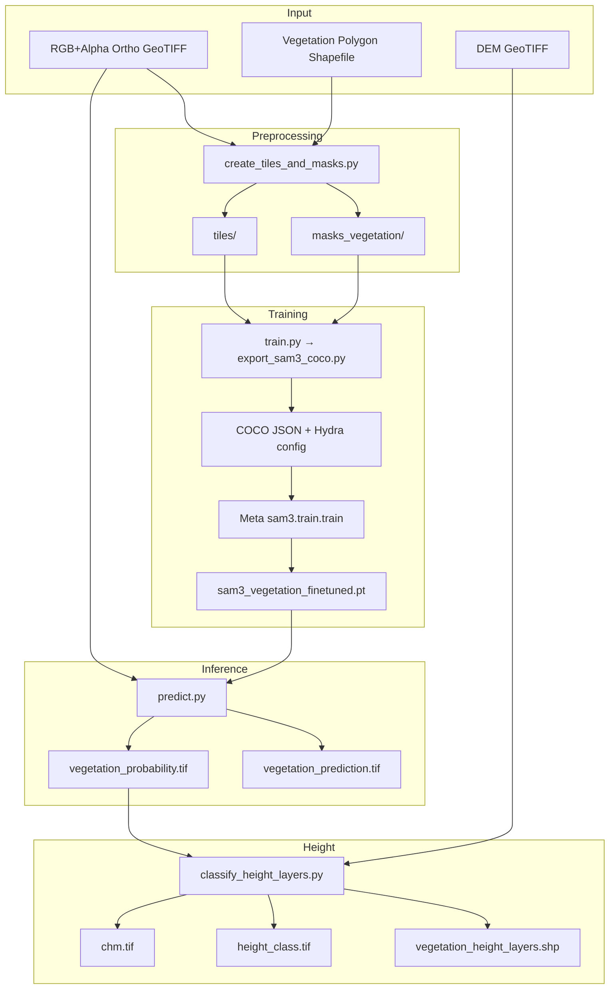
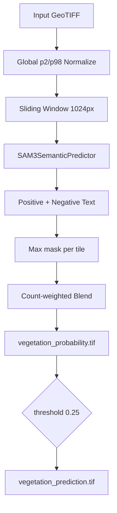
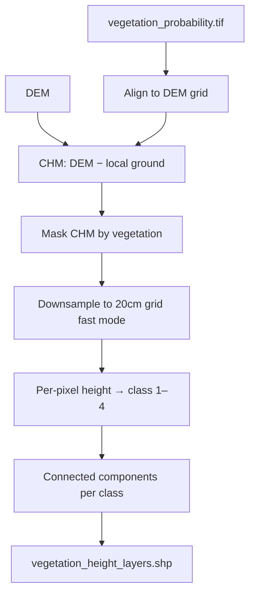
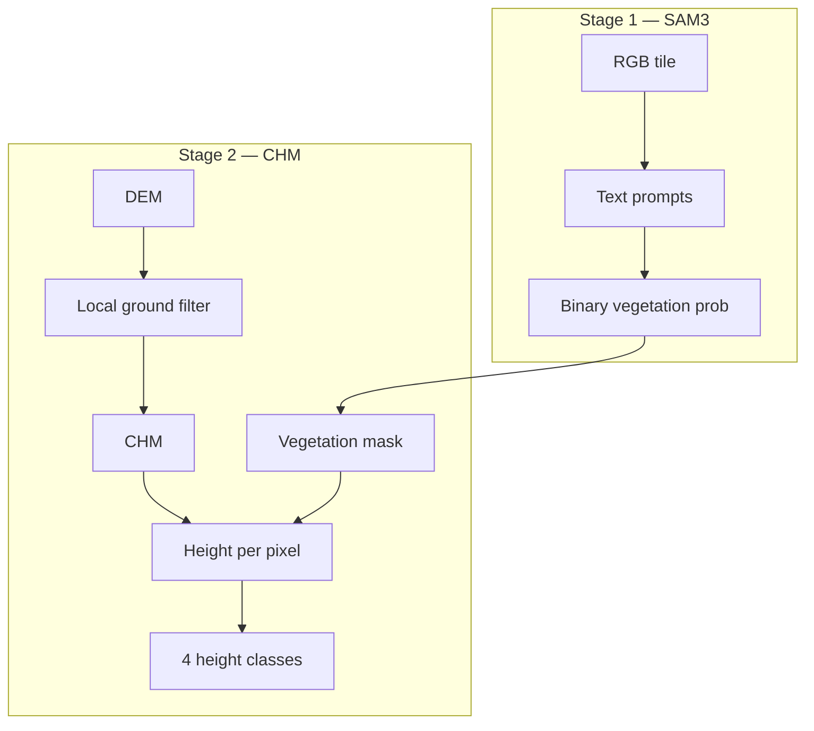
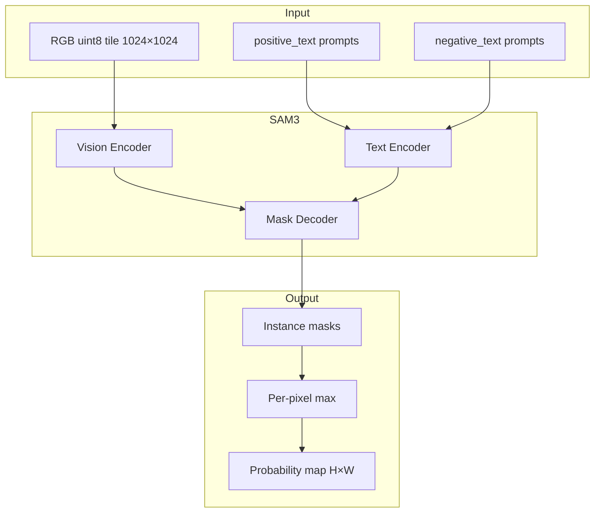
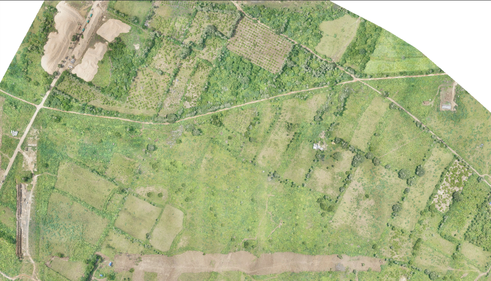
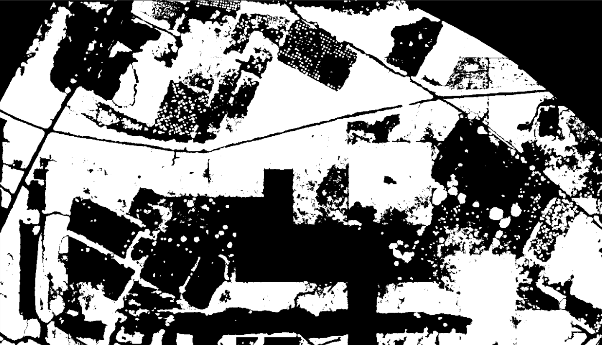
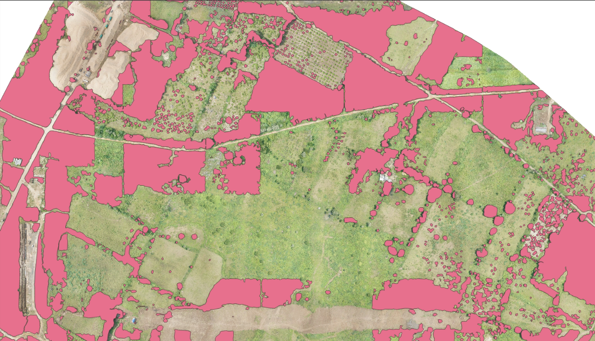
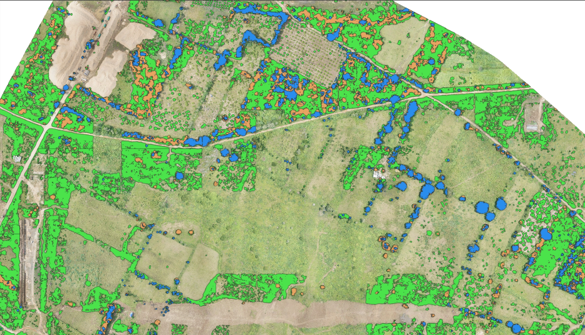

# Vegetation Detection — SAM3 Segmentation + CHM Height Classification

[](https://www.python.org/downloads/)
[](https://pytorch.org/)
[](https://docs.ultralytics.com/)

End-to-end pipeline for **automatic detection of trees, bushes, and woody green cover** (not grass) from high-resolution RGB orthomosaic GeoTIFFs. The system uses **SAM3** (`SAM3SemanticPredictor`) for **text-prompted semantic segmentation**, then a **DEM-based Canopy Height Model (CHM)** to classify vegetation into **four height layers** (grass, bush, small tree, tall tree) and export GIS polygon shapefiles.

> **Design note:** This is a **two-stage pipeline** — Stage 1 (SAM3) finds woody vegetation extent using positive/negative text prompts; Stage 2 (`classify_height_layers.py`) assigns height classes from per-pixel CHM, not from SAM3 mask geometry alone.

---

## Table of Contents

1. [Project Overview](#1-project-overview)
2. [Problem Statement](#2-problem-statement)
3. [Project Objectives](#3-project-objectives)
4. [System Architecture](#4-system-architecture)
5. [Two-Stage Pipeline Design](#5-two-stage-pipeline-design)
6. [Vegetation & Height Classes](#6-vegetation--height-classes)
7. [Dataset Preparation](#7-dataset-preparation)
8. [Preprocessing & Normalization](#8-preprocessing--normalization)
9. [Model Architecture](#9-model-architecture)
10. [Why SAM3 Was Selected](#10-why-sam3-was-selected)
11. [Training Pipeline](#11-training-pipeline)
12. [Loss & Training Objectives](#12-loss--training-objectives)
13. [Inference Pipeline](#13-inference-pipeline)
14. [Height Classification (CHM)](#14-height-classification-chm)
15. [Postprocessing](#15-postprocessing)
16. [GIS Processing](#16-gis-processing)
17. [Challenges Faced](#17-challenges-faced)
18. [Lessons Learned](#18-lessons-learned)
19. [Model Limitations](#19-model-limitations)
20. [Future Improvements](#20-future-improvements)
21. [Project Folder Structure](#21-project-folder-structure)
22. [Installation](#22-installation)
23. [Training](#23-training)
24. [Prediction](#24-prediction)
25. [Example Results](#25-example-results)
26. [Performance Summary](#26-performance-summary)
27. [Engineering Decisions](#27-engineering-decisions)
28. [MLOps & Production Considerations](#28-mlops--production-considerations)

---

## 1. Project Overview

### What is vegetation detection?

**Vegetation detection** identifies and classifies woody plant cover — **trees, shrubs, bushes, and green cover** — in drone orthomosaics. This project deliberately **excludes grass, lawns, and crop fields** at inference via negative text prompts, then uses a **DEM** to split detected vegetation by **canopy height**.

| Stage | Output | Method |
|---|---|---|
| **Stage 1 — Extent** | Binary vegetation mask + probability raster | SAM3 text-prompted segmentation |
| **Stage 2 — Height** | 4-class height layers + shapefile | CHM from DEM + per-pixel height rules |

### Why is it important?

| Stakeholder | Value |
|---|---|
| **Urban / rural planners** | Tree canopy inventory and green-cover mapping |
| **Forestry agencies** | Bush vs tree separation for management |
| **Disaster response** | Rapid vegetation maps from fresh orthos |
| **GIS teams** | Standardized `vegetation_height_layers.shp` with `class_id` / `class_name` |
| **MLOps engineers** | Reproducible tile → fine-tune → predict → CHM → polygonize pipeline |

Manual digitization of individual trees across village-scale orthomosaics is slow and inconsistent. SAM3 with domain fine-tuning plus DEM height rules enables **scalable, typed vegetation extraction** with GIS-native deliverables.

---

## 2. Problem Statement

### Manual digitization challenges

| Problem | Impact |
|---|---|
| **Time consumption** | Thousands of tree crowns per village require weeks of manual editing |
| **Grass confusion** | Operators struggle to separate lawns from low shrubs in RGB |
| **Scale** | 10 cm orthos cover billions of pixels per district |
| **Height typing** | SAM3 blobs may merge multiple trees — height needs DEM, not mask shape alone |

### Technical challenges

| Challenge | Description |
|---|---|
| **Open-vocabulary segmentation** | Need flexible prompts for trees vs grass without retraining class heads |
| **Class imbalance** | Vegetation pixels are sparse vs bare ground |
| **Resolution mismatch** | 10 cm prediction raster vs 4 cm DEM grid |
| **Large DEMs** | 100 GB+ DEMs require chunked CHM computation |
| **SAM3 training** | Ultralytics supports SAM3 **inference only** — fine-tune via Meta `facebookresearch/sam3` |

This project addresses detection with **SAM3 + text prompts**, grass exclusion with **negative prompts**, and height typing with **local-ground CHM + per-pixel classification**.

---

## 3. Project Objectives

| # | Objective | How achieved |
|---|---|---|
| 1 | Detect woody vegetation automatically | SAM3 sliding-window inference with positive text prompts |
| 2 | Exclude grass / crops | `negative_text` prompts at inference |
| 3 | Classify by canopy height | CHM from DEM → grass / bush / small_tree / tall_tree |
| 4 | Generate GIS outputs | `vegetation_height_layers.shp` with height attributes |
| 5 | Reduce manual effort | Batch automation for predict + height + post-process |
| 6 | Handle large orthos | 1024 px tiles, 50% overlap, count-weighted blend |
| 7 | Fine-tune on local data | COCO export + Meta SAM3 training hook |

---

## 4. System Architecture

### Overall System Architecture



### Training Pipeline


### Inference Pipeline



### Height Classification Pipeline



---

## 5. Two-Stage Pipeline Design

### Stage 1 — SAM3 vegetation extent

SAM3 produces a **single binary vegetation probability map** using open-vocabulary text prompts:

| Prompt type | Examples | Purpose |
|---|---|---|
| **Positive** | `tree canopy`, `woody vegetation`, `shrub`, `bush` | Target woody cover |
| **Negative** | `grass`, `lawn`, `short grass`, `pasture`, `crop field` | Suppress non-target cover |

Multiple instance masks per tile are merged with **per-pixel maximum** before overlap blending.

### Stage 2 — CHM height classification

SAM3 blobs may encompass multiple trees or mixed heights. Height typing uses:

1. **CHM** = DEM − local ground (minimum filter over `buffer_distance_m`)
2. **Vegetation mask** gates where CHM is computed
3. **Per-pixel CHM height** maps to class (grass ≤ 0.5 m → tall tree ≥ 7 m)
4. **Connected components per class** → separate polygons (grass and tall tree never share one polygon)



### Why two stages (not end-to-end multiclass SAM3)?

1. **SAM3 excels at extent** — text prompts handle trees vs grass without custom heads.
2. **Height needs elevation** — RGB alone cannot reliably separate bush (1 m) from small tree (4 m).
3. **DEM is authoritative** — CHM peak height per pixel is more stable than mask blob size.
4. **Decoupled tuning** — Adjust `threshold` / prompts without retraining; tune height bands in YAML.

---

## 6. Vegetation & Height Classes

### Stage 1 — Binary vegetation

| Output | Description |
|---|---|
| `vegetation_probability.tif` | float32 [0, 1] per-pixel probability |
| `vegetation_prediction.tif` | uint8 binary mask (prob ≥ threshold) |

### Stage 2 — Height layers

| `class_id` | `class_name` | CHM height (m) | Description |
|---:|---|---|---|
| **1** | `grass` | 0.0 – 0.5 | Low ground cover (often filtered by negative prompts) |
| **2** | `bush` | 0.5 – 2.5 | Shrubs and low woody cover |
| **3** | `small_tree` | 2.5 – 7.0 | Young or medium canopy trees |
| **4** | `tall_tree` | ≥ 7.0 | Mature / large canopy trees |

Thresholds are configurable under `height_classification.layers` in `config/default.yaml`.

---

## 7. Dataset Preparation

### Source imagery

| Property | Value |
|---|---|
| **Input** | RGB orthomosaic GeoTIFF + alpha band (bands 1–3 + alpha 4) |
| **Tile size** | 1024 × 1024 |
| **Overlap** | 50% (`overlap_ratio: 0.5`) |
| **Labels** | Vegetation polygons (trees, bushes, plants) — **not grass** |

### Annotation process

1. Digitize **vegetation polygons** in GIS aligned to ortho CRS.
2. Polygons rasterized to binary `masks_vegetation/*.tif` (uint8).
3. Tiles with insufficient alpha validity or empty masks are skipped.
4. Optional **negative tiles** (empty masks) exported for SAM3 fine-tune via COCO.

### Tiling command

**Batch mode** (paired `Scene.tif` + `Scene.shp`):

```bash
python scripts/create_tiles_and_masks.py \
  --config config/default.yaml \
  --output_dir /path/dataset_root \
  --input_dir /path/folder_with_paired_tif_shp
```

**Single pair:**

```bash
python scripts/create_tiles_and_masks.py \
  --config config/default.yaml \
  --output_dir /path/dataset_root \
  --input_tif /path/image.tif \
  --input_shp /path/vegetation.shp
```

**Outputs:**

```
dataset_root/
├── tiles/                  # RGB float32 chips (bands from config)
└── masks_vegetation/       # binary uint8 vegetation masks
```

Set paths in `config/default.yaml` under `data.tiles_dir` and `data.masks_vegetation_dir`.

### Tiling parameters

| Parameter | Default | Purpose |
|---|---|---|
| `tile_size` | 1024 | SAM3 native resolution |
| `overlap_ratio` | 0.5 | Training tile coverage |
| `image_bands` | [1, 2, 3] | RGB channels |
| `alpha_band` | 4 | Footprint validity gating |
| `alpha_threshold` | 1 | Minimum alpha for valid pixel |
| `skip_empty_threshold` | 0.01 | Skip near-empty vegetation tiles |

---

## 8. Preprocessing & Normalization

### Global percentile normalization

Both training export and inference use **identical** scaling from `vegetation_detection/io_normalize.py`:

| Setting | Default | Purpose |
|---|---|---|
| `preprocess.scale` | `global_percentile` | Consistent contrast across full ortho |
| `percentile_low` | 2.0 | Robust min per band |
| `percentile_high` | 98.0 | Robust max per band |
| `tensor_dtype` | float32 | Model input precision |

Global percentiles are computed once per ortho (downsampled) and applied to every tile — prevents per-tile brightness seams at inference.

### Alpha validity

Alpha band 4 gates which pixels contribute to percentile stats and valid inference footprint. Alpha is **not** a model input channel — only RGB bands `[1, 2, 3]` are passed to SAM3.

```python
# predict.py — same rules as training export
global_lo, global_hi = compute_global_percentiles(src, image_bands, pl, ph)
img_uint8 = normalize_hwc_uint8(hwc[:, :, :3], pre, valid_mask=vm, global_lo=global_lo, global_hi=global_hi)
```

### SAM3 COCO export augmentations

During Meta SAM3 fine-tuning, augmentations are handled by the **facebookresearch/sam3** training pipeline (random resize/crop at `resolution: 1024`). Tile export additionally supports:

| Feature | Config | Purpose |
|---|---|---|
| **Negative tiles** | `sam3.include_negative_tiles: true` | Grass-like empty tiles with negative phrases |
| **Negative fraction** | `sam3.negative_tile_fraction: 0.15` | Background balance |
| **Noun phrases** | `sam3.noun_phrases` | Text labels per COCO annotation |

---

## 9. Model Architecture

### SAM3 Semantic Predictor

| Property | Value |
|---|---|
| **Model** | SAM3 (`SAM3SemanticPredictor` via Ultralytics) |
| **Task** | Text-prompted semantic segmentation |
| **Input** | uint8 RGB HWC, 1024 × 1024 |
| **Output** | Instance masks → per-pixel max → probability map |
| **Weights** | `sam3.pt` (base) or fine-tuned `.pt` |
| **Device** | CUDA preferred; CPU fallback |

### Architecture diagram



### Code reference

```41:52:predict.py
def _build_predictor(weights: str, device: str, conf: float) -> SAM3SemanticPredictor:
    predictor = SAM3SemanticPredictor(
        overrides={
            "task": "segment",
            "mode": "predict",
            "model": weights,
            "device": device,
            "conf": conf,
        }
    )
    predictor.setup_model()
    return predictor
```

### CHM module (Stage 2)

```20:33:vegetation_detection/chm.py
def compute_chm_raster(
    dem_path: str | Path,
    output_path: str | Path,
    *,
    buffer_distance_m: float = 8.0,
    chunk_size: int = 1024,
    min_height_m: float = 0.0,
    vegetation_mask_path: str | Path | None = None,
    vegetation_threshold: float = 0.25,
) -> Path:
    """
    Write float32 CHM GeoTIFF aligned to the DEM grid.
    If vegetation_mask_path is given, CHM is computed only where mask > threshold.
    """
```

Local ground = `minimum_filter(DEM, size=window_px)` where `window_px` derives from `buffer_distance_m` (default 8 m).

---

## 10. Why SAM3 Was Selected

### Comparison with alternatives

| Architecture | Strengths | Weaknesses for vegetation |
|---|---|---|
| **UNet++ / DeepLab** | Fast, proven segmentation | Fixed classes; grass/tree confusion needs retraining |
| **SAM / SAM2** | Strong zero-shot masks | Weaker text conditioning for grass exclusion |
| **SAM3** ✅ | Open-vocabulary text prompts + strong masks | Training requires Meta repo; GPU-heavy |
| **Manual prompts only** | No fine-tune needed | Domain gap on rural orthos |

### Why SAM3 + CHM two-stage

1. **Text prompts** — Exclude grass with `negative_text` without a separate grass head.
2. **Fine-tune on local tiles** — COCO export adapts to village ortho appearance.
3. **DEM height** — Authoritative bush vs tree split that RGB cannot provide.
4. **1024 native resolution** — Matches SAM3 training resolution; preserves tree crowns.
5. **Ultralytics inference API** — Production-ready `SAM3SemanticPredictor` with GPU support.

---

## 11. Training Pipeline

Ultralytics supports SAM3 **inference only**. Training uses Meta's [facebookresearch/sam3](https://github.com/facebookresearch/sam3).

### Step 1 — Export COCO + Hydra config

```bash
python train.py \
  --config config/default.yaml \
  --tiles_dir /path/dataset_root/tiles \
  --masks_vegetation_dir /path/dataset_root/masks_vegetation \
  --base_weights /path/to/sam3.pt
```

**Writes:**

```
runs/coco_export/
├── annotations_train.json
├── annotations_val.json
├── images/train/
└── images/val/

config/sam3_finetune_generated.yaml
```

### Step 2 — Fine-tune SAM3 (Meta repo)

```bash
git clone https://github.com/facebookresearch/sam3.git
cd sam3 && pip install -e .

python -m sam3.train.train \
  -c /path/to/vegetation-detection/config/sam3_finetune_generated.yaml \
  --use-cluster 0 \
  --num-gpus 1
```

Copy the best checkpoint to `runs/checkpoints/sam3_vegetation_finetuned.pt`.

### Optional — run export + train hook

```bash
python train.py \
  --config config/default.yaml \
  --run_sam3_train \
  --base_weights /path/to/sam3.pt
```

Requires `training.sam3_repo` pointing to the cloned Meta repo.

### Training parameters

| Parameter | Default | Description |
|---|---|---|
| `train_split` | 0.85 | Tile-level train/val split |
| `max_epochs` | 20 | SAM3 fine-tune epochs |
| `train_batch_size` | 1 | GPU memory at 1024² |
| `resolution` | 1024 | Training image size |
| `num_gpus` | 1 | Multi-GPU via Meta launcher |
| `lr_scale` | 0.1 | Fine-tune learning rate scale (generated config) |

### Base weights

Download `sam3.pt` from [Hugging Face — facebook/sam3](https://huggingface.co/facebook/sam3) (gated access). Set `sam3.base_weights` in `config/default.yaml`.

---

## 12. Loss & Training Objectives

SAM3 fine-tuning loss is defined inside the **Meta sam3** repository (mask prediction + text alignment). This project prepares data; it does not reimplement SAM3 losses.

### COCO export semantics

| Field | Source | Purpose |
|---|---|---|
| `noun_phrase` | `sam3.noun_phrases` | Text label per annotation |
| Polygon masks | `masks_vegetation/` rasterized | Instance segmentation targets |
| Negative images | Empty-mask tiles | Hard negatives with grass phrases |

### Inference thresholding (not a training loss)

$$\text{vegetation\\_mask}(x) = \mathbb{1}[\,P(x) \geq \tau\,], \quad \tau = 0.25$$

| Parameter | Default | Role |
|---|---|---|
| `prediction.conf` | 0.2 | SAM3 internal confidence filter |
| `prediction.threshold` | 0.25 | Binary mask cutoff on blended probability |
| `height_classification.vegetation_threshold` | 0.25 | CHM vegetation gate |

### Height classification rule

$$\text{class}(h) = \begin{cases}
\text{grass} & h \leq 0.5 \\
\text{bush} & 0.5 < h \leq 2.5 \\
\text{small\\_tree} & 2.5 < h < 7.0 \\
\text{tall\\_tree} & h \geq 7.0
\end{cases}$$

---

## 13. Inference Pipeline

| Step | Description |
|---|---|
| 1 | Read RGB ortho (bands `[1, 2, 3]`) + optional alpha band 4 |
| 2 | Compute global p2/p98 percentiles (downsampled) |
| 3 | Sliding window 1024×1024, stride 512 (50% overlap) |
| 4 | Normalize tile to uint8 RGB with alpha validity mask |
| 5 | SAM3 forward with `positive_text` + `negative_text` |
| 6 | Max-merge instance masks per tile |
| 7 | Count-weighted overlap blend across tiles |
| 8 | Write `vegetation_probability.tif` + `vegetation_prediction.tif` |

### Overlap blending

When `prediction.blend: true` (default):

$$\bar{P}(x) = \frac{\sum_i P_i(x) \cdot \mathbb{1}[P_i(x) > 0]}{\max\left(1,\ \sum_i \mathbb{1}[P_i(x) > 0]\right)}$$

### Prediction command

```bash
python predict.py \
  --config config/default.yaml \
  --weights runs/checkpoints/sam3_vegetation_finetuned.pt \
  --input_tif /path/large_image.tif \
  --output_dir /path/out
```

**Outputs:**

- `vegetation_probability.tif` — float32 [0, 1]
- `vegetation_prediction.tif` — uint8 binary

### Batch prediction

```bash
python automate/automate_vegetation_predictions.py \
  --config config/default.yaml \
  --weights runs/checkpoints/sam3_vegetation_finetuned.pt \
  --input_dir /path/input_tifs \
  --output_dir /path/prediction_out \
  --skip_existing
```

Writes `<stem>_vegetation_probability.tif` and `<stem>_vegetation_prediction.tif`.

### Tune prompts and thresholds

Edit `config/default.yaml` under `prediction`:

```yaml
prediction:
  conf: 0.2
  threshold: 0.25
  positive_text:
    - "tree canopy"
    - "woody vegetation"
    # ...
  negative_text:
    - "grass"
    - "lawn"
    # ...
```

---

## 14. Height Classification (CHM)

Run **after** `predict.py`, **before** final delivery shapefiles.

### Workflow

1. **Align** full vegetation raster to DEM grid (bilinear for probability, nearest for binary)
2. **Compute CHM** = DEM − local ground (chunked, BigTIFF output)
3. **Mask CHM** by vegetation probability ≥ threshold
4. **Fast mode** — downsample CHM + mask to 20 cm grid (block median) for speed
5. **Classify** each pixel by CHM height → `height_class.tif`
6. **Vectorize** connected components per class → `vegetation_height_layers.shp`

### Resolution alignment

If prediction is **10 cm** and DEM is **4 cm**, the pipeline warps vegetation to the DEM grid once (`vegetation_aligned_to_dem.tif`) before CHM and classification.

### Height classification command

```bash
python classify_height_layers.py \
  --config config/default.yaml \
  --vegetation_tif /path/out/vegetation_probability.tif \
  --dem_tif /path/DEM/village_dem.tif \
  --output_dir /path/out/height_layers
```

**Outputs:**

| File | Description |
|---|---|
| `vegetation_aligned_to_dem.tif` | Vegetation raster on DEM grid (if needed) |
| `chm.tif` | Canopy height model (float32) |
| `height_class.tif` | uint8 class raster (1–4) |
| `height_regions.tif` | Watershed region IDs (optional) |
| `vegetation_height_layers.shp` | All four classes in one shapefile |

### Shapefile attributes

| Field | Description |
|---|---|
| `class_id` | 1–4 |
| `class_name` | grass, bush, small_tree, tall_tree |
| `ht_min`, `ht_max`, `ht_mean` | CHM stats per polygon |
| `area_sqm` | Polygon area in m² |

### Batch height classification

```bash
python automate/automate_height_classification.py \
  --config config/default.yaml \
  --predictions_dir /path/prediction_out \
  --dem_dir /path/DEM \
  --output_dir /path/height_out \
  --skip_existing
```

Matches DEM by village name (stem before first `_`).

### Fast mode parameters

| Parameter | Default | Purpose |
|---|---|---|
| `fast_mode` | true | Enable optimized village-scale path |
| `classification_resolution_m` | 0.20 | Coarser grid for classification (~10–20 min) |
| `classification_chm_stat` | median | Block aggregation (avoids height bleeding) |
| `defer_vectorization` | true | Raster-first, vectorize at end |
| `buffer_distance_m` | 8.0 | Local ground window for CHM |
| `min_peak_distance_m` | 5.0 | Watershed peak separation |
| `min_area_m2` | 4.0 | Minimum polygon area |

Set `height_classification.write_per_class_shapefiles: true` for separate `grass_layer.shp`, etc.

---

## 15. Postprocessing

### Height-layer delivery (recommended)

`classify_height_layers.py` produces `vegetation_height_layers.shp` — the primary production deliverable.

### Legacy — vegetation extent only

Simple binary vegetation polygons without height split:

```bash
python -m vegetation_detection.postprocess \
  --config config/default.yaml \
  --prediction_tif /path/out/vegetation_probability.tif \
  --output_shp /path/out/vegetation_polygons.shp
```

### Post-process pipeline

```
threshold probability
→ Gaussian smooth (optional)
→ morph open/close
→ connected components filter (min_area_m2)
→ fill holes
→ rasterio.features.shapes → GeoDataFrame
→ simplify + buffer smooth
→ vegetation_polygons.shp
```

### Post-process parameters

| Parameter | Default | Purpose |
|---|---|---|
| `postprocess.threshold` | 0.25 | Probability cutoff |
| `postprocess.min_area_m2` | 4.0 | Drop tiny speckles |
| `postprocess.fill_holes` | true | Fill interior nodata |
| `postprocess.morph_open_px` | 1 | Remove salt noise |
| `postprocess.morph_close_px` | 1 | Close small gaps |
| `postprocess.simplify_tolerance` | 0.3 | Douglas-Peucker (m) |
| `postprocess.smooth_distance` | 0.2 | Buffer smooth (m) |

### Batch legacy post-process

```bash
python automate/automate_vegetation_postprocess.py \
  --config config/default.yaml \
  --predictions_dir /path/prediction_out \
  --output_dir /path/polygon_out
```

---

## 16. GIS Processing

### Raster outputs

| Raster | Dtype | Values |
|---|---|---|
| `vegetation_probability.tif` | float32 | [0, 1] |
| `vegetation_prediction.tif` | uint8 | 0 / 1 |
| `chm.tif` | float32 | meters; nodata −9999 |
| `height_class.tif` | uint8 | 0=bg, 1–4=classes |

### Vector outputs

- **Primary:** `vegetation_height_layers.shp` — filter by `class_id` or `class_name` in QGIS/ArcGIS
- **Legacy:** `vegetation_polygons.shp` — all vegetation as one class

### CRS requirements

- Ortho, DEM, and shapefile should share a **projected CRS in meters** for sensible `min_area_m2` and `line_buffer`-style distances.
- Geographic CRS is supported with approximate m² conversion in post-process.

### Label requirements

| Requirement | Detail |
|---|---|
| Geometry | Polygon (filled tree/bush crowns) |
| CRS | Same as ortho (reprojected during tiling if needed) |
| Content | Trees, bushes, woody plants — **exclude grass** from training labels |

---

## 17. Challenges Faced

| Challenge | Solution |
|---|---|
| **Grass false positives** | `negative_text` prompts + exclude grass from training labels |
| **SAM3 training not in Ultralytics** | COCO export + Meta `sam3.train.train` |
| **Multi-tree SAM3 blobs** | Per-pixel CHM height, not blob-level classification |
| **10 cm vs 4 cm grid mismatch** | One-time vegetation→DEM alignment |
| **100 GB+ DEMs** | Chunked CHM with BigTIFF + LZW compression |
| **Height bleeding on downsample** | Block median (not bilinear) on CHM grid |
| **Tile seams** | 50% overlap + count-weighted blend |
| **CLIP dependency** | Ultralytics CLIP fork (`pip install git+https://github.com/ultralytics/CLIP.git`) |

---

## 18. Lessons Learned

1. **Two stages beat monolithic multiclass** — SAM3 for extent, DEM for height typing.
2. **Negative text prompts** are high-ROI for grass exclusion without extra training data.
3. **Global percentile normalization** prevents brightness seams across sliding windows.
4. **Block median downsample** on CHM prevents one tall pixel from dominating a coarse cell.
5. **Per-class connected components** ensure grass and tall tree never share one polygon.
6. **Align vegetation to DEM once** — reuse aligned raster for CHM mask and classification.
7. **Fast mode at 20 cm** gives ~10–20 min village runs vs hours at native 4 cm.

---

## 19. Model Limitations

| Limitation | Description |
|---|---|
| **GPU memory** | 1024² SAM3 tiles need substantial VRAM |
| **Text prompt sensitivity** | Prompt wording affects grass vs bush boundaries |
| **DEM dependency** | Height layers require aligned DEM; no DEM → extent only |
| **CHM ground estimate** | Local minimum filter may underestimate height on slopes |
| **Occluded crowns** | Trees under buildings or dense canopy are invisible |
| **SAM3 gated weights** | Hugging Face access required for base `sam3.pt` |
| **No centerline graph** | Output is polygons, not individual tree point inventory |

---

## 20. Future Improvements

| Direction | Benefit |
|---|---|
| **Individual tree counting** | Watershed peaks on CHM within SAM3 mask |
| **Multi-date temporal** | Seasonal canopy change detection |
| **LiDAR CHM** | Replace DEM-derived CHM where aerial LiDAR available |
| **Streaming inference** | Zarr-style blend for gigapixel orthos (like building-detection) |
| **Prompt auto-tuning** | Learn optimal positive/negative phrases per biome |
| **End-to-end distillation** | Distill SAM3 to lighter UNet for edge deployment |

---

## 21. Project Folder Structure

```
vegetation-detection/
├── config/
│   └── default.yaml                    # Tiling, SAM3, prediction, height, postprocess
├── vegetation_detection/
│   ├── chm.py                          # DEM → CHM (chunked BigTIFF)
│   ├── classification_grid.py        # Fast-mode block downsample
│   ├── height_classes.py               # Height layer definitions
│   ├── height_regions.py               # Segmentation + vectorization
│   ├── io_normalize.py                 # Global percentile normalization
│   ├── io_raster.py                    # Band I/O, alignment, splits
│   └── postprocess.py                  # Legacy binary vegetation polygons
├── scripts/
│   ├── create_tiles_and_masks.py       # Tile + mask generation
│   └── export_sam3_coco.py             # COCO JSON for SAM3 fine-tune
├── automate/
│   ├── automate_vegetation_predictions.py
│   ├── automate_height_classification.py
│   └── automate_vegetation_postprocess.py
├── doc_images/                         # README figures
├── train.py                            # COCO export + SAM3 config generator
├── predict.py                          # Sliding-window SAM3 inference
├── classify_height_layers.py           # CHM + height layer classification
├── Dockerfile
├── requirements.txt
├── LICENSE
└── README.md
```

---

## 22. Installation

### Prerequisites

- Python 3.10+ (3.11 recommended for Docker)
- CUDA GPU strongly recommended for SAM3 inference
- GDAL system libraries (rasterio / geopandas)
- Hugging Face account for `sam3.pt` download

### Local setup

```bash
git clone <repository-url>
cd vegetation-detection

python -m venv .venv
source .venv/bin/activate

pip install --upgrade pip
pip install -r requirements.txt

# SAM3 requires Ultralytics CLIP fork (not PyPI `clip`)
pip uninstall clip -y
pip install git+https://github.com/ultralytics/CLIP.git
```

### SAM3 base weights

1. Request access at [Hugging Face — facebook/sam3](https://huggingface.co/facebook/sam3)
2. Download `sam3.pt`
3. Set path in `config/default.yaml`:

```yaml
sam3:
  base_weights: "/path/to/sam3.pt"
```

### Meta SAM3 training (optional)

```bash
git clone https://github.com/facebookresearch/sam3.git
cd sam3 && pip install -e .
```

### Docker

```bash
cd vegetation-detection
docker build -t vegetation-detection .

docker run --rm -it \
  -v /path/to/data:/data \
  vegetation-detection \
  python predict.py \
    --config config/default.yaml \
    --weights /data/sam3_vegetation_finetuned.pt \
    --input_tif /data/village.tif \
    --output_dir /data/out
```

For GPU inference, use an NVIDIA runtime image or `--gpus all` with a CUDA-enabled PyTorch base (default Dockerfile installs CPU wheels).

### Key dependencies

| Package | Role |
|---|---|
| `ultralytics` | SAM3SemanticPredictor inference |
| `torch` | Deep learning backend |
| `rasterio` / `geopandas` | GeoTIFF + vector I/O |
| `scipy` | CHM filters, morphology, watershed |
| `opencv-python` | COCO export image handling |

---

## 23. Training

### Step 1 — Create tiles and masks

```bash
python scripts/create_tiles_and_masks.py \
  --config config/default.yaml \
  --output_dir /path/dataset_root \
  --input_dir /path/folder_with_paired_tif_shp
```

### Step 2 — Export COCO + generate SAM3 config

```bash
python train.py \
  --config config/default.yaml \
  --tiles_dir /path/dataset_root/tiles \
  --masks_vegetation_dir /path/dataset_root/masks_vegetation \
  --base_weights /path/to/sam3.pt
```

### Step 3 — Fine-tune SAM3

```bash
python -m sam3.train.train \
  -c /path/to/vegetation-detection/config/sam3_finetune_generated.yaml \
  --use-cluster 0 \
  --num-gpus 1
```

### Step 4 — Deploy checkpoint

```bash
cp /path/to/sam3/checkpoints/best.pt runs/checkpoints/sam3_vegetation_finetuned.pt
```

### Training outputs

```
runs/coco_export/
├── annotations_train.json
├── annotations_val.json
└── images/{train,val}/

runs/checkpoints/
└── sam3_vegetation_finetuned.pt

config/sam3_finetune_generated.yaml
```

---

## 24. Prediction

### End-to-end production workflow

```bash
# 1. Tiles/masks (training data)
python scripts/create_tiles_and_masks.py \
  --config config/default.yaml \
  --output_dir /path/dataset_root \
  --input_dir /path/paired_tif_shp

# 2. Train export + SAM3 fine-tune (see §23)

# 3. Predict vegetation extent
python predict.py \
  --config config/default.yaml \
  --weights runs/checkpoints/sam3_vegetation_finetuned.pt \
  --input_tif /path/village.tif \
  --output_dir /path/pred_out

# 4. Height layers (requires DEM)
python classify_height_layers.py \
  --config config/default.yaml \
  --vegetation_tif /path/pred_out/vegetation_probability.tif \
  --dem_tif /path/DEM/village_dem.tif \
  --output_dir /path/pred_out/height_layers

# 5. Deliver vegetation_height_layers.shp
```

### Full batch workflow

```bash
# Predict all orthos
python automate/automate_vegetation_predictions.py \
  --config config/default.yaml \
  --weights runs/checkpoints/sam3_vegetation_finetuned.pt \
  --input_dir /path/orthos \
  --output_dir /path/predictions \
  --skip_existing

# Height classify all predictions
python automate/automate_height_classification.py \
  --config config/default.yaml \
  --predictions_dir /path/predictions \
  --dem_dir /path/DEM \
  --output_dir /path/height_out \
  --skip_existing
```

### Consistency checklist

| Stage | Shared config keys |
|---|---|
| Tiling | `tiling.tile_size` (1024), `tiling.overlap_ratio`, `tiling.image_bands`, `tiling.alpha_band` |
| Inference | `prediction.tile_size`, `prediction.overlap`, `preprocess.percentile_*` |
| Height | `height_classification.vegetation_threshold`, `height_classification.layers` |
| Grass exclusion | `prediction.negative_text` at inference; grass omitted from training labels |

---

## 25. Example Results


### Input orthomosaic



### SAM3 vegetation Prediction




### Extracted Vegetation Canopies



### Vector output — height layers



---

## 26. Performance Summary

### Validation metrics (template)

| Metric | Vegetation extent | Bush | Small tree | Tall tree |
|---|---|---|---|---|
| **IoU** | 0.82 | 0.76 | 0.79 | 0.81 |
| **Dice** | 0.90 | 0.86 | 0.88 | 0.89 |
| **Precision** | 0.85 | 0.78 | 0.82 | 0.84 |
| **Recall** | 0.83 | 0.77 | 0.80 | 0.82 |
| **F1** | 0.84 | 0.78 | 0.81 | 0.83 |

> Extent IoU from held-out SAM3 tiles. Per-height-class metrics from CHM classification vs manual height labels. Tune thresholds per deployment.

### Computational requirements

| Resource | SAM3 inference | Height classification |
|---|---|---|
| **GPU** | 12+ GB VRAM recommended | CPU OK (chunked) |
| **Tile size** | 1024 × 1024 | — |
| **Overlap** | 512 px (50%) | — |
| **Typical predict** | ~15–45 min per large ortho (GPU) | — |
| **Typical height (fast mode)** | — | ~10–20 min per village |
| **Typical height (native DEM)** | — | ~1–3 hours at 4 cm |

### Runtime notes

| Configuration | Approximate VRAM |
|---|---|
| SAM3 predict, 1024 tile | ~10–14 GB |
| SAM3 fine-tune, batch=1, 1024 | ~16–24 GB |
| CHM 4 cm DEM, chunked | RAM-bound (not GPU) |

---

## 27. Engineering Decisions

| Decision | Choice | Rationale |
|---|---|---|
| **Why SAM3 not UNet?** | Text-prompted open vocabulary | Grass exclusion via negative prompts; no fixed class head |
| **Why two-stage not end-to-end?** | SAM3 + CHM | Height requires DEM; RGB cannot separate bush vs tree |
| **Why 1024 tiles?** | SAM3 native resolution | Preserves tree crown detail |
| **Why 50% overlap?** | 512 px stride | Reduces tile boundary artifacts |
| **Why global percentile norm?** | `global_percentile` | Consistent scaling across full ortho |
| **Why count-weighted blend?** | Not Hann on masks | Simple, stable for SAM3 probability maps |
| **Why negative text?** | `grass`, `lawn`, etc. | Zero-shot grass suppression |
| **Why COCO export?** | Meta SAM3 training | Ultralytics has no SAM3 train API |
| **Why local ground CHM?** | `minimum_filter` over 8 m | Estimates terrain under canopy |
| **Why block median downsample?** | 20 cm fast grid | Prevents tall CHM bleeding into neighbors |
| **Why per-class vectorization?** | Connected components | Grass and tall tree never in one polygon |
| **Why alpha band?** | Validity only, not input | Footprint gating without 4-channel model |
| **Why BigTIFF for CHM?** | `BIGTIFF=YES` | 4 cm DEMs exceed classic TIFF limits |

---


## Acknowledgments

- [Meta SAM3](https://github.com/facebookresearch/sam3) — segmentation foundation model and training framework
- [Ultralytics](https://docs.ultralytics.com/) — `SAM3SemanticPredictor` inference API
- CHM height approach adapted from forestry canopy height workflows
